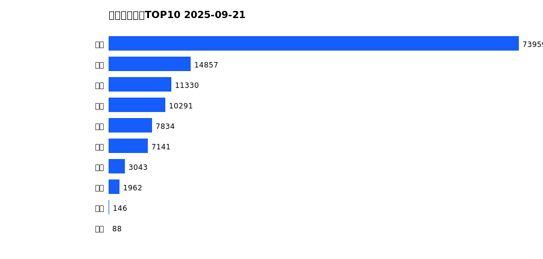

# 销售日报 2025-09-21

## 摘要

- 业态数: 10
- 门店数: 15
- 业态日销最大: 超市 4348
- 业态日销最小: 电影 13
- 门店日销最大: 许昌 时代广场店 2280
- 门店日销最小: 许昌 劳动店 50
- 同比: -
- 环比: -

## 集团合计

| period | sales_wan |
| --- | --- |
| daily | 8328.0 |
| monthly | 130651.0 |
| yearly | 1667513.0 |

## 业态 TOP10

### 日销

| rank | business_type | sales_wan |
| --- | --- | --- |
| 1 | 超市 | 4348.0 |
| 2 | 珠宝 | 917.0 |
| 3 | 百货 | 847.0 |
| 4 | 电器 | 818.0 |
| 5 | 服饰 | 643.0 |
| 6 | 茶叶 | 437.0 |
| 7 | 医药 | 173.0 |
| 8 | 餐饮 | 119.0 |
| 9 | 电影 | 13.0 |
| 10 | 电玩 | 13.0 |

### 月度累计

| rank | business_type | sales_wan |
| --- | --- | --- |
| 1 | 超市 | 73959.0 |
| 2 | 珠宝 | 14857.0 |
| 3 | 百货 | 11330.0 |
| 4 | 电器 | 10291.0 |
| 5 | 服饰 | 7834.0 |
| 6 | 茶叶 | 7141.0 |
| 7 | 医药 | 3043.0 |
| 8 | 餐饮 | 1962.0 |
| 9 | 电玩 | 146.0 |
| 10 | 电影 | 88.0 |

### 年度累计

| rank | business_type | sales_wan |
| --- | --- | --- |
| 1 | 超市 | 914909.0 |
| 2 | 珠宝 | 173939.0 |
| 3 | 百货 | 165267.0 |
| 4 | 电器 | 156494.0 |
| 5 | 服饰 | 112763.0 |
| 6 | 茶叶 | 74296.0 |
| 7 | 医药 | 37292.0 |
| 8 | 餐饮 | 27585.0 |
| 9 | 电玩 | 3179.0 |
| 10 | 电影 | 1789.0 |

## 门店 TOP10

### 日销

| rank | store_name | sales_wan |
| --- | --- | --- |
| 1 | 许昌 时代广场店 | 2280.0 |
| 2 | 新乡 大胖店 | 1229.0 |
| 3 | 许昌 天使城店 | 1089.0 |
| 4 | 新乡 小胖店 | 937.0 |
| 5 | 许昌 实业公司店 | 667.0 |
| 6 | 许昌 生活广场店 | 595.0 |
| 7 | 许昌 线上商城 | 414.0 |
| 8 | 许昌 禹州店 | 319.0 |
| 9 | 许昌 北海店 | 313.0 |
| 10 | 许昌 金三角店 | 281.0 |

### 月度累计

| rank | store_name | sales_wan |
| --- | --- | --- |
| 1 | 许昌 时代广场店 | 33775.0 |
| 2 | 新乡 大胖店 | 18239.0 |
| 3 | 许昌 天使城店 | 17873.0 |
| 4 | 新乡 小胖店 | 14845.0 |
| 5 | 许昌 实业公司店 | 9034.0 |
| 6 | 许昌 生活广场店 | 8370.0 |
| 7 | 许昌 线上商城 | 8194.0 |
| 8 | 许昌 禹州店 | 6176.0 |
| 9 | 许昌 金三角店 | 5313.0 |
| 10 | 许昌 北海店 | 5011.0 |

### 年度累计

| rank | store_name | sales_wan |
| --- | --- | --- |
| 1 | 许昌 时代广场店 | 427850.0 |
| 2 | 新乡 大胖店 | 237430.0 |
| 3 | 许昌 天使城店 | 237074.0 |
| 4 | 新乡 小胖店 | 189878.0 |
| 5 | 许昌 生活广场店 | 119406.0 |
| 6 | 许昌 实业公司店 | 92617.0 |
| 7 | 许昌 禹州店 | 85766.0 |
| 8 | 许昌 北海店 | 67078.0 |
| 9 | 许昌 线上商城 | 66145.0 |
| 10 | 许昌 金三角店 | 65754.0 |

