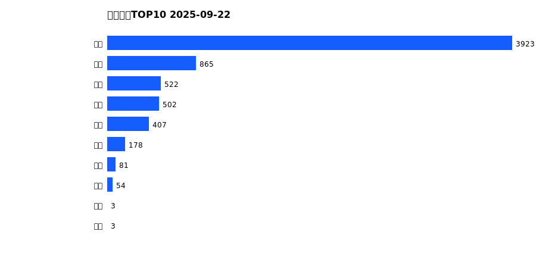
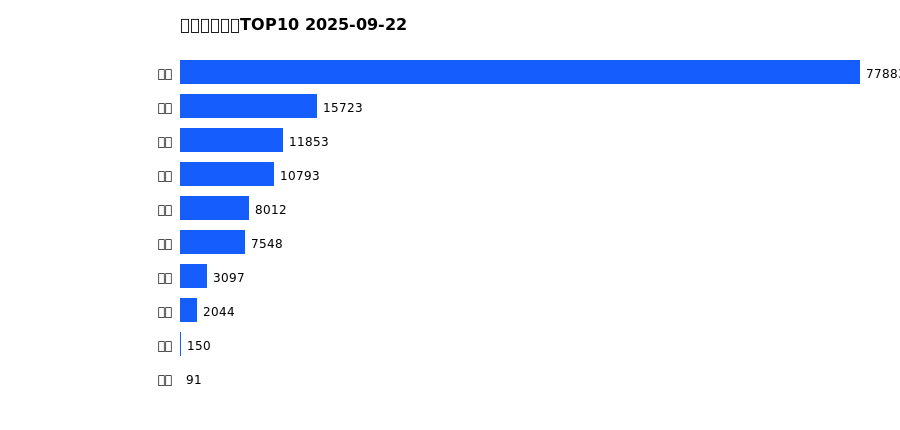
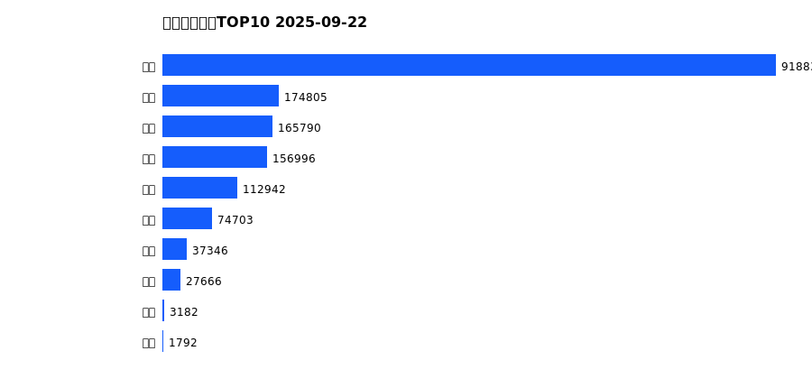
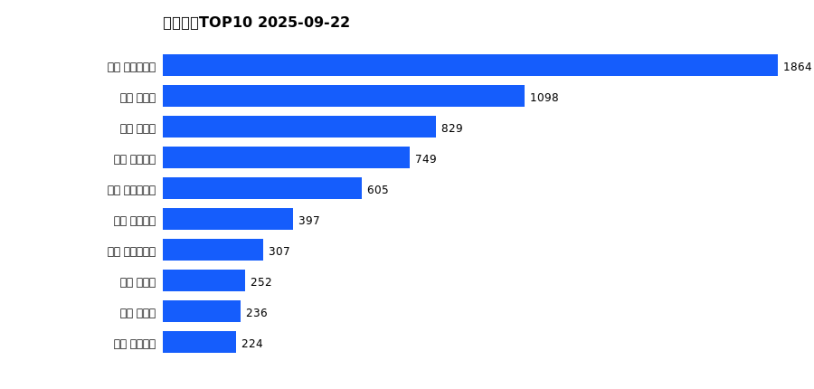
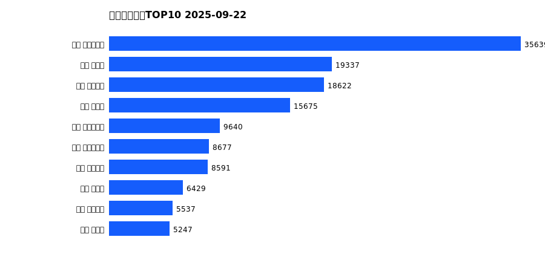
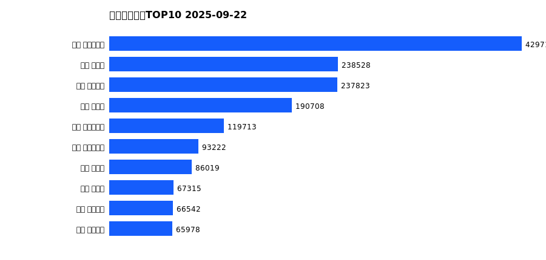

# 销售日报 2025-09-22

## 摘要

- 业态数: 10
- 门店数: 15
- 业态日销最大: 超市 3923
- 业态日销最小: 电影 3
- 门店日销最大: 许昌 时代广场店 1864
- 门店日销最小: 许昌 大众服饰店 0
- 同比: -
- 环比: -

## 集团合计

| period | sales_wan |
| --- | --- |
| daily | 6538.0 |
| monthly | 137194.0 |
| yearly | 1674054.0 |

## 业态 TOP10

### 日销

| rank | business_type | sales_wan |
| --- | --- | --- |
| 1 | 超市 | 3923.0 |
| 2 | 珠宝 | 865.0 |
| 3 | 百货 | 522.0 |
| 4 | 电器 | 502.0 |
| 5 | 茶叶 | 407.0 |
| 6 | 服饰 | 178.0 |
| 7 | 餐饮 | 81.0 |
| 8 | 医药 | 54.0 |
| 9 | 电影 | 3.0 |
| 10 | 电玩 | 3.0 |

### 月度累计

| rank | business_type | sales_wan |
| --- | --- | --- |
| 1 | 超市 | 77883.0 |
| 2 | 珠宝 | 15723.0 |
| 3 | 百货 | 11853.0 |
| 4 | 电器 | 10793.0 |
| 5 | 服饰 | 8012.0 |
| 6 | 茶叶 | 7548.0 |
| 7 | 医药 | 3097.0 |
| 8 | 餐饮 | 2044.0 |
| 9 | 电玩 | 150.0 |
| 10 | 电影 | 91.0 |

### 年度累计

| rank | business_type | sales_wan |
| --- | --- | --- |
| 1 | 超市 | 918832.0 |
| 2 | 珠宝 | 174805.0 |
| 3 | 百货 | 165790.0 |
| 4 | 电器 | 156996.0 |
| 5 | 服饰 | 112942.0 |
| 6 | 茶叶 | 74703.0 |
| 7 | 医药 | 37346.0 |
| 8 | 餐饮 | 27666.0 |
| 9 | 电玩 | 3182.0 |
| 10 | 电影 | 1792.0 |

## 门店 TOP10

### 日销

| rank | store_name | sales_wan |
| --- | --- | --- |
| 1 | 许昌 时代广场店 | 1864.0 |
| 2 | 新乡 大胖店 | 1098.0 |
| 3 | 新乡 小胖店 | 829.0 |
| 4 | 许昌 天使城店 | 749.0 |
| 5 | 许昌 实业公司店 | 605.0 |
| 6 | 许昌 线上商城 | 397.0 |
| 7 | 许昌 生活广场店 | 307.0 |
| 8 | 许昌 禹州店 | 252.0 |
| 9 | 许昌 北海店 | 236.0 |
| 10 | 许昌 金三角店 | 224.0 |

### 月度累计

| rank | store_name | sales_wan |
| --- | --- | --- |
| 1 | 许昌 时代广场店 | 35639.0 |
| 2 | 新乡 大胖店 | 19337.0 |
| 3 | 许昌 天使城店 | 18622.0 |
| 4 | 新乡 小胖店 | 15675.0 |
| 5 | 许昌 实业公司店 | 9640.0 |
| 6 | 许昌 生活广场店 | 8677.0 |
| 7 | 许昌 线上商城 | 8591.0 |
| 8 | 许昌 禹州店 | 6429.0 |
| 9 | 许昌 金三角店 | 5537.0 |
| 10 | 许昌 北海店 | 5247.0 |

### 年度累计

| rank | store_name | sales_wan |
| --- | --- | --- |
| 1 | 许昌 时代广场店 | 429714.0 |
| 2 | 新乡 大胖店 | 238528.0 |
| 3 | 许昌 天使城店 | 237823.0 |
| 4 | 新乡 小胖店 | 190708.0 |
| 5 | 许昌 生活广场店 | 119713.0 |
| 6 | 许昌 实业公司店 | 93222.0 |
| 7 | 许昌 禹州店 | 86019.0 |
| 8 | 许昌 北海店 | 67315.0 |
| 9 | 许昌 线上商城 | 66542.0 |
| 10 | 许昌 金三角店 | 65978.0 |

