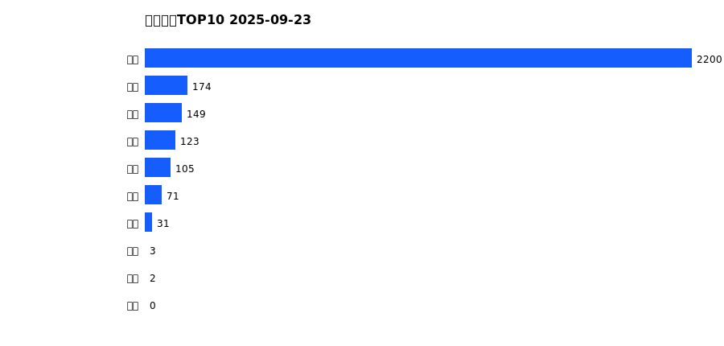
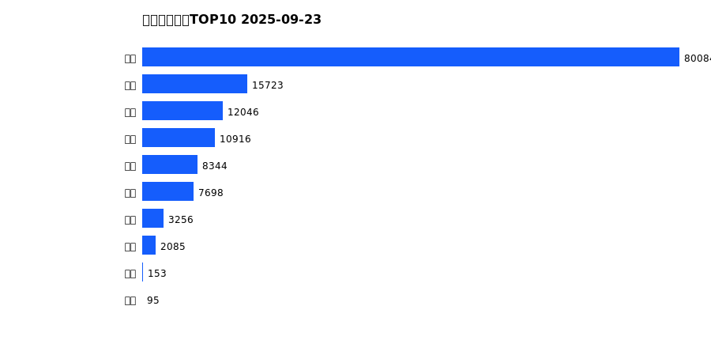
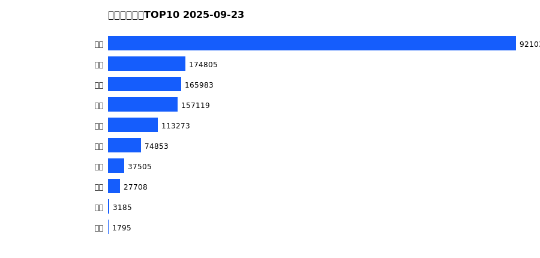
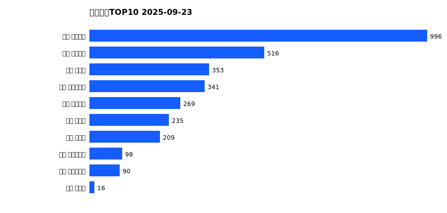
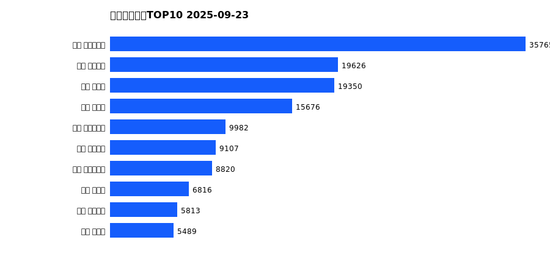
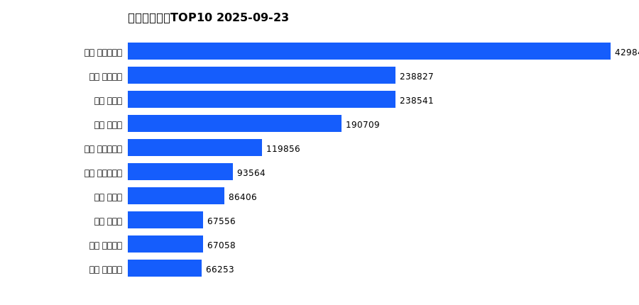

# 销售日报 2025-09-23

## 摘要

- 业态数: 10
- 门店数: 15
- 业态日销最大: 超市 2200
- 业态日销最小: 珠宝 0
- 门店日销最大: 许昌 天使城店 996
- 门店日销最小: 许昌 生活广场店 0
- 同比: -
- 环比: -

## 集团合计

| period | sales_wan |
| --- | --- |
| daily | 2858.0 |
| monthly | 140400.0 |
| yearly | 1677259.0 |

## 业态 TOP10

### 日销

| rank | business_type | sales_wan |
| --- | --- | --- |
| 1 | 超市 | 2200.0 |
| 2 | 百货 | 174.0 |
| 3 | 茶叶 | 149.0 |
| 4 | 电器 | 123.0 |
| 5 | 服饰 | 105.0 |
| 6 | 医药 | 71.0 |
| 7 | 餐饮 | 31.0 |
| 8 | 电影 | 3.0 |
| 9 | 电玩 | 2.0 |
| 10 | 珠宝 | 0.0 |

### 月度累计

| rank | business_type | sales_wan |
| --- | --- | --- |
| 1 | 超市 | 80084.0 |
| 2 | 珠宝 | 15723.0 |
| 3 | 百货 | 12046.0 |
| 4 | 电器 | 10916.0 |
| 5 | 服饰 | 8344.0 |
| 6 | 茶叶 | 7698.0 |
| 7 | 医药 | 3256.0 |
| 8 | 餐饮 | 2085.0 |
| 9 | 电玩 | 153.0 |
| 10 | 电影 | 95.0 |

### 年度累计

| rank | business_type | sales_wan |
| --- | --- | --- |
| 1 | 超市 | 921033.0 |
| 2 | 珠宝 | 174805.0 |
| 3 | 百货 | 165983.0 |
| 4 | 电器 | 157119.0 |
| 5 | 服饰 | 113273.0 |
| 6 | 茶叶 | 74853.0 |
| 7 | 医药 | 37505.0 |
| 8 | 餐饮 | 27708.0 |
| 9 | 电玩 | 3185.0 |
| 10 | 电影 | 1795.0 |

## 门店 TOP10

### 日销

| rank | store_name | sales_wan |
| --- | --- | --- |
| 1 | 许昌 天使城店 | 996.0 |
| 2 | 许昌 线上商城 | 516.0 |
| 3 | 许昌 禹州店 | 353.0 |
| 4 | 许昌 实业公司店 | 341.0 |
| 5 | 许昌 金三角店 | 269.0 |
| 6 | 许昌 北海店 | 235.0 |
| 7 | 许昌 金汇店 | 209.0 |
| 8 | 许昌 时代广场店 | 98.0 |
| 9 | 许昌 大众服饰店 | 90.0 |
| 10 | 许昌 魏源店 | 16.0 |

### 月度累计

| rank | store_name | sales_wan |
| --- | --- | --- |
| 1 | 许昌 时代广场店 | 35765.0 |
| 2 | 许昌 天使城店 | 19626.0 |
| 3 | 新乡 大胖店 | 19350.0 |
| 4 | 新乡 小胖店 | 15676.0 |
| 5 | 许昌 实业公司店 | 9982.0 |
| 6 | 许昌 线上商城 | 9107.0 |
| 7 | 许昌 生活广场店 | 8820.0 |
| 8 | 许昌 禹州店 | 6816.0 |
| 9 | 许昌 金三角店 | 5813.0 |
| 10 | 许昌 北海店 | 5489.0 |

### 年度累计

| rank | store_name | sales_wan |
| --- | --- | --- |
| 1 | 许昌 时代广场店 | 429840.0 |
| 2 | 许昌 天使城店 | 238827.0 |
| 3 | 新乡 大胖店 | 238541.0 |
| 4 | 新乡 小胖店 | 190709.0 |
| 5 | 许昌 生活广场店 | 119856.0 |
| 6 | 许昌 实业公司店 | 93564.0 |
| 7 | 许昌 禹州店 | 86406.0 |
| 8 | 许昌 北海店 | 67556.0 |
| 9 | 许昌 线上商城 | 67058.0 |
| 10 | 许昌 金三角店 | 66253.0 |

