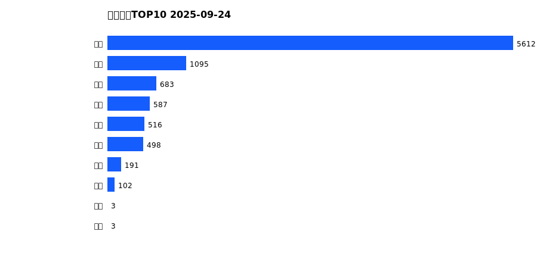
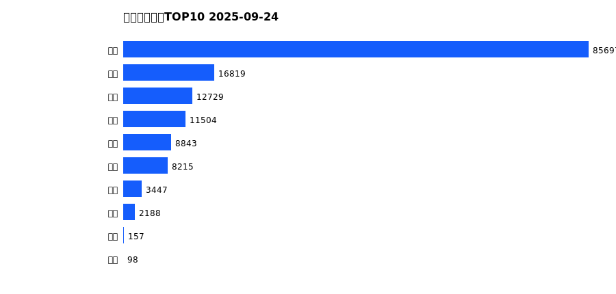
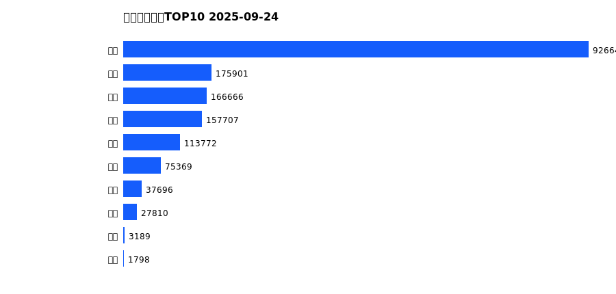
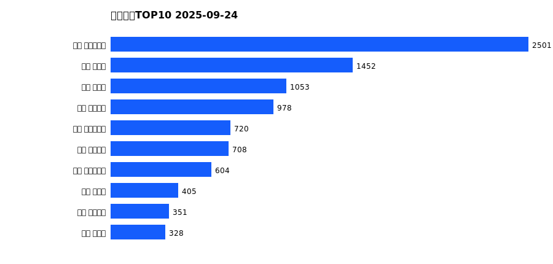
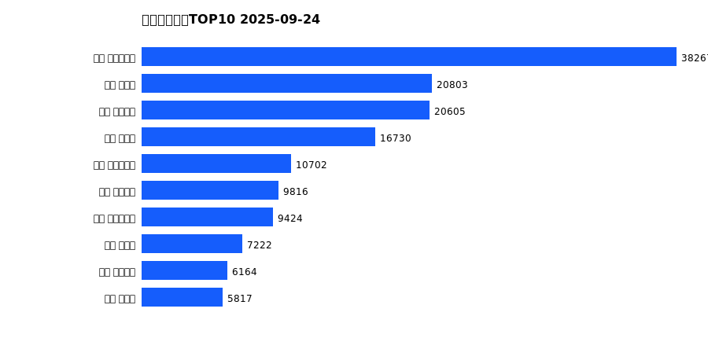
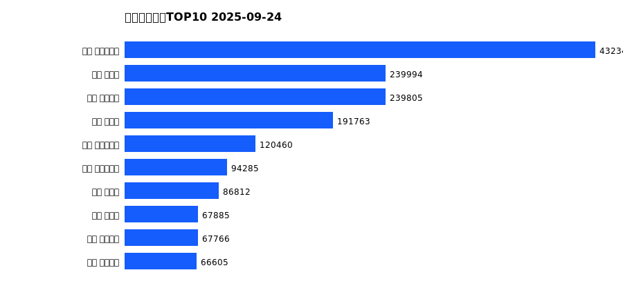

# 销售日报 2025-09-24

## 摘要

- 业态数: 10
- 门店数: 15
- 业态日销最大: 超市 5612
- 业态日销最小: 电影 3
- 门店日销最大: 许昌 时代广场店 2501
- 门店日销最小: 许昌 劳动店 69
- 同比: -
- 环比: -

## 集团合计

| period | sales_wan |
| --- | --- |
| daily | 9290.0 |
| monthly | 149697.0 |
| yearly | 1686554.0 |

## 业态 TOP10

### 日销

| rank | business_type | sales_wan |
| --- | --- | --- |
| 1 | 超市 | 5612.0 |
| 2 | 珠宝 | 1095.0 |
| 3 | 百货 | 683.0 |
| 4 | 电器 | 587.0 |
| 5 | 茶叶 | 516.0 |
| 6 | 服饰 | 498.0 |
| 7 | 医药 | 191.0 |
| 8 | 餐饮 | 102.0 |
| 9 | 电影 | 3.0 |
| 10 | 电玩 | 3.0 |

### 月度累计

| rank | business_type | sales_wan |
| --- | --- | --- |
| 1 | 超市 | 85697.0 |
| 2 | 珠宝 | 16819.0 |
| 3 | 百货 | 12729.0 |
| 4 | 电器 | 11504.0 |
| 5 | 服饰 | 8843.0 |
| 6 | 茶叶 | 8215.0 |
| 7 | 医药 | 3447.0 |
| 8 | 餐饮 | 2188.0 |
| 9 | 电玩 | 157.0 |
| 10 | 电影 | 98.0 |

### 年度累计

| rank | business_type | sales_wan |
| --- | --- | --- |
| 1 | 超市 | 926646.0 |
| 2 | 珠宝 | 175901.0 |
| 3 | 百货 | 166666.0 |
| 4 | 电器 | 157707.0 |
| 5 | 服饰 | 113772.0 |
| 6 | 茶叶 | 75369.0 |
| 7 | 医药 | 37696.0 |
| 8 | 餐饮 | 27810.0 |
| 9 | 电玩 | 3189.0 |
| 10 | 电影 | 1798.0 |

## 门店 TOP10

### 日销

| rank | store_name | sales_wan |
| --- | --- | --- |
| 1 | 许昌 时代广场店 | 2501.0 |
| 2 | 新乡 大胖店 | 1452.0 |
| 3 | 新乡 小胖店 | 1053.0 |
| 4 | 许昌 天使城店 | 978.0 |
| 5 | 许昌 实业公司店 | 720.0 |
| 6 | 许昌 线上商城 | 708.0 |
| 7 | 许昌 生活广场店 | 604.0 |
| 8 | 许昌 禹州店 | 405.0 |
| 9 | 许昌 金三角店 | 351.0 |
| 10 | 许昌 北海店 | 328.0 |

### 月度累计

| rank | store_name | sales_wan |
| --- | --- | --- |
| 1 | 许昌 时代广场店 | 38267.0 |
| 2 | 新乡 大胖店 | 20803.0 |
| 3 | 许昌 天使城店 | 20605.0 |
| 4 | 新乡 小胖店 | 16730.0 |
| 5 | 许昌 实业公司店 | 10702.0 |
| 6 | 许昌 线上商城 | 9816.0 |
| 7 | 许昌 生活广场店 | 9424.0 |
| 8 | 许昌 禹州店 | 7222.0 |
| 9 | 许昌 金三角店 | 6164.0 |
| 10 | 许昌 北海店 | 5817.0 |

### 年度累计

| rank | store_name | sales_wan |
| --- | --- | --- |
| 1 | 许昌 时代广场店 | 432342.0 |
| 2 | 新乡 大胖店 | 239994.0 |
| 3 | 许昌 天使城店 | 239805.0 |
| 4 | 新乡 小胖店 | 191763.0 |
| 5 | 许昌 生活广场店 | 120460.0 |
| 6 | 许昌 实业公司店 | 94285.0 |
| 7 | 许昌 禹州店 | 86812.0 |
| 8 | 许昌 北海店 | 67885.0 |
| 9 | 许昌 线上商城 | 67766.0 |
| 10 | 许昌 金三角店 | 66605.0 |

