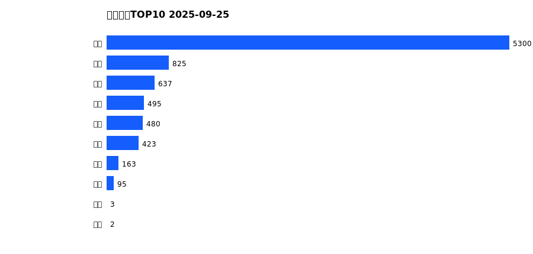
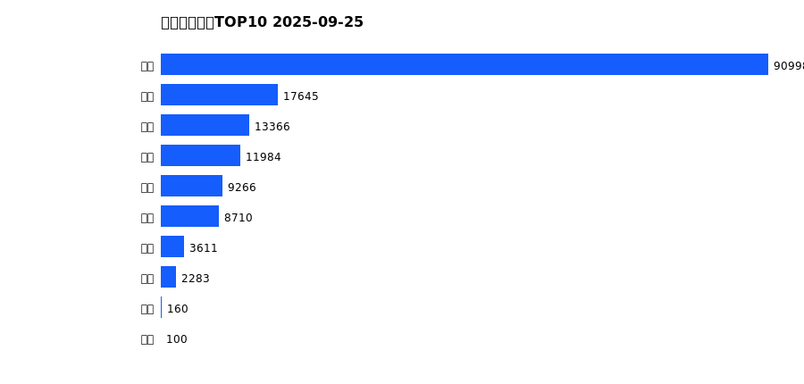
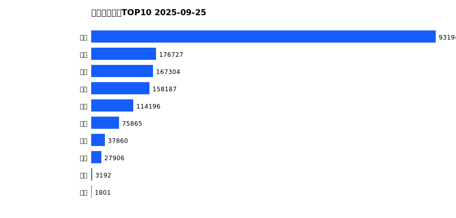
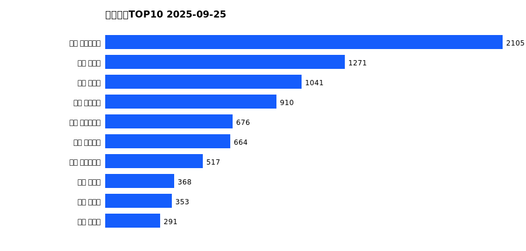
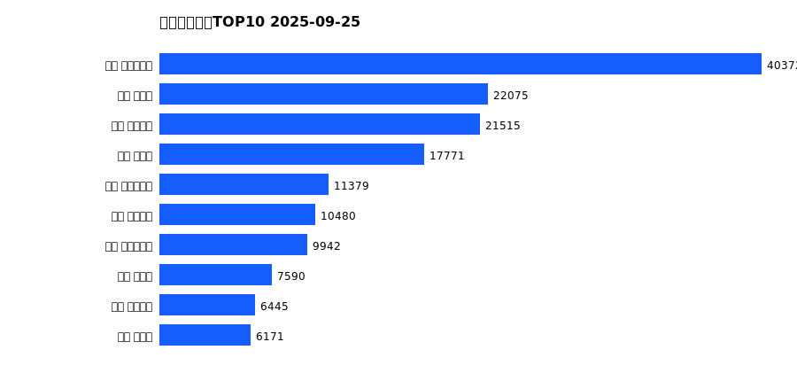
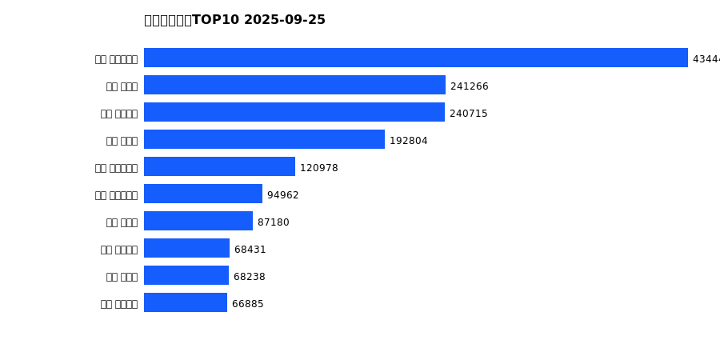

# 销售日报 2025-09-25

## 摘要

- 业态数: 10
- 门店数: 15
- 业态日销最大: 超市 5300
- 业态日销最小: 电影 2
- 门店日销最大: 许昌 时代广场店 2105
- 门店日销最小: 许昌 劳动店 65
- 同比: -
- 环比: -

## 集团合计

| period | sales_wan |
| --- | --- |
| daily | 8423.0 |
| monthly | 158123.0 |
| yearly | 1694985.0 |

## 业态 TOP10

### 日销

| rank | business_type | sales_wan |
| --- | --- | --- |
| 1 | 超市 | 5300.0 |
| 2 | 珠宝 | 825.0 |
| 3 | 百货 | 637.0 |
| 4 | 茶叶 | 495.0 |
| 5 | 电器 | 480.0 |
| 6 | 服饰 | 423.0 |
| 7 | 医药 | 163.0 |
| 8 | 餐饮 | 95.0 |
| 9 | 电玩 | 3.0 |
| 10 | 电影 | 2.0 |

### 月度累计

| rank | business_type | sales_wan |
| --- | --- | --- |
| 1 | 超市 | 90998.0 |
| 2 | 珠宝 | 17645.0 |
| 3 | 百货 | 13366.0 |
| 4 | 电器 | 11984.0 |
| 5 | 服饰 | 9266.0 |
| 6 | 茶叶 | 8710.0 |
| 7 | 医药 | 3611.0 |
| 8 | 餐饮 | 2283.0 |
| 9 | 电玩 | 160.0 |
| 10 | 电影 | 100.0 |

### 年度累计

| rank | business_type | sales_wan |
| --- | --- | --- |
| 1 | 超市 | 931947.0 |
| 2 | 珠宝 | 176727.0 |
| 3 | 百货 | 167304.0 |
| 4 | 电器 | 158187.0 |
| 5 | 服饰 | 114196.0 |
| 6 | 茶叶 | 75865.0 |
| 7 | 医药 | 37860.0 |
| 8 | 餐饮 | 27906.0 |
| 9 | 电玩 | 3192.0 |
| 10 | 电影 | 1801.0 |

## 门店 TOP10

### 日销

| rank | store_name | sales_wan |
| --- | --- | --- |
| 1 | 许昌 时代广场店 | 2105.0 |
| 2 | 新乡 大胖店 | 1271.0 |
| 3 | 新乡 小胖店 | 1041.0 |
| 4 | 许昌 天使城店 | 910.0 |
| 5 | 许昌 实业公司店 | 676.0 |
| 6 | 许昌 线上商城 | 664.0 |
| 7 | 许昌 生活广场店 | 517.0 |
| 8 | 许昌 禹州店 | 368.0 |
| 9 | 许昌 北海店 | 353.0 |
| 10 | 许昌 魏源店 | 291.0 |

### 月度累计

| rank | store_name | sales_wan |
| --- | --- | --- |
| 1 | 许昌 时代广场店 | 40372.0 |
| 2 | 新乡 大胖店 | 22075.0 |
| 3 | 许昌 天使城店 | 21515.0 |
| 4 | 新乡 小胖店 | 17771.0 |
| 5 | 许昌 实业公司店 | 11379.0 |
| 6 | 许昌 线上商城 | 10480.0 |
| 7 | 许昌 生活广场店 | 9942.0 |
| 8 | 许昌 禹州店 | 7590.0 |
| 9 | 许昌 金三角店 | 6445.0 |
| 10 | 许昌 北海店 | 6171.0 |

### 年度累计

| rank | store_name | sales_wan |
| --- | --- | --- |
| 1 | 许昌 时代广场店 | 434447.0 |
| 2 | 新乡 大胖店 | 241266.0 |
| 3 | 许昌 天使城店 | 240715.0 |
| 4 | 新乡 小胖店 | 192804.0 |
| 5 | 许昌 生活广场店 | 120978.0 |
| 6 | 许昌 实业公司店 | 94962.0 |
| 7 | 许昌 禹州店 | 87180.0 |
| 8 | 许昌 线上商城 | 68431.0 |
| 9 | 许昌 北海店 | 68238.0 |
| 10 | 许昌 金三角店 | 66885.0 |

