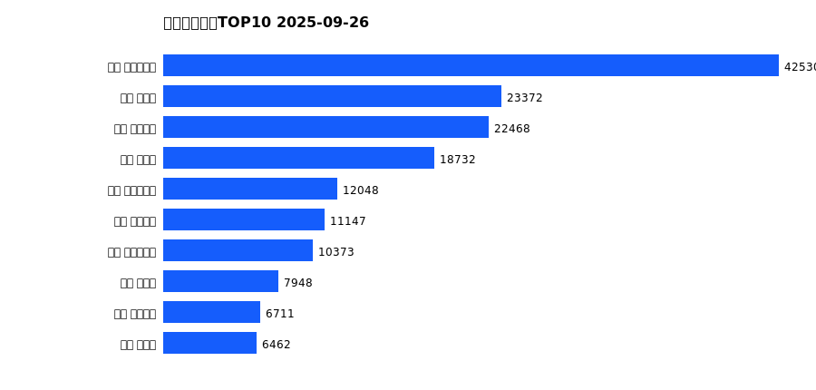

# 销售日报 2025-09-26

## 摘要

- 业态数: 10
- 门店数: 15
- 业态日销最大: 超市 5313
- 业态日销最小: 电影 3
- 门店日销最大: 许昌 时代广场店 2157
- 门店日销最小: 许昌 劳动店 59
- 同比: -
- 环比: -

## 集团合计

| period | sales_wan |
| --- | --- |
| daily | 8295.0 |
| monthly | 166424.0 |
| yearly | 1703286.0 |

## 业态 TOP10

### 日销

| rank | business_type | sales_wan |
| --- | --- | --- |
| 1 | 超市 | 5313.0 |
| 2 | 珠宝 | 719.0 |
| 3 | 电器 | 619.0 |
| 4 | 百货 | 591.0 |
| 5 | 茶叶 | 443.0 |
| 6 | 服饰 | 363.0 |
| 7 | 医药 | 143.0 |
| 8 | 餐饮 | 97.0 |
| 9 | 电玩 | 4.0 |
| 10 | 电影 | 3.0 |

### 月度累计

| rank | business_type | sales_wan |
| --- | --- | --- |
| 1 | 超市 | 96311.0 |
| 2 | 珠宝 | 18365.0 |
| 3 | 百货 | 13958.0 |
| 4 | 电器 | 12603.0 |
| 5 | 服饰 | 9629.0 |
| 6 | 茶叶 | 9154.0 |
| 7 | 医药 | 3755.0 |
| 8 | 餐饮 | 2381.0 |
| 9 | 电玩 | 164.0 |
| 10 | 电影 | 104.0 |

### 年度累计

| rank | business_type | sales_wan |
| --- | --- | --- |
| 1 | 超市 | 937261.0 |
| 2 | 珠宝 | 177447.0 |
| 3 | 百货 | 167895.0 |
| 4 | 电器 | 158807.0 |
| 5 | 服饰 | 114559.0 |
| 6 | 茶叶 | 76309.0 |
| 7 | 医药 | 38004.0 |
| 8 | 餐饮 | 28003.0 |
| 9 | 电玩 | 3196.0 |
| 10 | 电影 | 1805.0 |

## 门店 TOP10

### 日销

| rank | store_name | sales_wan |
| --- | --- | --- |
| 1 | 许昌 时代广场店 | 2157.0 |
| 2 | 新乡 大胖店 | 1297.0 |
| 3 | 新乡 小胖店 | 960.0 |
| 4 | 许昌 天使城店 | 953.0 |
| 5 | 许昌 实业公司店 | 669.0 |
| 6 | 许昌 线上商城 | 667.0 |
| 7 | 许昌 生活广场店 | 430.0 |
| 8 | 许昌 禹州店 | 357.0 |
| 9 | 许昌 北海店 | 291.0 |
| 10 | 许昌 金三角店 | 265.0 |

### 月度累计

| rank | store_name | sales_wan |
| --- | --- | --- |
| 1 | 许昌 时代广场店 | 42530.0 |
| 2 | 新乡 大胖店 | 23372.0 |
| 3 | 许昌 天使城店 | 22468.0 |
| 4 | 新乡 小胖店 | 18732.0 |
| 5 | 许昌 实业公司店 | 12048.0 |
| 6 | 许昌 线上商城 | 11147.0 |
| 7 | 许昌 生活广场店 | 10373.0 |
| 8 | 许昌 禹州店 | 7948.0 |
| 9 | 许昌 金三角店 | 6711.0 |
| 10 | 许昌 北海店 | 6462.0 |

### 年度累计

| rank | store_name | sales_wan |
| --- | --- | --- |
| 1 | 许昌 时代广场店 | 436604.0 |
| 2 | 新乡 大胖店 | 242564.0 |
| 3 | 许昌 天使城店 | 241669.0 |
| 4 | 新乡 小胖店 | 193764.0 |
| 5 | 许昌 生活广场店 | 121409.0 |
| 6 | 许昌 实业公司店 | 95631.0 |
| 7 | 许昌 禹州店 | 87538.0 |
| 8 | 许昌 线上商城 | 69098.0 |
| 9 | 许昌 北海店 | 68530.0 |
| 10 | 许昌 金三角店 | 67151.0 |

