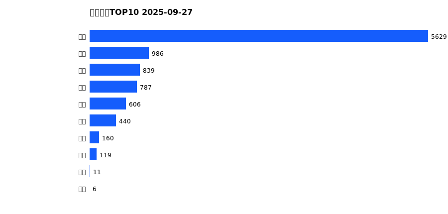
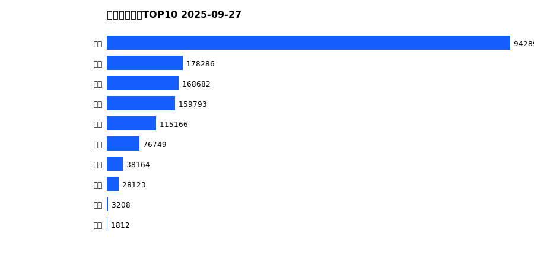
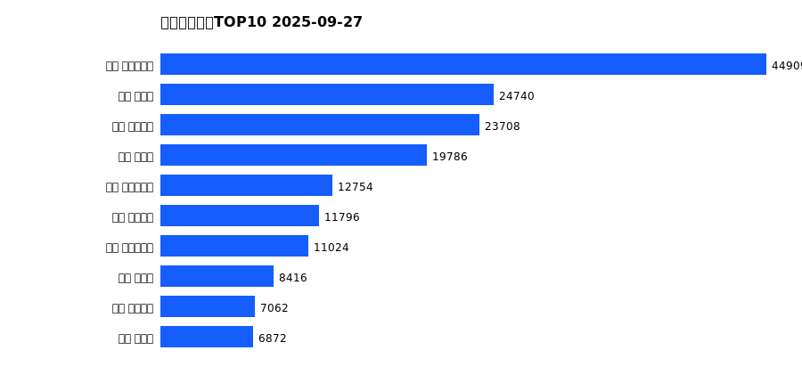
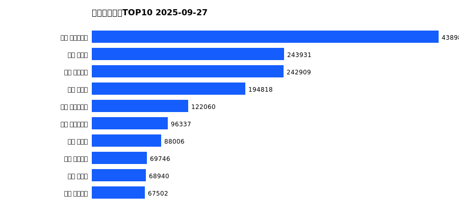

# 销售日报 2025-09-27

## 摘要

- 业态数: 10
- 门店数: 15
- 业态日销最大: 超市 5629
- 业态日销最小: 电影 6
- 门店日销最大: 许昌 时代广场店 2379
- 门店日销最小: 许昌 劳动店 65
- 同比: -
- 环比: -

## 集团合计

| period | sales_wan |
| --- | --- |
| daily | 9583.0 |
| monthly | 176013.0 |
| yearly | 1712873.0 |

## 业态 TOP10

### 日销

| rank | business_type | sales_wan |
| --- | --- | --- |
| 1 | 超市 | 5629.0 |
| 2 | 电器 | 986.0 |
| 3 | 珠宝 | 839.0 |
| 4 | 百货 | 787.0 |
| 5 | 服饰 | 606.0 |
| 6 | 茶叶 | 440.0 |
| 7 | 医药 | 160.0 |
| 8 | 餐饮 | 119.0 |
| 9 | 电玩 | 11.0 |
| 10 | 电影 | 6.0 |

### 月度累计

| rank | business_type | sales_wan |
| --- | --- | --- |
| 1 | 超市 | 101941.0 |
| 2 | 珠宝 | 19204.0 |
| 3 | 百货 | 14745.0 |
| 4 | 电器 | 13590.0 |
| 5 | 服饰 | 10236.0 |
| 6 | 茶叶 | 9595.0 |
| 7 | 医药 | 3916.0 |
| 8 | 餐饮 | 2500.0 |
| 9 | 电玩 | 175.0 |
| 10 | 电影 | 111.0 |

### 年度累计

| rank | business_type | sales_wan |
| --- | --- | --- |
| 1 | 超市 | 942890.0 |
| 2 | 珠宝 | 178286.0 |
| 3 | 百货 | 168682.0 |
| 4 | 电器 | 159793.0 |
| 5 | 服饰 | 115166.0 |
| 6 | 茶叶 | 76749.0 |
| 7 | 医药 | 38164.0 |
| 8 | 餐饮 | 28123.0 |
| 9 | 电玩 | 3208.0 |
| 10 | 电影 | 1812.0 |

## 门店 TOP10

### 日销

| rank | store_name | sales_wan |
| --- | --- | --- |
| 1 | 许昌 时代广场店 | 2379.0 |
| 2 | 新乡 大胖店 | 1367.0 |
| 3 | 许昌 天使城店 | 1240.0 |
| 4 | 新乡 小胖店 | 1054.0 |
| 5 | 许昌 实业公司店 | 705.0 |
| 6 | 许昌 生活广场店 | 651.0 |
| 7 | 许昌 线上商城 | 648.0 |
| 8 | 许昌 禹州店 | 468.0 |
| 9 | 许昌 北海店 | 410.0 |
| 10 | 许昌 金三角店 | 351.0 |

### 月度累计

| rank | store_name | sales_wan |
| --- | --- | --- |
| 1 | 许昌 时代广场店 | 44909.0 |
| 2 | 新乡 大胖店 | 24740.0 |
| 3 | 许昌 天使城店 | 23708.0 |
| 4 | 新乡 小胖店 | 19786.0 |
| 5 | 许昌 实业公司店 | 12754.0 |
| 6 | 许昌 线上商城 | 11796.0 |
| 7 | 许昌 生活广场店 | 11024.0 |
| 8 | 许昌 禹州店 | 8416.0 |
| 9 | 许昌 金三角店 | 7062.0 |
| 10 | 许昌 北海店 | 6872.0 |

### 年度累计

| rank | store_name | sales_wan |
| --- | --- | --- |
| 1 | 许昌 时代广场店 | 438984.0 |
| 2 | 新乡 大胖店 | 243931.0 |
| 3 | 许昌 天使城店 | 242909.0 |
| 4 | 新乡 小胖店 | 194818.0 |
| 5 | 许昌 生活广场店 | 122060.0 |
| 6 | 许昌 实业公司店 | 96337.0 |
| 7 | 许昌 禹州店 | 88006.0 |
| 8 | 许昌 线上商城 | 69746.0 |
| 9 | 许昌 北海店 | 68940.0 |
| 10 | 许昌 金三角店 | 67502.0 |

