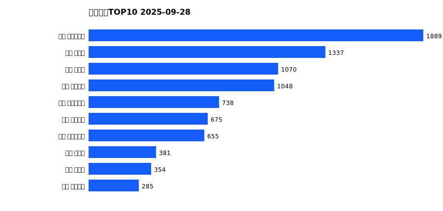

# 销售日报 2025-09-28

## 摘要

- 业态数: 10
- 门店数: 15
- 业态日销最大: 超市 5500
- 业态日销最小: 电影 3
- 门店日销最大: 许昌 时代广场店 1889
- 门店日销最小: 许昌 劳动店 52
- 同比: -
- 环比: -

## 集团合计

| period | sales_wan |
| --- | --- |
| daily | 8700.0 |
| monthly | 184717.0 |
| yearly | 1721577.0 |

## 业态 TOP10

### 日销

| rank | business_type | sales_wan |
| --- | --- | --- |
| 1 | 超市 | 5500.0 |
| 2 | 珠宝 | 788.0 |
| 3 | 百货 | 746.0 |
| 4 | 电器 | 528.0 |
| 5 | 服饰 | 463.0 |
| 6 | 茶叶 | 406.0 |
| 7 | 医药 | 162.0 |
| 8 | 餐饮 | 100.0 |
| 9 | 电玩 | 4.0 |
| 10 | 电影 | 3.0 |

### 月度累计

| rank | business_type | sales_wan |
| --- | --- | --- |
| 1 | 超市 | 107441.0 |
| 2 | 珠宝 | 19992.0 |
| 3 | 百货 | 15491.0 |
| 4 | 电器 | 14118.0 |
| 5 | 服饰 | 10700.0 |
| 6 | 茶叶 | 10001.0 |
| 7 | 医药 | 4078.0 |
| 8 | 餐饮 | 2601.0 |
| 9 | 电玩 | 180.0 |
| 10 | 电影 | 115.0 |

### 年度累计

| rank | business_type | sales_wan |
| --- | --- | --- |
| 1 | 超市 | 948390.0 |
| 2 | 珠宝 | 179074.0 |
| 3 | 百货 | 169429.0 |
| 4 | 电器 | 160321.0 |
| 5 | 服饰 | 115629.0 |
| 6 | 茶叶 | 77156.0 |
| 7 | 医药 | 38327.0 |
| 8 | 餐饮 | 28223.0 |
| 9 | 电玩 | 3212.0 |
| 10 | 电影 | 1816.0 |

## 门店 TOP10

### 日销

| rank | store_name | sales_wan |
| --- | --- | --- |
| 1 | 许昌 时代广场店 | 1889.0 |
| 2 | 新乡 大胖店 | 1337.0 |
| 3 | 新乡 小胖店 | 1070.0 |
| 4 | 许昌 天使城店 | 1048.0 |
| 5 | 许昌 生活广场店 | 738.0 |
| 6 | 许昌 线上商城 | 675.0 |
| 7 | 许昌 实业公司店 | 655.0 |
| 8 | 许昌 禹州店 | 381.0 |
| 9 | 许昌 北海店 | 354.0 |
| 10 | 许昌 金三角店 | 285.0 |

### 月度累计

| rank | store_name | sales_wan |
| --- | --- | --- |
| 1 | 许昌 时代广场店 | 46799.0 |
| 2 | 新乡 大胖店 | 26078.0 |
| 3 | 许昌 天使城店 | 24757.0 |
| 4 | 新乡 小胖店 | 20856.0 |
| 5 | 许昌 实业公司店 | 13410.0 |
| 6 | 许昌 线上商城 | 12471.0 |
| 7 | 许昌 生活广场店 | 11762.0 |
| 8 | 许昌 禹州店 | 8798.0 |
| 9 | 许昌 金三角店 | 7347.0 |
| 10 | 许昌 北海店 | 7226.0 |

### 年度累计

| rank | store_name | sales_wan |
| --- | --- | --- |
| 1 | 许昌 时代广场店 | 440874.0 |
| 2 | 新乡 大胖店 | 245269.0 |
| 3 | 许昌 天使城店 | 243958.0 |
| 4 | 新乡 小胖店 | 195889.0 |
| 5 | 许昌 生活广场店 | 122798.0 |
| 6 | 许昌 实业公司店 | 96992.0 |
| 7 | 许昌 禹州店 | 88388.0 |
| 8 | 许昌 线上商城 | 70421.0 |
| 9 | 许昌 北海店 | 69294.0 |
| 10 | 许昌 金三角店 | 67787.0 |

