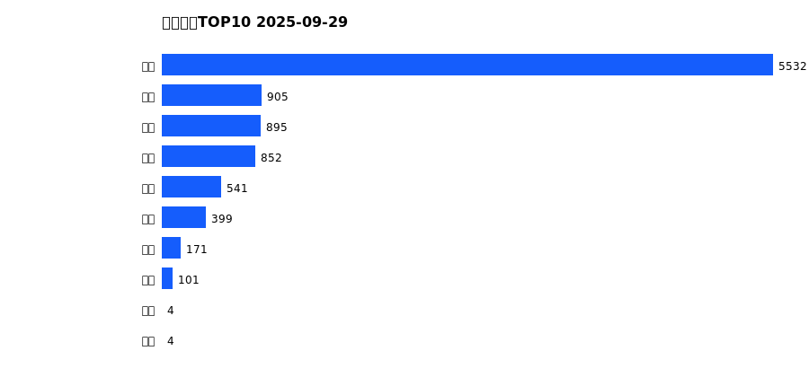
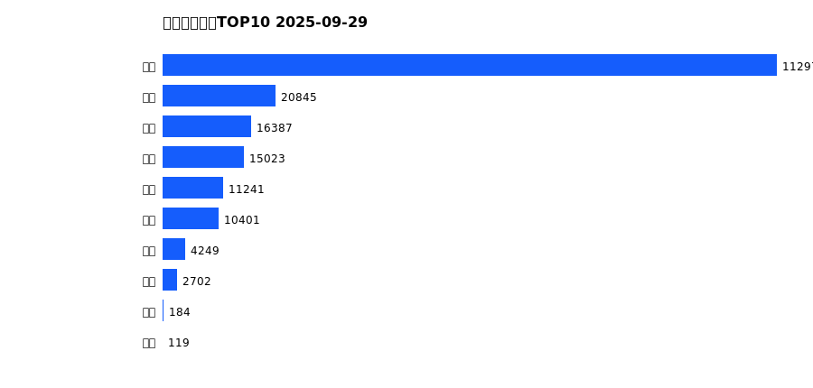
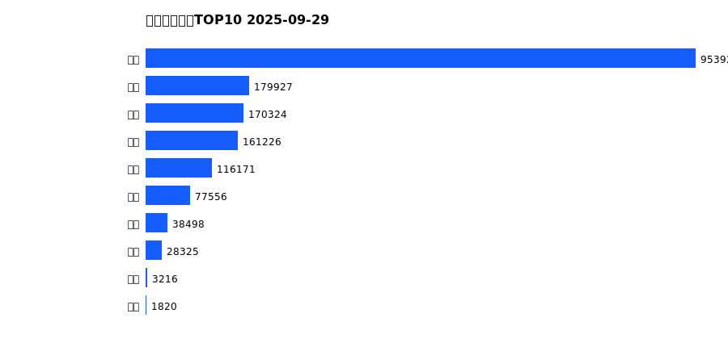
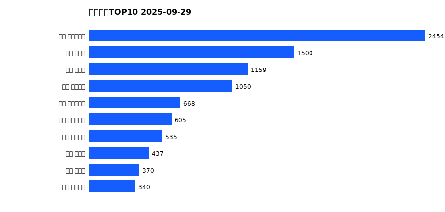
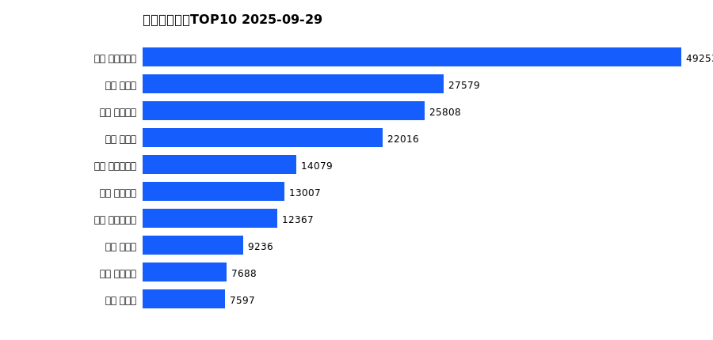
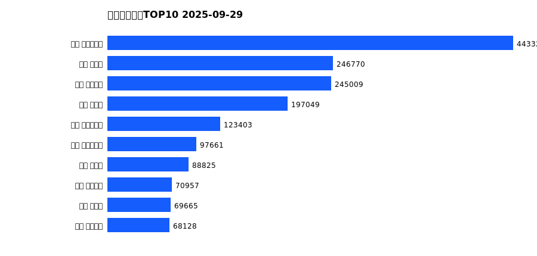

# 销售日报 2025-09-29

## 摘要

- 业态数: 10
- 门店数: 15
- 业态日销最大: 超市 5532
- 业态日销最小: 电影 4
- 门店日销最大: 许昌 时代广场店 2454
- 门店日销最小: 许昌 劳动店 71
- 同比: -
- 环比: -

## 集团合计

| period | sales_wan |
| --- | --- |
| daily | 9404.0 |
| monthly | 194124.0 |
| yearly | 1730985.0 |

## 业态 TOP10

### 日销

| rank | business_type | sales_wan |
| --- | --- | --- |
| 1 | 超市 | 5532.0 |
| 2 | 电器 | 905.0 |
| 3 | 百货 | 895.0 |
| 4 | 珠宝 | 852.0 |
| 5 | 服饰 | 541.0 |
| 6 | 茶叶 | 399.0 |
| 7 | 医药 | 171.0 |
| 8 | 餐饮 | 101.0 |
| 9 | 电影 | 4.0 |
| 10 | 电玩 | 4.0 |

### 月度累计

| rank | business_type | sales_wan |
| --- | --- | --- |
| 1 | 超市 | 112973.0 |
| 2 | 珠宝 | 20845.0 |
| 3 | 百货 | 16387.0 |
| 4 | 电器 | 15023.0 |
| 5 | 服饰 | 11241.0 |
| 6 | 茶叶 | 10401.0 |
| 7 | 医药 | 4249.0 |
| 8 | 餐饮 | 2702.0 |
| 9 | 电玩 | 184.0 |
| 10 | 电影 | 119.0 |

### 年度累计

| rank | business_type | sales_wan |
| --- | --- | --- |
| 1 | 超市 | 953922.0 |
| 2 | 珠宝 | 179927.0 |
| 3 | 百货 | 170324.0 |
| 4 | 电器 | 161226.0 |
| 5 | 服饰 | 116171.0 |
| 6 | 茶叶 | 77556.0 |
| 7 | 医药 | 38498.0 |
| 8 | 餐饮 | 28325.0 |
| 9 | 电玩 | 3216.0 |
| 10 | 电影 | 1820.0 |

## 门店 TOP10

### 日销

| rank | store_name | sales_wan |
| --- | --- | --- |
| 1 | 许昌 时代广场店 | 2454.0 |
| 2 | 新乡 大胖店 | 1500.0 |
| 3 | 新乡 小胖店 | 1159.0 |
| 4 | 许昌 天使城店 | 1050.0 |
| 5 | 许昌 实业公司店 | 668.0 |
| 6 | 许昌 生活广场店 | 605.0 |
| 7 | 许昌 线上商城 | 535.0 |
| 8 | 许昌 禹州店 | 437.0 |
| 9 | 许昌 北海店 | 370.0 |
| 10 | 许昌 金三角店 | 340.0 |

### 月度累计

| rank | store_name | sales_wan |
| --- | --- | --- |
| 1 | 许昌 时代广场店 | 49253.0 |
| 2 | 新乡 大胖店 | 27579.0 |
| 3 | 许昌 天使城店 | 25808.0 |
| 4 | 新乡 小胖店 | 22016.0 |
| 5 | 许昌 实业公司店 | 14079.0 |
| 6 | 许昌 线上商城 | 13007.0 |
| 7 | 许昌 生活广场店 | 12367.0 |
| 8 | 许昌 禹州店 | 9236.0 |
| 9 | 许昌 金三角店 | 7688.0 |
| 10 | 许昌 北海店 | 7597.0 |

### 年度累计

| rank | store_name | sales_wan |
| --- | --- | --- |
| 1 | 许昌 时代广场店 | 443328.0 |
| 2 | 新乡 大胖店 | 246770.0 |
| 3 | 许昌 天使城店 | 245009.0 |
| 4 | 新乡 小胖店 | 197049.0 |
| 5 | 许昌 生活广场店 | 123403.0 |
| 6 | 许昌 实业公司店 | 97661.0 |
| 7 | 许昌 禹州店 | 88825.0 |
| 8 | 许昌 线上商城 | 70957.0 |
| 9 | 许昌 北海店 | 69665.0 |
| 10 | 许昌 金三角店 | 68128.0 |

