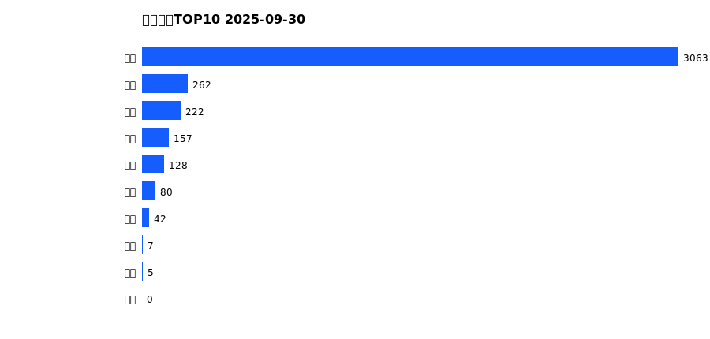
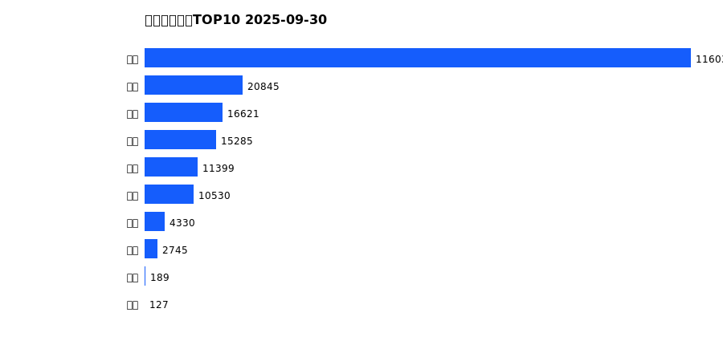
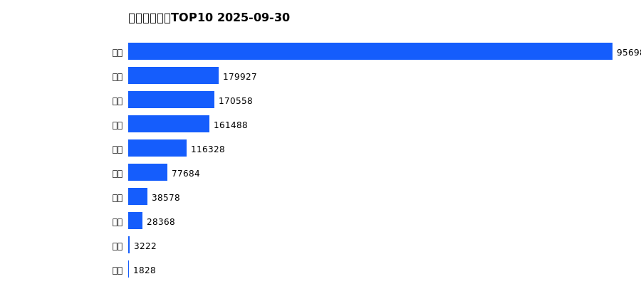
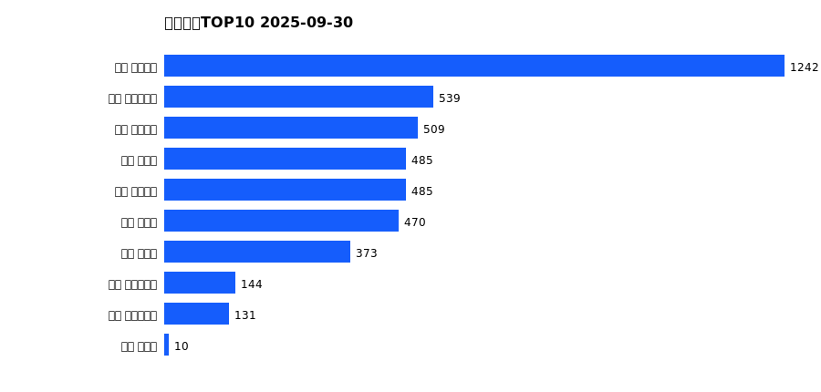
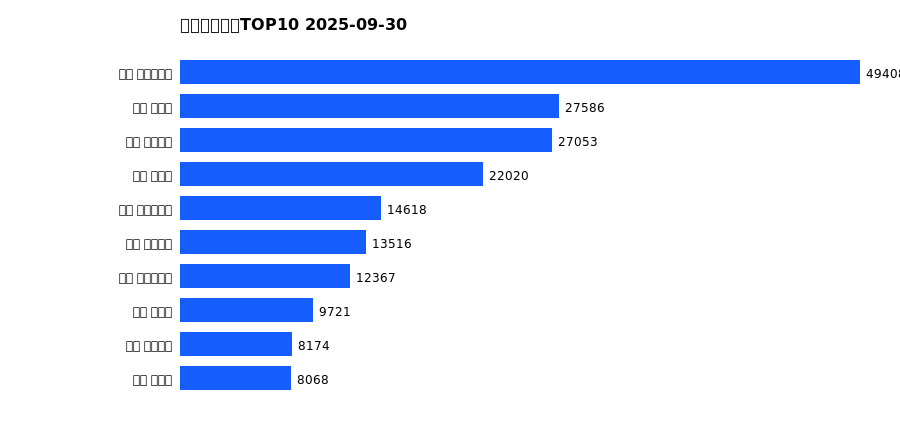
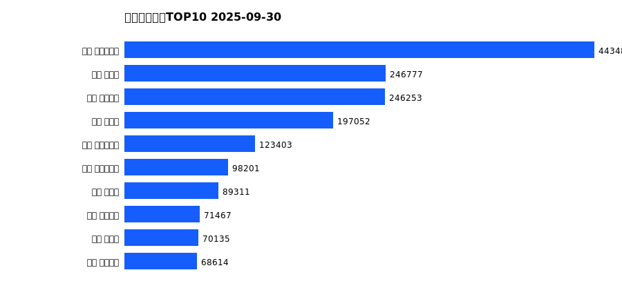

# 销售日报 2025-09-30

## 摘要

- 业态数: 10
- 门店数: 15
- 业态日销最大: 超市 3063
- 业态日销最小: 珠宝 0
- 门店日销最大: 许昌 天使城店 1242
- 门店日销最小: 许昌 生活广场店 -1
- 同比: -
- 环比: -

## 集团合计

| period | sales_wan |
| --- | --- |
| daily | 3966.0 |
| monthly | 198108.0 |
| yearly | 1734967.0 |

## 业态 TOP10

### 日销

| rank | business_type | sales_wan |
| --- | --- | --- |
| 1 | 超市 | 3063.0 |
| 2 | 电器 | 262.0 |
| 3 | 百货 | 222.0 |
| 4 | 服饰 | 157.0 |
| 5 | 茶叶 | 128.0 |
| 6 | 医药 | 80.0 |
| 7 | 餐饮 | 42.0 |
| 8 | 电影 | 7.0 |
| 9 | 电玩 | 5.0 |
| 10 | 珠宝 | 0.0 |

### 月度累计

| rank | business_type | sales_wan |
| --- | --- | --- |
| 1 | 超市 | 116037.0 |
| 2 | 珠宝 | 20845.0 |
| 3 | 百货 | 16621.0 |
| 4 | 电器 | 15285.0 |
| 5 | 服饰 | 11399.0 |
| 6 | 茶叶 | 10530.0 |
| 7 | 医药 | 4330.0 |
| 8 | 餐饮 | 2745.0 |
| 9 | 电玩 | 189.0 |
| 10 | 电影 | 127.0 |

### 年度累计

| rank | business_type | sales_wan |
| --- | --- | --- |
| 1 | 超市 | 956986.0 |
| 2 | 珠宝 | 179927.0 |
| 3 | 百货 | 170558.0 |
| 4 | 电器 | 161488.0 |
| 5 | 服饰 | 116328.0 |
| 6 | 茶叶 | 77684.0 |
| 7 | 医药 | 38578.0 |
| 8 | 餐饮 | 28368.0 |
| 9 | 电玩 | 3222.0 |
| 10 | 电影 | 1828.0 |

## 门店 TOP10

### 日销

| rank | store_name | sales_wan |
| --- | --- | --- |
| 1 | 许昌 天使城店 | 1242.0 |
| 2 | 许昌 实业公司店 | 539.0 |
| 3 | 许昌 线上商城 | 509.0 |
| 4 | 许昌 禹州店 | 485.0 |
| 5 | 许昌 金三角店 | 485.0 |
| 6 | 许昌 北海店 | 470.0 |
| 7 | 许昌 金汇店 | 373.0 |
| 8 | 许昌 时代广场店 | 144.0 |
| 9 | 许昌 大众服饰店 | 131.0 |
| 10 | 许昌 魏源店 | 10.0 |

### 月度累计

| rank | store_name | sales_wan |
| --- | --- | --- |
| 1 | 许昌 时代广场店 | 49408.0 |
| 2 | 新乡 大胖店 | 27586.0 |
| 3 | 许昌 天使城店 | 27053.0 |
| 4 | 新乡 小胖店 | 22020.0 |
| 5 | 许昌 实业公司店 | 14618.0 |
| 6 | 许昌 线上商城 | 13516.0 |
| 7 | 许昌 生活广场店 | 12367.0 |
| 8 | 许昌 禹州店 | 9721.0 |
| 9 | 许昌 金三角店 | 8174.0 |
| 10 | 许昌 北海店 | 8068.0 |

### 年度累计

| rank | store_name | sales_wan |
| --- | --- | --- |
| 1 | 许昌 时代广场店 | 443483.0 |
| 2 | 新乡 大胖店 | 246777.0 |
| 3 | 许昌 天使城店 | 246253.0 |
| 4 | 新乡 小胖店 | 197052.0 |
| 5 | 许昌 生活广场店 | 123403.0 |
| 6 | 许昌 实业公司店 | 98201.0 |
| 7 | 许昌 禹州店 | 89311.0 |
| 8 | 许昌 线上商城 | 71467.0 |
| 9 | 许昌 北海店 | 70135.0 |
| 10 | 许昌 金三角店 | 68614.0 |

