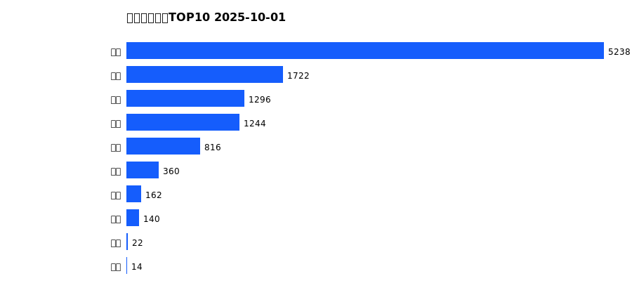
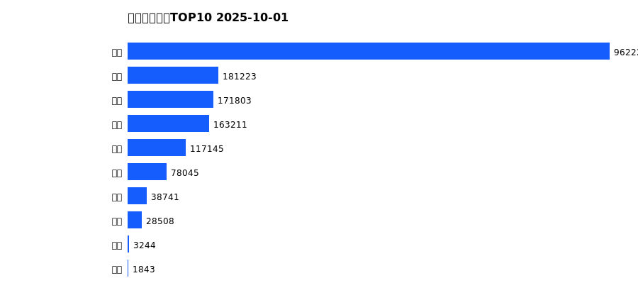
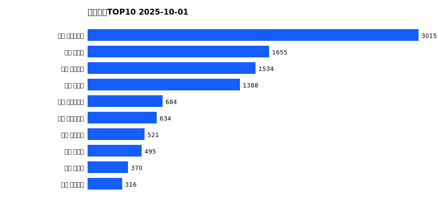
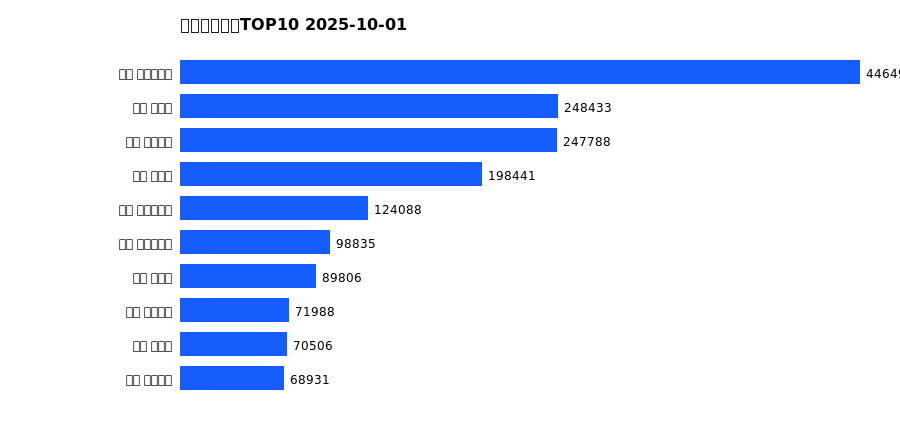

# 销售日报 2025-10-01

## 摘要

- 业态数: 10
- 门店数: 15
- 业态日销最大: 超市 5238
- 业态日销最小: 电影 14
- 门店日销最大: 许昌 时代广场店 3015
- 门店日销最小: 许昌 劳动店 63
- 同比: -
- 环比: -

## 集团合计

| period | sales_wan |
| --- | --- |
| daily | 11014.0 |
| monthly | 11014.0 |
| yearly | 1745987.0 |

## 业态 TOP10

### 日销

| rank | business_type | sales_wan |
| --- | --- | --- |
| 1 | 超市 | 5238.0 |
| 2 | 电器 | 1722.0 |
| 3 | 珠宝 | 1296.0 |
| 4 | 百货 | 1244.0 |
| 5 | 服饰 | 816.0 |
| 6 | 茶叶 | 360.0 |
| 7 | 医药 | 162.0 |
| 8 | 餐饮 | 140.0 |
| 9 | 电玩 | 22.0 |
| 10 | 电影 | 14.0 |

### 月度累计

| rank | business_type | sales_wan |
| --- | --- | --- |
| 1 | 超市 | 5238.0 |
| 2 | 电器 | 1722.0 |
| 3 | 珠宝 | 1296.0 |
| 4 | 百货 | 1244.0 |
| 5 | 服饰 | 816.0 |
| 6 | 茶叶 | 360.0 |
| 7 | 医药 | 162.0 |
| 8 | 餐饮 | 140.0 |
| 9 | 电玩 | 22.0 |
| 10 | 电影 | 14.0 |

### 年度累计

| rank | business_type | sales_wan |
| --- | --- | --- |
| 1 | 超市 | 962224.0 |
| 2 | 珠宝 | 181223.0 |
| 3 | 百货 | 171803.0 |
| 4 | 电器 | 163211.0 |
| 5 | 服饰 | 117145.0 |
| 6 | 茶叶 | 78045.0 |
| 7 | 医药 | 38741.0 |
| 8 | 餐饮 | 28508.0 |
| 9 | 电玩 | 3244.0 |
| 10 | 电影 | 1843.0 |

## 门店 TOP10

### 日销

| rank | store_name | sales_wan |
| --- | --- | --- |
| 1 | 许昌 时代广场店 | 3015.0 |
| 2 | 新乡 大胖店 | 1655.0 |
| 3 | 许昌 天使城店 | 1534.0 |
| 4 | 新乡 小胖店 | 1388.0 |
| 5 | 许昌 生活广场店 | 684.0 |
| 6 | 许昌 实业公司店 | 634.0 |
| 7 | 许昌 线上商城 | 521.0 |
| 8 | 许昌 禹州店 | 495.0 |
| 9 | 许昌 北海店 | 370.0 |
| 10 | 许昌 金三角店 | 316.0 |

### 月度累计

| rank | store_name | sales_wan |
| --- | --- | --- |
| 1 | 许昌 时代广场店 | 3015.0 |
| 2 | 新乡 大胖店 | 1655.0 |
| 3 | 许昌 天使城店 | 1534.0 |
| 4 | 新乡 小胖店 | 1388.0 |
| 5 | 许昌 生活广场店 | 684.0 |
| 6 | 许昌 实业公司店 | 634.0 |
| 7 | 许昌 线上商城 | 521.0 |
| 8 | 许昌 禹州店 | 495.0 |
| 9 | 许昌 北海店 | 370.0 |
| 10 | 许昌 金三角店 | 316.0 |

### 年度累计

| rank | store_name | sales_wan |
| --- | --- | --- |
| 1 | 许昌 时代广场店 | 446499.0 |
| 2 | 新乡 大胖店 | 248433.0 |
| 3 | 许昌 天使城店 | 247788.0 |
| 4 | 新乡 小胖店 | 198441.0 |
| 5 | 许昌 生活广场店 | 124088.0 |
| 6 | 许昌 实业公司店 | 98835.0 |
| 7 | 许昌 禹州店 | 89806.0 |
| 8 | 许昌 线上商城 | 71988.0 |
| 9 | 许昌 北海店 | 70506.0 |
| 10 | 许昌 金三角店 | 68931.0 |

