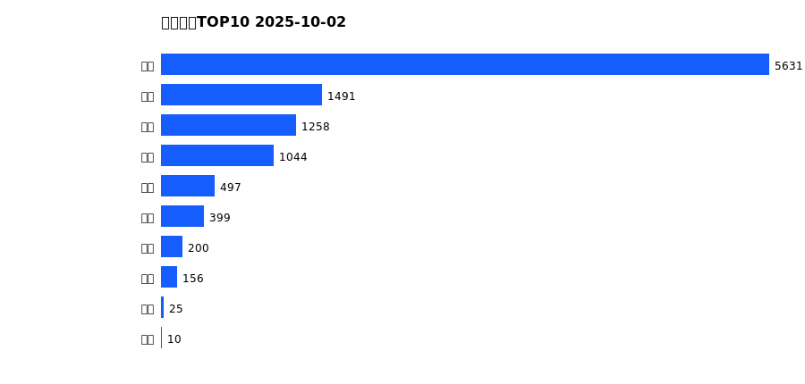
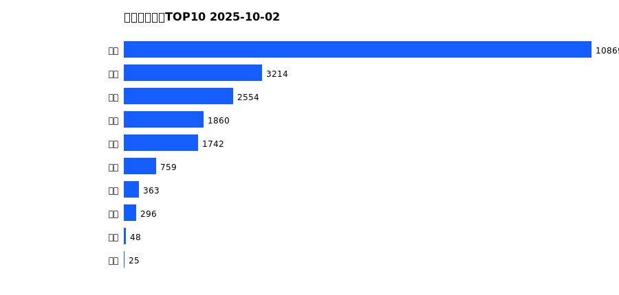
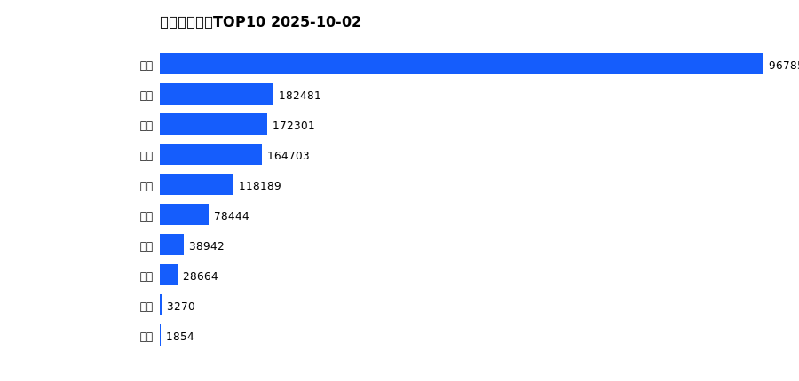
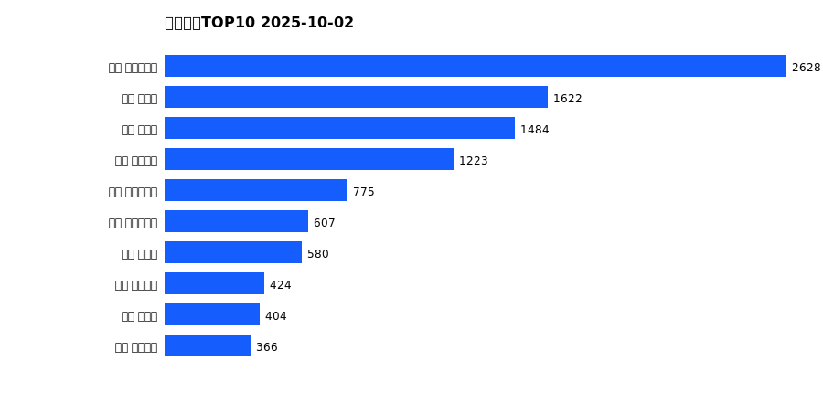
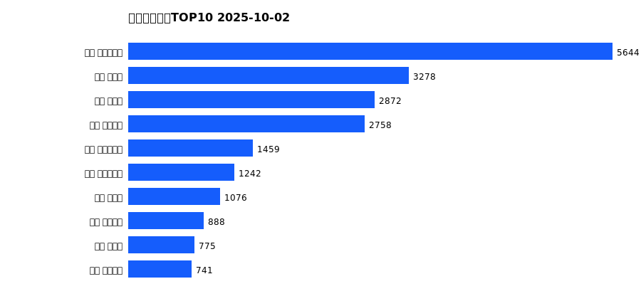
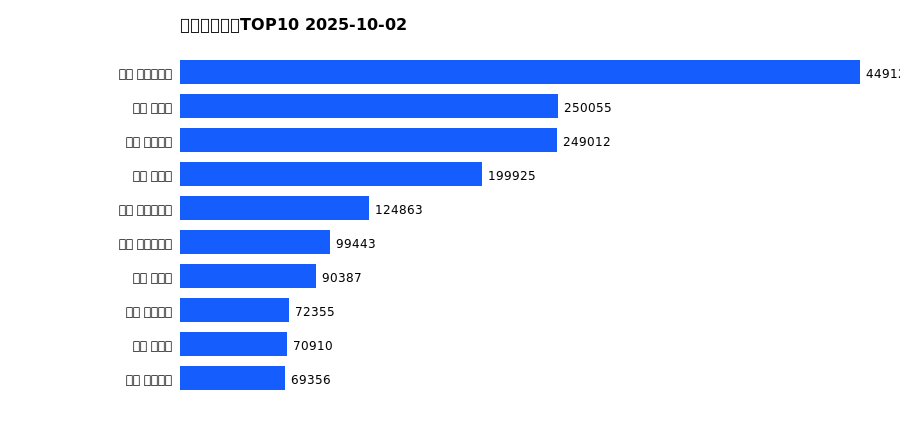

# 销售日报 2025-10-02

## 摘要

- 业态数: 10
- 门店数: 15
- 业态日销最大: 超市 5631
- 业态日销最小: 电影 10
- 门店日销最大: 许昌 时代广场店 2628
- 门店日销最小: 许昌 劳动店 69
- 同比: -
- 环比: -

## 集团合计

| period | sales_wan |
| --- | --- |
| daily | 10711.0 |
| monthly | 21730.0 |
| yearly | 1756703.0 |

## 业态 TOP10

### 日销

| rank | business_type | sales_wan |
| --- | --- | --- |
| 1 | 超市 | 5631.0 |
| 2 | 电器 | 1491.0 |
| 3 | 珠宝 | 1258.0 |
| 4 | 服饰 | 1044.0 |
| 5 | 百货 | 497.0 |
| 6 | 茶叶 | 399.0 |
| 7 | 医药 | 200.0 |
| 8 | 餐饮 | 156.0 |
| 9 | 电玩 | 25.0 |
| 10 | 电影 | 10.0 |

### 月度累计

| rank | business_type | sales_wan |
| --- | --- | --- |
| 1 | 超市 | 10869.0 |
| 2 | 电器 | 3214.0 |
| 3 | 珠宝 | 2554.0 |
| 4 | 服饰 | 1860.0 |
| 5 | 百货 | 1742.0 |
| 6 | 茶叶 | 759.0 |
| 7 | 医药 | 363.0 |
| 8 | 餐饮 | 296.0 |
| 9 | 电玩 | 48.0 |
| 10 | 电影 | 25.0 |

### 年度累计

| rank | business_type | sales_wan |
| --- | --- | --- |
| 1 | 超市 | 967855.0 |
| 2 | 珠宝 | 182481.0 |
| 3 | 百货 | 172301.0 |
| 4 | 电器 | 164703.0 |
| 5 | 服饰 | 118189.0 |
| 6 | 茶叶 | 78444.0 |
| 7 | 医药 | 38942.0 |
| 8 | 餐饮 | 28664.0 |
| 9 | 电玩 | 3270.0 |
| 10 | 电影 | 1854.0 |

## 门店 TOP10

### 日销

| rank | store_name | sales_wan |
| --- | --- | --- |
| 1 | 许昌 时代广场店 | 2628.0 |
| 2 | 新乡 大胖店 | 1622.0 |
| 3 | 新乡 小胖店 | 1484.0 |
| 4 | 许昌 天使城店 | 1223.0 |
| 5 | 许昌 生活广场店 | 775.0 |
| 6 | 许昌 实业公司店 | 607.0 |
| 7 | 许昌 禹州店 | 580.0 |
| 8 | 许昌 金三角店 | 424.0 |
| 9 | 许昌 北海店 | 404.0 |
| 10 | 许昌 线上商城 | 366.0 |

### 月度累计

| rank | store_name | sales_wan |
| --- | --- | --- |
| 1 | 许昌 时代广场店 | 5644.0 |
| 2 | 新乡 大胖店 | 3278.0 |
| 3 | 新乡 小胖店 | 2872.0 |
| 4 | 许昌 天使城店 | 2758.0 |
| 5 | 许昌 生活广场店 | 1459.0 |
| 6 | 许昌 实业公司店 | 1242.0 |
| 7 | 许昌 禹州店 | 1076.0 |
| 8 | 许昌 线上商城 | 888.0 |
| 9 | 许昌 北海店 | 775.0 |
| 10 | 许昌 金三角店 | 741.0 |

### 年度累计

| rank | store_name | sales_wan |
| --- | --- | --- |
| 1 | 许昌 时代广场店 | 449128.0 |
| 2 | 新乡 大胖店 | 250055.0 |
| 3 | 许昌 天使城店 | 249012.0 |
| 4 | 新乡 小胖店 | 199925.0 |
| 5 | 许昌 生活广场店 | 124863.0 |
| 6 | 许昌 实业公司店 | 99443.0 |
| 7 | 许昌 禹州店 | 90387.0 |
| 8 | 许昌 线上商城 | 72355.0 |
| 9 | 许昌 北海店 | 70910.0 |
| 10 | 许昌 金三角店 | 69356.0 |

