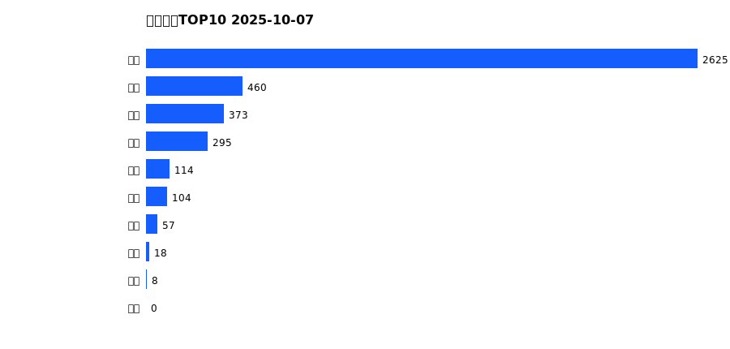
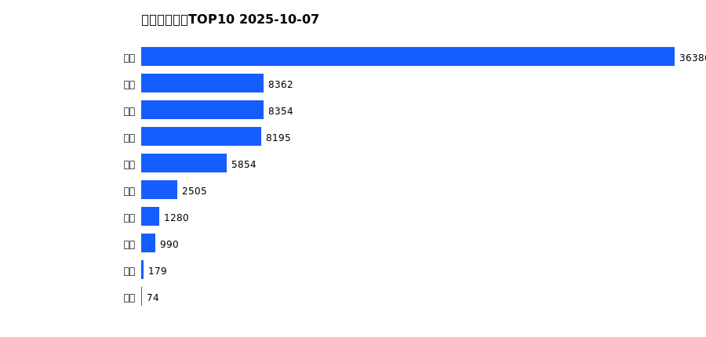
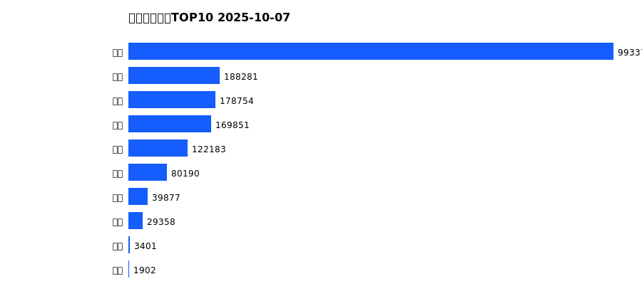
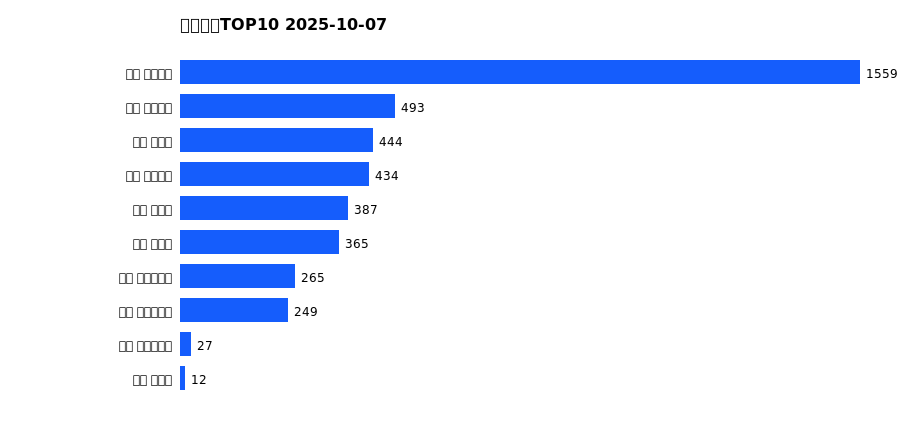
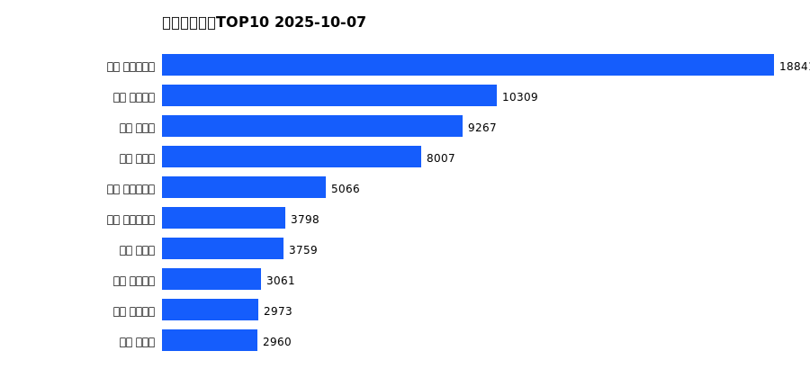
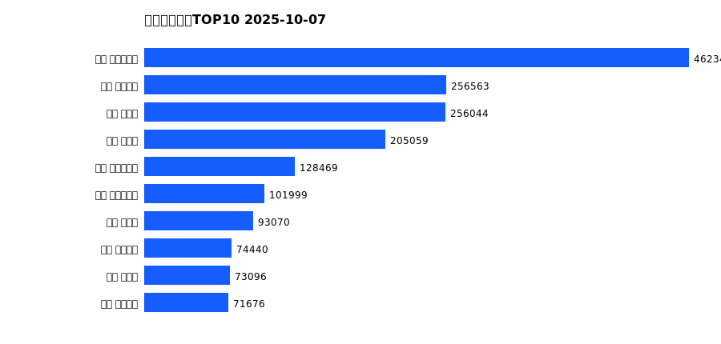

# 销售日报 2025-10-07

## 摘要

- 业态数: 10
- 门店数: 15
- 业态日销最大: 超市 2625
- 业态日销最小: 珠宝 0
- 门店日销最大: 许昌 天使城店 1559
- 门店日销最小: 许昌 生活广场店 0
- 同比: -
- 环比: -

## 集团合计

| period | sales_wan |
| --- | --- |
| daily | 4054.0 |
| monthly | 72179.0 |
| yearly | 1807170.0 |

## 业态 TOP10

### 日销

| rank | business_type | sales_wan |
| --- | --- | --- |
| 1 | 超市 | 2625.38 |
| 2 | 电器 | 459.92 |
| 3 | 百货 | 372.6 |
| 4 | 服饰 | 294.6 |
| 5 | 茶叶 | 114.49 |
| 6 | 医药 | 104.15 |
| 7 | 餐饮 | 57.49 |
| 8 | 电玩 | 18.32 |
| 9 | 电影 | 7.52 |
| 10 | 珠宝 | 0.0 |

### 月度累计

| rank | business_type | sales_wan |
| --- | --- | --- |
| 1 | 超市 | 36386.2 |
| 2 | 电器 | 8362.2 |
| 3 | 珠宝 | 8353.67 |
| 4 | 百货 | 8194.76 |
| 5 | 服饰 | 5854.05 |
| 6 | 茶叶 | 2505.0 |
| 7 | 医药 | 1280.48 |
| 8 | 餐饮 | 990.29 |
| 9 | 电玩 | 178.85 |
| 10 | 电影 | 73.73 |

### 年度累计

| rank | business_type | sales_wan |
| --- | --- | --- |
| 1 | 超市 | 993372.7 |
| 2 | 珠宝 | 188280.91 |
| 3 | 百货 | 178753.72 |
| 4 | 电器 | 169851.14 |
| 5 | 服饰 | 122183.02 |
| 6 | 茶叶 | 80189.77 |
| 7 | 医药 | 39876.83 |
| 8 | 餐饮 | 29358.42 |
| 9 | 电玩 | 3400.97 |
| 10 | 电影 | 1902.21 |

## 门店 TOP10

### 日销

| rank | store_name | sales_wan |
| --- | --- | --- |
| 1 | 许昌 天使城店 | 1558.51 |
| 2 | 许昌 金三角店 | 493.18 |
| 3 | 许昌 禹州店 | 444.33 |
| 4 | 许昌 线上商城 | 434.48 |
| 5 | 许昌 北海店 | 386.78 |
| 6 | 许昌 金汇店 | 364.81 |
| 7 | 许昌 实业公司店 | 264.8 |
| 8 | 许昌 大众服饰店 | 248.72 |
| 9 | 许昌 时代广场店 | 27.28 |
| 10 | 许昌 魏源店 | 11.76 |

### 月度累计

| rank | store_name | sales_wan |
| --- | --- | --- |
| 1 | 许昌 时代广场店 | 18840.62 |
| 2 | 许昌 天使城店 | 10308.87 |
| 3 | 新乡 大胖店 | 9266.78 |
| 4 | 新乡 小胖店 | 8006.97 |
| 5 | 许昌 生活广场店 | 5065.54 |
| 6 | 许昌 实业公司店 | 3798.24 |
| 7 | 许昌 禹州店 | 3758.93 |
| 8 | 许昌 金三角店 | 3061.24 |
| 9 | 许昌 线上商城 | 2972.53 |
| 10 | 许昌 北海店 | 2960.18 |

### 年度累计

| rank | store_name | sales_wan |
| --- | --- | --- |
| 1 | 许昌 时代广场店 | 462341.34 |
| 2 | 许昌 天使城店 | 256562.81 |
| 3 | 新乡 大胖店 | 256043.99 |
| 4 | 新乡 小胖店 | 205059.45 |
| 5 | 许昌 生活广场店 | 128469.21 |
| 6 | 许昌 实业公司店 | 101999.48 |
| 7 | 许昌 禹州店 | 93070.3 |
| 8 | 许昌 线上商城 | 74439.54 |
| 9 | 许昌 北海店 | 73095.93 |
| 10 | 许昌 金三角店 | 71675.73 |

