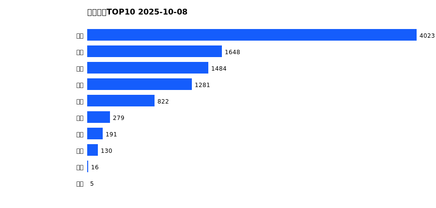
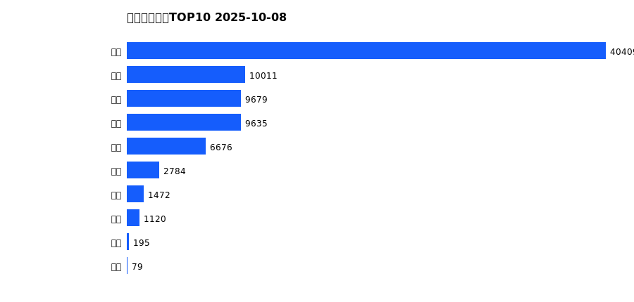
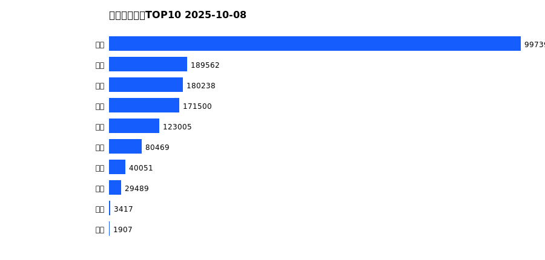
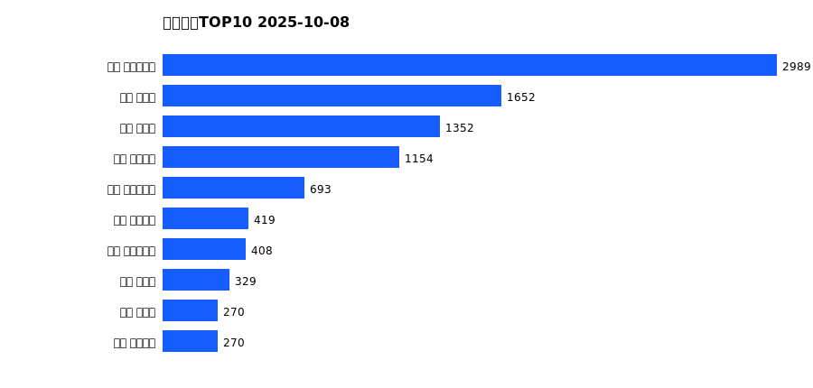
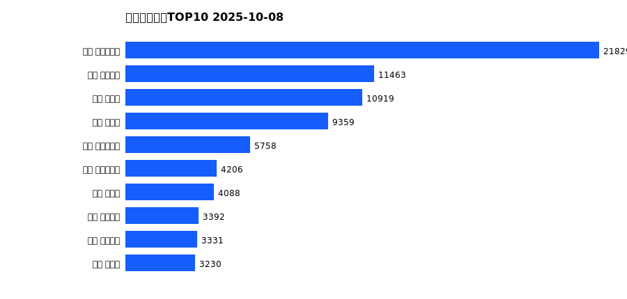
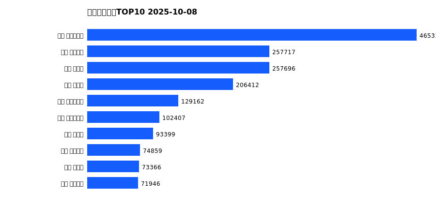

# 销售日报 2025-10-08

## 摘要

- 业态数: 10
- 门店数: 15
- 业态日销最大: 超市 4023
- 业态日销最小: 电影 5
- 门店日销最大: 许昌 时代广场店 2989
- 门店日销最小: 许昌 劳动店 46
- 同比: -
- 环比: -

## 集团合计

| period | sales_wan |
| --- | --- |
| daily | 9882.0 |
| monthly | 82061.0 |
| yearly | 1817034.0 |

## 业态 TOP10

### 日销

| rank | business_type | sales_wan |
| --- | --- | --- |
| 1 | 超市 | 4022.93 |
| 2 | 电器 | 1648.38 |
| 3 | 百货 | 1484.37 |
| 4 | 珠宝 | 1281.34 |
| 5 | 服饰 | 822.39 |
| 6 | 茶叶 | 279.49 |
| 7 | 医药 | 191.42 |
| 8 | 餐饮 | 130.19 |
| 9 | 电玩 | 16.49 |
| 10 | 电影 | 5.03 |

### 月度累计

| rank | business_type | sales_wan |
| --- | --- | --- |
| 1 | 超市 | 40409.13 |
| 2 | 电器 | 10010.58 |
| 3 | 百货 | 9679.13 |
| 4 | 珠宝 | 9635.01 |
| 5 | 服饰 | 6676.44 |
| 6 | 茶叶 | 2784.49 |
| 7 | 医药 | 1471.89 |
| 8 | 餐饮 | 1120.48 |
| 9 | 电玩 | 195.34 |
| 10 | 电影 | 78.76 |

### 年度累计

| rank | business_type | sales_wan |
| --- | --- | --- |
| 1 | 超市 | 997395.63 |
| 2 | 珠宝 | 189562.25 |
| 3 | 百货 | 180238.09 |
| 4 | 电器 | 171499.52 |
| 5 | 服饰 | 123005.41 |
| 6 | 茶叶 | 80469.26 |
| 7 | 医药 | 40050.94 |
| 8 | 餐饮 | 29488.61 |
| 9 | 电玩 | 3417.47 |
| 10 | 电影 | 1907.25 |

## 门店 TOP10

### 日销

| rank | store_name | sales_wan |
| --- | --- | --- |
| 1 | 许昌 时代广场店 | 2988.68 |
| 2 | 新乡 大胖店 | 1651.99 |
| 3 | 新乡 小胖店 | 1352.46 |
| 4 | 许昌 天使城店 | 1154.17 |
| 5 | 许昌 生活广场店 | 692.64 |
| 6 | 许昌 线上商城 | 419.29 |
| 7 | 许昌 实业公司店 | 407.51 |
| 8 | 许昌 禹州店 | 328.67 |
| 9 | 许昌 北海店 | 270.32 |
| 10 | 许昌 金三角店 | 269.92 |

### 月度累计

| rank | store_name | sales_wan |
| --- | --- | --- |
| 1 | 许昌 时代广场店 | 21829.31 |
| 2 | 许昌 天使城店 | 11463.04 |
| 3 | 新乡 大胖店 | 10918.78 |
| 4 | 新乡 小胖店 | 9359.43 |
| 5 | 许昌 生活广场店 | 5758.18 |
| 6 | 许昌 实业公司店 | 4205.75 |
| 7 | 许昌 禹州店 | 4087.6 |
| 8 | 许昌 线上商城 | 3391.82 |
| 9 | 许昌 金三角店 | 3331.16 |
| 10 | 许昌 北海店 | 3230.5 |

### 年度累计

| rank | store_name | sales_wan |
| --- | --- | --- |
| 1 | 许昌 时代广场店 | 465312.72 |
| 2 | 许昌 天使城店 | 257716.98 |
| 3 | 新乡 大胖店 | 257695.98 |
| 4 | 新乡 小胖店 | 206411.91 |
| 5 | 许昌 生活广场店 | 129161.86 |
| 6 | 许昌 实业公司店 | 102406.99 |
| 7 | 许昌 禹州店 | 93398.97 |
| 8 | 许昌 线上商城 | 74858.84 |
| 9 | 许昌 北海店 | 73366.25 |
| 10 | 许昌 金三角店 | 71945.65 |

