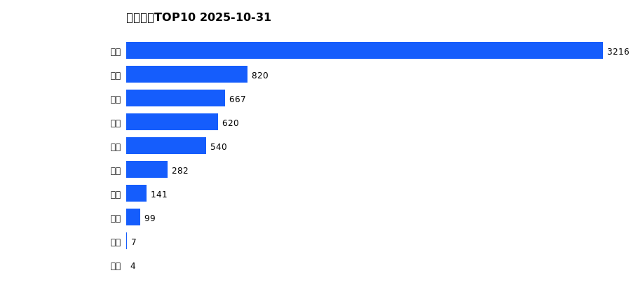

# 销售日报 2025-10-31

## 摘要

- 业态数: 10
- 门店数: 15
- 业态日销最大: 超市 3216
- 业态日销最小: 电玩 4
- 门店日销最大: 许昌 时代广场店 1562
- 门店日销最小: 许昌 劳动店 34
- 同比: -
- 环比: -

## 集团合计

| period | sales_wan |
| --- | --- |
| daily | 6395.0 |
| monthly | 220925.0 |
| yearly | 1955898.0 |

## 业态 TOP10

### 日销

| rank | business_type | sales_wan |
| --- | --- | --- |
| 1 | 超市 | 3215.64 |
| 2 | 百货 | 819.56 |
| 3 | 电器 | 667.05 |
| 4 | 服饰 | 619.73 |
| 5 | 珠宝 | 539.5 |
| 6 | 茶叶 | 281.91 |
| 7 | 医药 | 141.25 |
| 8 | 餐饮 | 99.13 |
| 9 | 电影 | 6.63 |
| 10 | 电玩 | 4.45 |

### 月度累计

| rank | business_type | sales_wan |
| --- | --- | --- |
| 1 | 超市 | 109772.5 |
| 2 | 珠宝 | 26106.79 |
| 3 | 百货 | 24359.2 |
| 4 | 电器 | 22255.53 |
| 5 | 服饰 | 20689.89 |
| 6 | 茶叶 | 9069.96 |
| 7 | 医药 | 4962.41 |
| 8 | 餐饮 | 3237.83 |
| 9 | 电玩 | 333.58 |
| 10 | 电影 | 137.02 |

### 年度累计

| rank | business_type | sales_wan |
| --- | --- | --- |
| 1 | 超市 | 1066759.01 |
| 2 | 珠宝 | 206034.03 |
| 3 | 百货 | 194918.15 |
| 4 | 电器 | 183744.48 |
| 5 | 服饰 | 137018.86 |
| 6 | 茶叶 | 86754.74 |
| 7 | 医药 | 43541.46 |
| 8 | 餐饮 | 31605.96 |
| 9 | 电玩 | 3555.71 |
| 10 | 电影 | 1965.51 |

## 门店 TOP10

### 日销

| rank | store_name | sales_wan |
| --- | --- | --- |
| 1 | 许昌 时代广场店 | 1561.86 |
| 2 | 新乡 大胖店 | 1063.91 |
| 3 | 新乡 小胖店 | 866.9 |
| 4 | 许昌 天使城店 | 719.72 |
| 5 | 许昌 生活广场店 | 506.72 |
| 6 | 许昌 实业公司店 | 405.15 |
| 7 | 许昌 线上商城 | 398.12 |
| 8 | 许昌 禹州店 | 291.51 |
| 9 | 许昌 北海店 | 234.96 |
| 10 | 许昌 金三角店 | 177.36 |

### 月度累计

| rank | store_name | sales_wan |
| --- | --- | --- |
| 1 | 许昌 时代广场店 | 58486.74 |
| 2 | 新乡 大胖店 | 30026.04 |
| 3 | 许昌 天使城店 | 29775.96 |
| 4 | 新乡 小胖店 | 25982.29 |
| 5 | 许昌 生活广场店 | 17606.59 |
| 6 | 许昌 实业公司店 | 10985.72 |
| 7 | 许昌 禹州店 | 10464.71 |
| 8 | 许昌 线上商城 | 9580.99 |
| 9 | 许昌 金三角店 | 8337.97 |
| 10 | 许昌 北海店 | 8228.31 |

### 年度累计

| rank | store_name | sales_wan |
| --- | --- | --- |
| 1 | 许昌 时代广场店 | 501970.16 |
| 2 | 新乡 大胖店 | 276803.24 |
| 3 | 许昌 天使城店 | 276029.9 |
| 4 | 新乡 小胖店 | 223034.77 |
| 5 | 许昌 生活广场店 | 141010.26 |
| 6 | 许昌 实业公司店 | 109186.96 |
| 7 | 许昌 禹州店 | 99776.08 |
| 8 | 许昌 线上商城 | 81048.01 |
| 9 | 许昌 北海店 | 78364.06 |
| 10 | 许昌 金三角店 | 76952.46 |

