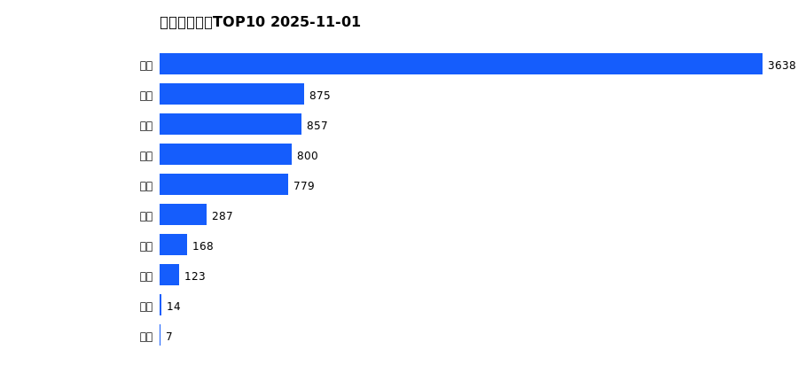
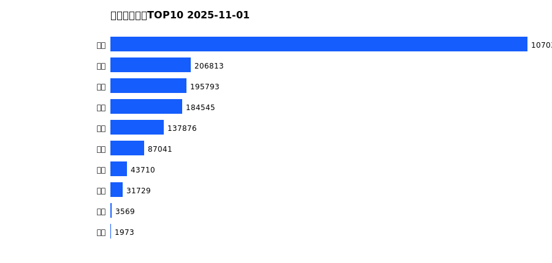
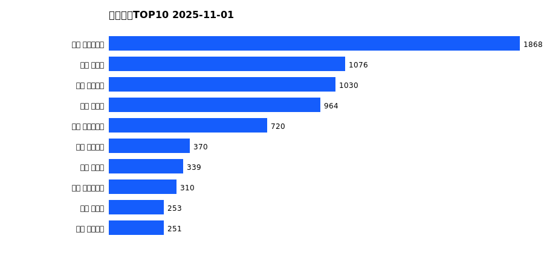
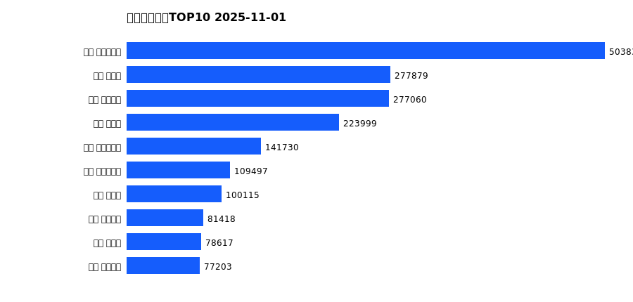

# 销售日报 2025-11-01

## 摘要

- 业态数: 10
- 门店数: 15
- 业态日销最大: 超市 3638
- 业态日销最小: 电影 7
- 门店日销最大: 许昌 时代广场店 1868
- 门店日销最小: 许昌 劳动店 36
- 同比: -
- 环比: -

## 集团合计

| period | sales_wan |
| --- | --- |
| daily | 7548.0 |
| monthly | 7548.0 |
| yearly | 1963446.0 |

## 业态 TOP10

### 日销

| rank | business_type | sales_wan |
| --- | --- | --- |
| 1 | 超市 | 3638.38 |
| 2 | 百货 | 875.25 |
| 3 | 服饰 | 856.84 |
| 4 | 电器 | 800.05 |
| 5 | 珠宝 | 778.54 |
| 6 | 茶叶 | 286.73 |
| 7 | 医药 | 168.32 |
| 8 | 餐饮 | 122.96 |
| 9 | 电玩 | 13.52 |
| 10 | 电影 | 7.42 |

### 月度累计

| rank | business_type | sales_wan |
| --- | --- | --- |
| 1 | 超市 | 3638.38 |
| 2 | 百货 | 875.25 |
| 3 | 服饰 | 856.84 |
| 4 | 电器 | 800.05 |
| 5 | 珠宝 | 778.54 |
| 6 | 茶叶 | 286.73 |
| 7 | 医药 | 168.32 |
| 8 | 餐饮 | 122.96 |
| 9 | 电玩 | 13.52 |
| 10 | 电影 | 7.42 |

### 年度累计

| rank | business_type | sales_wan |
| --- | --- | --- |
| 1 | 超市 | 1070397.39 |
| 2 | 珠宝 | 206812.57 |
| 3 | 百货 | 195793.4 |
| 4 | 电器 | 184544.52 |
| 5 | 服饰 | 137875.69 |
| 6 | 茶叶 | 87041.46 |
| 7 | 医药 | 43709.78 |
| 8 | 餐饮 | 31728.93 |
| 9 | 电玩 | 3569.22 |
| 10 | 电影 | 1972.93 |

## 门店 TOP10

### 日销

| rank | store_name | sales_wan |
| --- | --- | --- |
| 1 | 许昌 时代广场店 | 1868.24 |
| 2 | 新乡 大胖店 | 1076.21 |
| 3 | 许昌 天使城店 | 1030.3 |
| 4 | 新乡 小胖店 | 963.95 |
| 5 | 许昌 生活广场店 | 720.18 |
| 6 | 许昌 线上商城 | 369.69 |
| 7 | 许昌 禹州店 | 338.72 |
| 8 | 许昌 实业公司店 | 309.98 |
| 9 | 许昌 北海店 | 252.56 |
| 10 | 许昌 金三角店 | 250.91 |

### 月度累计

| rank | store_name | sales_wan |
| --- | --- | --- |
| 1 | 许昌 时代广场店 | 1868.24 |
| 2 | 新乡 大胖店 | 1076.21 |
| 3 | 许昌 天使城店 | 1030.3 |
| 4 | 新乡 小胖店 | 963.95 |
| 5 | 许昌 生活广场店 | 720.18 |
| 6 | 许昌 线上商城 | 369.69 |
| 7 | 许昌 禹州店 | 338.72 |
| 8 | 许昌 实业公司店 | 309.98 |
| 9 | 许昌 北海店 | 252.56 |
| 10 | 许昌 金三角店 | 250.91 |

### 年度累计

| rank | store_name | sales_wan |
| --- | --- | --- |
| 1 | 许昌 时代广场店 | 503838.39 |
| 2 | 新乡 大胖店 | 277879.46 |
| 3 | 许昌 天使城店 | 277060.2 |
| 4 | 新乡 小胖店 | 223998.71 |
| 5 | 许昌 生活广场店 | 141730.44 |
| 6 | 许昌 实业公司店 | 109496.97 |
| 7 | 许昌 禹州店 | 100114.8 |
| 8 | 许昌 线上商城 | 81417.7 |
| 9 | 许昌 北海店 | 78616.62 |
| 10 | 许昌 金三角店 | 77203.38 |

