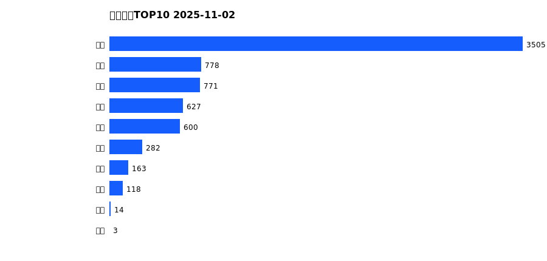
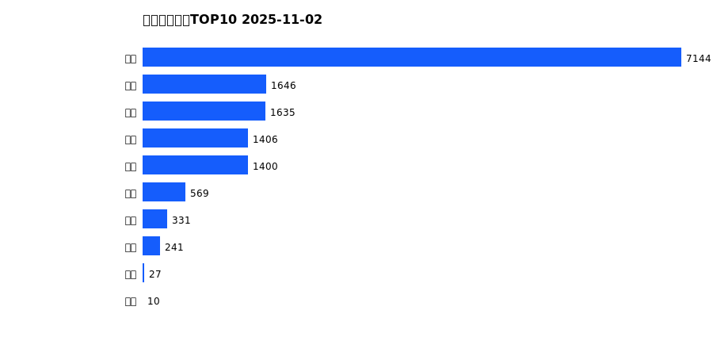
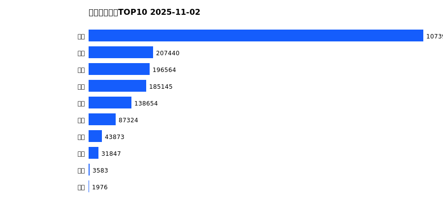
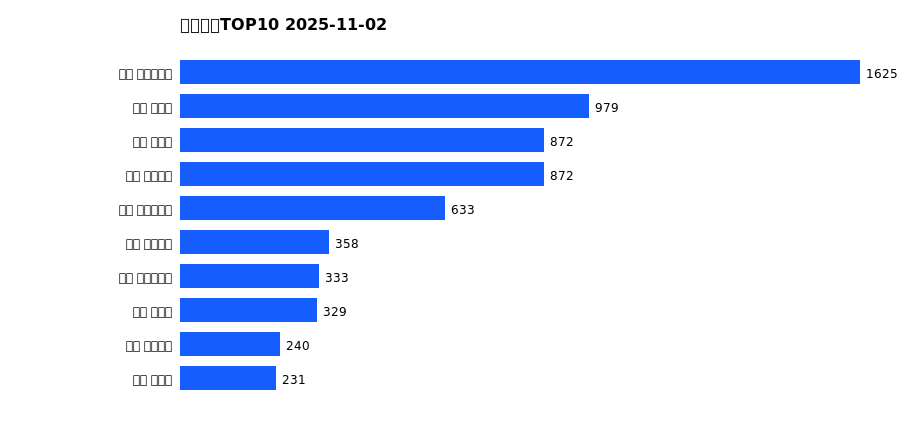
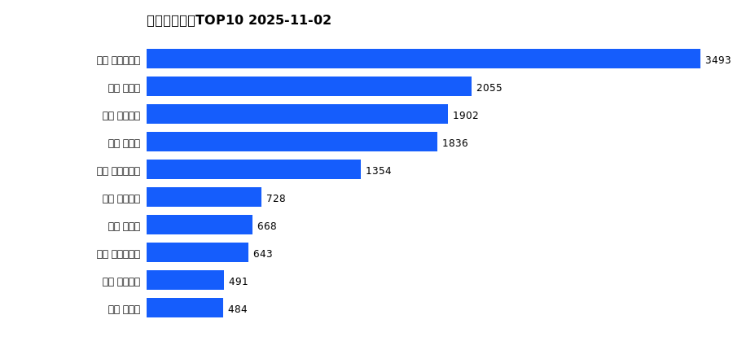
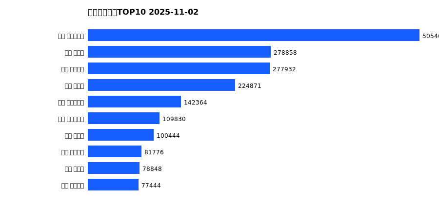

# 销售日报 2025-11-02

## 摘要

- 业态数: 10
- 门店数: 15
- 业态日销最大: 超市 3505
- 业态日销最小: 电影 3
- 门店日销最大: 许昌 时代广场店 1625
- 门店日销最小: 许昌 劳动店 40
- 同比: -
- 环比: -

## 集团合计

| period | sales_wan |
| --- | --- |
| daily | 6862.0 |
| monthly | 14410.0 |
| yearly | 1970307.0 |

## 业态 TOP10

### 日销

| rank | business_type | sales_wan |
| --- | --- | --- |
| 1 | 超市 | 3505.29 |
| 2 | 服饰 | 778.42 |
| 3 | 百货 | 770.8 |
| 4 | 珠宝 | 627.21 |
| 5 | 电器 | 600.02 |
| 6 | 茶叶 | 282.47 |
| 7 | 医药 | 162.84 |
| 8 | 餐饮 | 117.77 |
| 9 | 电玩 | 13.75 |
| 10 | 电影 | 2.93 |

### 月度累计

| rank | business_type | sales_wan |
| --- | --- | --- |
| 1 | 超市 | 7143.67 |
| 2 | 百货 | 1646.06 |
| 3 | 服饰 | 1635.25 |
| 4 | 珠宝 | 1405.75 |
| 5 | 电器 | 1400.06 |
| 6 | 茶叶 | 569.19 |
| 7 | 医药 | 331.16 |
| 8 | 餐饮 | 240.74 |
| 9 | 电玩 | 27.27 |
| 10 | 电影 | 10.36 |

### 年度累计

| rank | business_type | sales_wan |
| --- | --- | --- |
| 1 | 超市 | 1073902.68 |
| 2 | 珠宝 | 207439.79 |
| 3 | 百货 | 196564.2 |
| 4 | 电器 | 185144.54 |
| 5 | 服饰 | 138654.11 |
| 6 | 茶叶 | 87323.93 |
| 7 | 医药 | 43872.61 |
| 8 | 餐饮 | 31846.7 |
| 9 | 电玩 | 3582.98 |
| 10 | 电影 | 1975.87 |

## 门店 TOP10

### 日销

| rank | store_name | sales_wan |
| --- | --- | --- |
| 1 | 许昌 时代广场店 | 1625.23 |
| 2 | 新乡 大胖店 | 978.75 |
| 3 | 新乡 小胖店 | 871.82 |
| 4 | 许昌 天使城店 | 871.67 |
| 5 | 许昌 生活广场店 | 633.45 |
| 6 | 许昌 线上商城 | 358.11 |
| 7 | 许昌 实业公司店 | 333.27 |
| 8 | 许昌 禹州店 | 329.26 |
| 9 | 许昌 金三角店 | 240.14 |
| 10 | 许昌 北海店 | 231.02 |

### 月度累计

| rank | store_name | sales_wan |
| --- | --- | --- |
| 1 | 许昌 时代广场店 | 3493.46 |
| 2 | 新乡 大胖店 | 2054.97 |
| 3 | 许昌 天使城店 | 1901.96 |
| 4 | 新乡 小胖店 | 1835.77 |
| 5 | 许昌 生活广场店 | 1353.63 |
| 6 | 许昌 线上商城 | 727.8 |
| 7 | 许昌 禹州店 | 667.99 |
| 8 | 许昌 实业公司店 | 643.25 |
| 9 | 许昌 金三角店 | 491.05 |
| 10 | 许昌 北海店 | 483.58 |

### 年度累计

| rank | store_name | sales_wan |
| --- | --- | --- |
| 1 | 许昌 时代广场店 | 505463.62 |
| 2 | 新乡 大胖店 | 278858.21 |
| 3 | 许昌 天使城店 | 277931.86 |
| 4 | 新乡 小胖店 | 224870.53 |
| 5 | 许昌 生活广场店 | 142363.89 |
| 6 | 许昌 实业公司店 | 109830.24 |
| 7 | 许昌 禹州店 | 100444.07 |
| 8 | 许昌 线上商城 | 81775.81 |
| 9 | 许昌 北海店 | 78847.64 |
| 10 | 许昌 金三角店 | 77443.51 |

