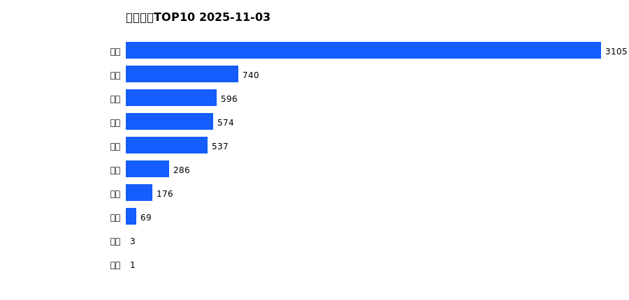
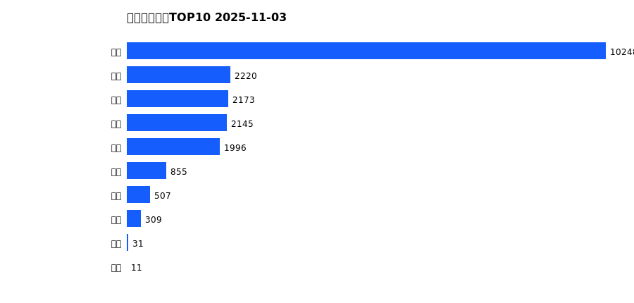
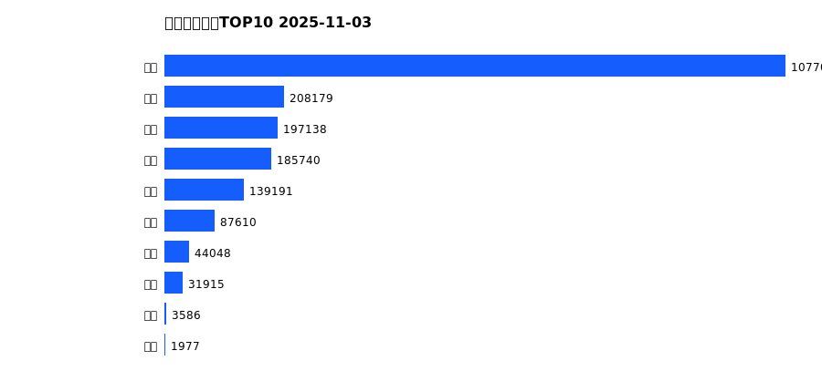
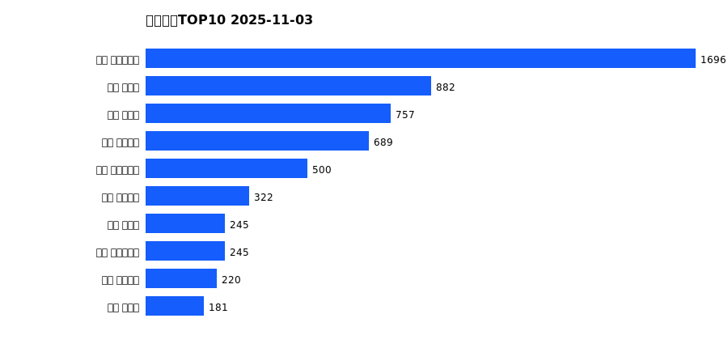
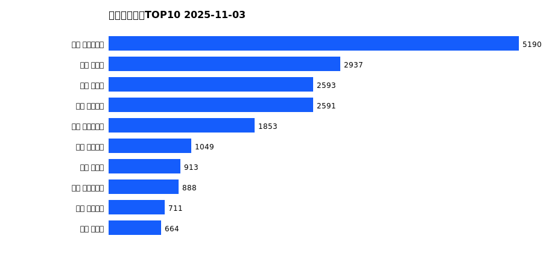
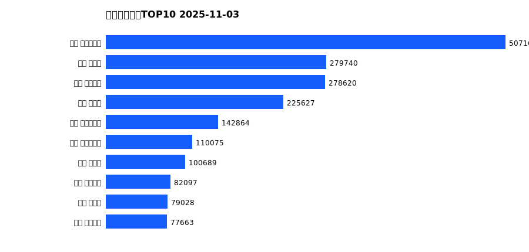

# 销售日报 2025-11-03

## 摘要

- 业态数: 10
- 门店数: 15
- 业态日销最大: 超市 3105
- 业态日销最小: 电影 1
- 门店日销最大: 许昌 时代广场店 1696
- 门店日销最小: 许昌 劳动店 40
- 同比: -
- 环比: -

## 集团合计

| period | sales_wan |
| --- | --- |
| daily | 6086.0 |
| monthly | 20495.0 |
| yearly | 1976393.0 |

## 业态 TOP10

### 日销

| rank | business_type | sales_wan |
| --- | --- | --- |
| 1 | 超市 | 3104.83 |
| 2 | 珠宝 | 739.59 |
| 3 | 电器 | 595.64 |
| 4 | 百货 | 573.6 |
| 5 | 服饰 | 537.26 |
| 6 | 茶叶 | 286.22 |
| 7 | 医药 | 175.55 |
| 8 | 餐饮 | 68.71 |
| 9 | 电玩 | 3.37 |
| 10 | 电影 | 0.98 |

### 月度累计

| rank | business_type | sales_wan |
| --- | --- | --- |
| 1 | 超市 | 10248.5 |
| 2 | 百货 | 2219.65 |
| 3 | 服饰 | 2172.52 |
| 4 | 珠宝 | 2145.34 |
| 5 | 电器 | 1995.7 |
| 6 | 茶叶 | 855.41 |
| 7 | 医药 | 506.7 |
| 8 | 餐饮 | 309.44 |
| 9 | 电玩 | 30.64 |
| 10 | 电影 | 11.34 |

### 年度累计

| rank | business_type | sales_wan |
| --- | --- | --- |
| 1 | 超市 | 1077007.51 |
| 2 | 珠宝 | 208179.38 |
| 3 | 百货 | 197137.8 |
| 4 | 电器 | 185740.18 |
| 5 | 服饰 | 139191.37 |
| 6 | 茶叶 | 87610.15 |
| 7 | 医药 | 44048.16 |
| 8 | 餐饮 | 31915.41 |
| 9 | 电玩 | 3586.34 |
| 10 | 电影 | 1976.85 |

## 门店 TOP10

### 日销

| rank | store_name | sales_wan |
| --- | --- | --- |
| 1 | 许昌 时代广场店 | 1696.43 |
| 2 | 新乡 大胖店 | 882.08 |
| 3 | 新乡 小胖店 | 756.95 |
| 4 | 许昌 天使城店 | 688.59 |
| 5 | 许昌 生活广场店 | 499.7 |
| 6 | 许昌 线上商城 | 321.53 |
| 7 | 许昌 禹州店 | 245.01 |
| 8 | 许昌 实业公司店 | 244.79 |
| 9 | 许昌 金三角店 | 219.71 |
| 10 | 许昌 北海店 | 180.63 |

### 月度累计

| rank | store_name | sales_wan |
| --- | --- | --- |
| 1 | 许昌 时代广场店 | 5189.89 |
| 2 | 新乡 大胖店 | 2937.05 |
| 3 | 新乡 小胖店 | 2592.72 |
| 4 | 许昌 天使城店 | 2590.56 |
| 5 | 许昌 生活广场店 | 1853.33 |
| 6 | 许昌 线上商城 | 1049.33 |
| 7 | 许昌 禹州店 | 912.99 |
| 8 | 许昌 实业公司店 | 888.04 |
| 9 | 许昌 金三角店 | 710.76 |
| 10 | 许昌 北海店 | 664.21 |

### 年度累计

| rank | store_name | sales_wan |
| --- | --- | --- |
| 1 | 许昌 时代广场店 | 507160.05 |
| 2 | 新乡 大胖店 | 279740.29 |
| 3 | 许昌 天使城店 | 278620.45 |
| 4 | 新乡 小胖店 | 225627.49 |
| 5 | 许昌 生活广场店 | 142863.59 |
| 6 | 许昌 实业公司店 | 110075.03 |
| 7 | 许昌 禹州店 | 100689.07 |
| 8 | 许昌 线上商城 | 82097.34 |
| 9 | 许昌 北海店 | 79028.27 |
| 10 | 许昌 金三角店 | 77663.22 |

