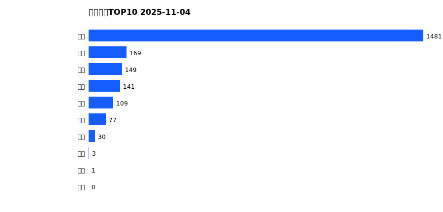
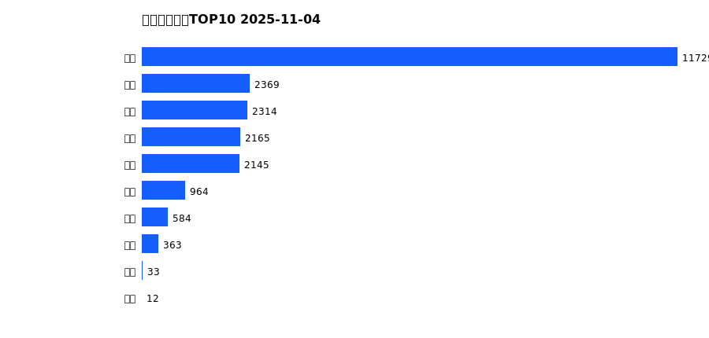
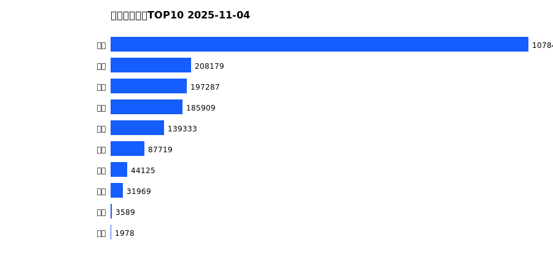
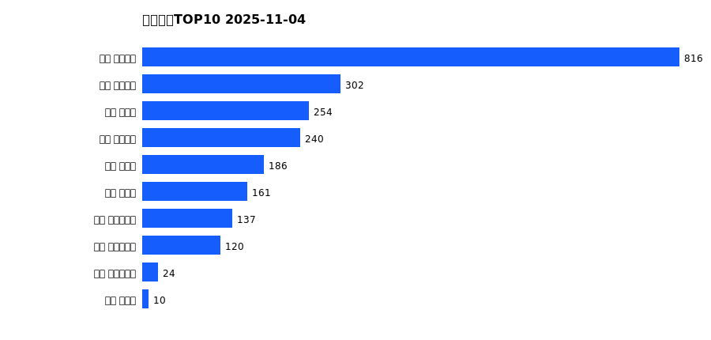
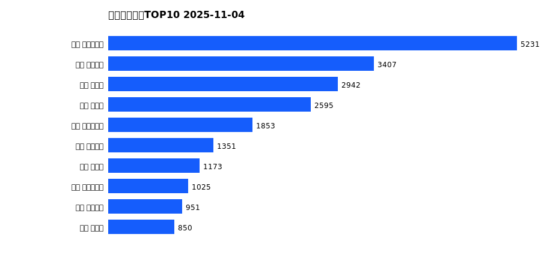
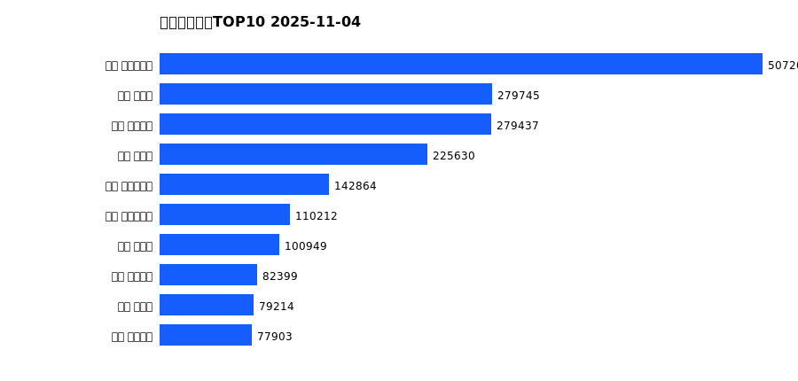

# 销售日报 2025-11-04

## 摘要

- 业态数: 10
- 门店数: 15
- 业态日销最大: 超市 1481
- 业态日销最小: 珠宝 0
- 门店日销最大: 许昌 天使城店 816
- 门店日销最小: 许昌 生活广场店 0
- 同比: -
- 环比: -

## 集团合计

| period | sales_wan |
| --- | --- |
| daily | 2160.0 |
| monthly | 22678.0 |
| yearly | 1978576.0 |

## 业态 TOP10

### 日销

| rank | business_type | sales_wan |
| --- | --- | --- |
| 1 | 超市 | 1480.8 |
| 2 | 电器 | 168.99 |
| 3 | 百货 | 148.57 |
| 4 | 服饰 | 141.21 |
| 5 | 茶叶 | 109.07 |
| 6 | 医药 | 76.93 |
| 7 | 餐饮 | 30.47 |
| 8 | 电玩 | 2.67 |
| 9 | 电影 | 0.99 |
| 10 | 珠宝 | 0.0 |

### 月度累计

| rank | business_type | sales_wan |
| --- | --- | --- |
| 1 | 超市 | 11729.3 |
| 2 | 百货 | 2368.62 |
| 3 | 服饰 | 2313.73 |
| 4 | 电器 | 2164.69 |
| 5 | 珠宝 | 2145.34 |
| 6 | 茶叶 | 964.48 |
| 7 | 医药 | 583.63 |
| 8 | 餐饮 | 362.78 |
| 9 | 电玩 | 33.31 |
| 10 | 电影 | 12.33 |

### 年度累计

| rank | business_type | sales_wan |
| --- | --- | --- |
| 1 | 超市 | 1078488.31 |
| 2 | 珠宝 | 208179.38 |
| 3 | 百货 | 197286.76 |
| 4 | 电器 | 185909.17 |
| 5 | 服饰 | 139332.59 |
| 6 | 茶叶 | 87719.22 |
| 7 | 医药 | 44125.09 |
| 8 | 餐饮 | 31968.74 |
| 9 | 电玩 | 3589.01 |
| 10 | 电影 | 1977.84 |

## 门店 TOP10

### 日销

| rank | store_name | sales_wan |
| --- | --- | --- |
| 1 | 许昌 天使城店 | 816.08 |
| 2 | 许昌 线上商城 | 301.78 |
| 3 | 许昌 禹州店 | 253.7 |
| 4 | 许昌 金三角店 | 240.06 |
| 5 | 许昌 北海店 | 185.58 |
| 6 | 许昌 金汇店 | 160.54 |
| 7 | 许昌 实业公司店 | 137.23 |
| 8 | 许昌 大众服饰店 | 119.62 |
| 9 | 许昌 时代广场店 | 24.35 |
| 10 | 许昌 魏源店 | 9.86 |

### 月度累计

| rank | store_name | sales_wan |
| --- | --- | --- |
| 1 | 许昌 时代广场店 | 5231.01 |
| 2 | 许昌 天使城店 | 3407.03 |
| 3 | 新乡 大胖店 | 2942.08 |
| 4 | 新乡 小胖店 | 2595.27 |
| 5 | 许昌 生活广场店 | 1853.33 |
| 6 | 许昌 线上商城 | 1351.11 |
| 7 | 许昌 禹州店 | 1172.79 |
| 8 | 许昌 实业公司店 | 1025.27 |
| 9 | 许昌 金三角店 | 950.82 |
| 10 | 许昌 北海店 | 849.79 |

### 年度累计

| rank | store_name | sales_wan |
| --- | --- | --- |
| 1 | 许昌 时代广场店 | 507201.16 |
| 2 | 新乡 大胖店 | 279745.32 |
| 3 | 许昌 天使城店 | 279436.93 |
| 4 | 新乡 小胖店 | 225630.04 |
| 5 | 许昌 生活广场店 | 142863.59 |
| 6 | 许昌 实业公司店 | 110212.26 |
| 7 | 许昌 禹州店 | 100948.87 |
| 8 | 许昌 线上商城 | 82399.12 |
| 9 | 许昌 北海店 | 79213.84 |
| 10 | 许昌 金三角店 | 77903.28 |

