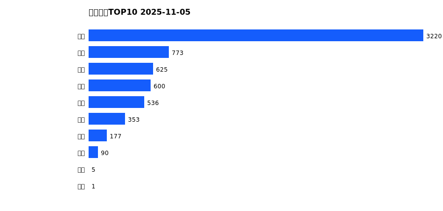
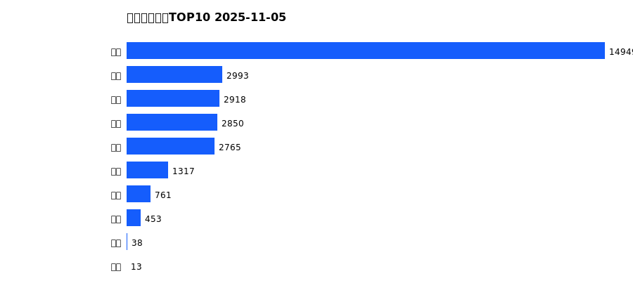
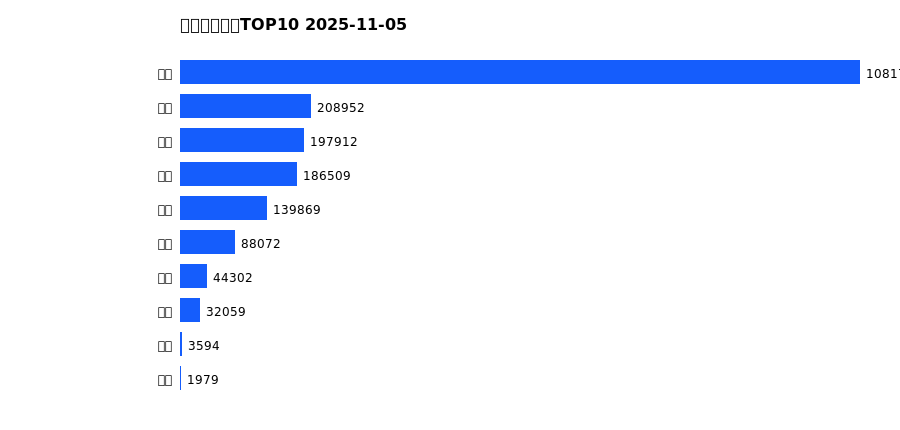
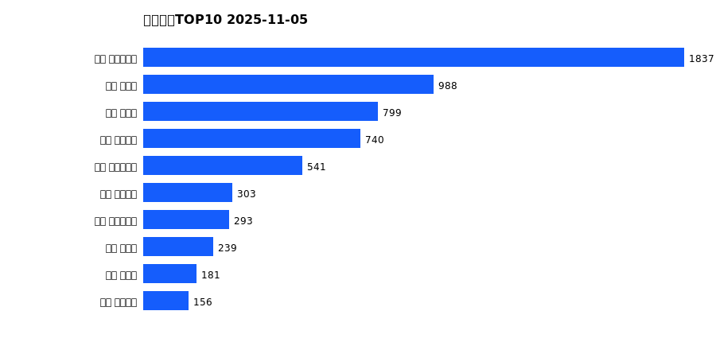
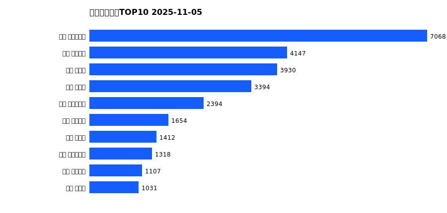
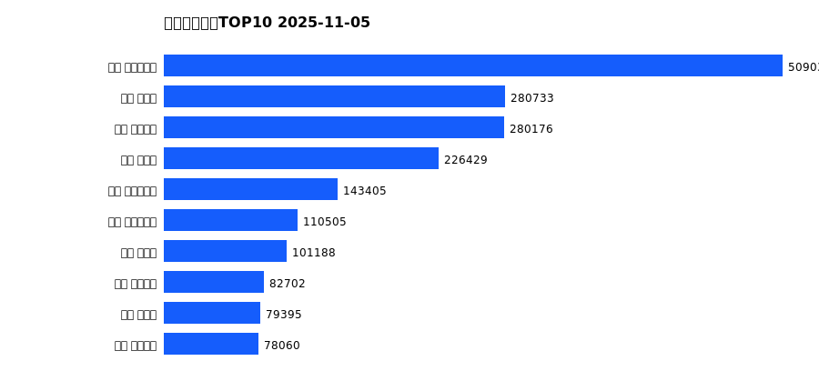

# 销售日报 2025-11-05

## 摘要

- 业态数: 10
- 门店数: 15
- 业态日销最大: 超市 3220
- 业态日销最小: 电影 1
- 门店日销最大: 许昌 时代广场店 1837
- 门店日销最小: 许昌 劳动店 36
- 同比: -
- 环比: -

## 集团合计

| period | sales_wan |
| --- | --- |
| daily | 6379.0 |
| monthly | 29058.0 |
| yearly | 1984955.0 |

## 业态 TOP10

### 日销

| rank | business_type | sales_wan |
| --- | --- | --- |
| 1 | 超市 | 3220.08 |
| 2 | 珠宝 | 772.55 |
| 3 | 百货 | 624.78 |
| 4 | 电器 | 600.16 |
| 5 | 服饰 | 536.12 |
| 6 | 茶叶 | 352.56 |
| 7 | 医药 | 177.37 |
| 8 | 餐饮 | 90.48 |
| 9 | 电玩 | 4.52 |
| 10 | 电影 | 0.75 |

### 月度累计

| rank | business_type | sales_wan |
| --- | --- | --- |
| 1 | 超市 | 14949.39 |
| 2 | 百货 | 2993.4 |
| 3 | 珠宝 | 2917.89 |
| 4 | 服饰 | 2849.85 |
| 5 | 电器 | 2764.85 |
| 6 | 茶叶 | 1317.04 |
| 7 | 医药 | 761.0 |
| 8 | 餐饮 | 453.26 |
| 9 | 电玩 | 37.82 |
| 10 | 电影 | 13.09 |

### 年度累计

| rank | business_type | sales_wan |
| --- | --- | --- |
| 1 | 超市 | 1081708.39 |
| 2 | 珠宝 | 208951.93 |
| 3 | 百货 | 197911.55 |
| 4 | 电器 | 186509.33 |
| 5 | 服饰 | 139868.71 |
| 6 | 茶叶 | 88071.78 |
| 7 | 医药 | 44302.45 |
| 8 | 餐饮 | 32059.22 |
| 9 | 电玩 | 3593.53 |
| 10 | 电影 | 1978.6 |

## 门店 TOP10

### 日销

| rank | store_name | sales_wan |
| --- | --- | --- |
| 1 | 许昌 时代广场店 | 1837.3 |
| 2 | 新乡 大胖店 | 987.75 |
| 3 | 新乡 小胖店 | 798.77 |
| 4 | 许昌 天使城店 | 739.64 |
| 5 | 许昌 生活广场店 | 540.92 |
| 6 | 许昌 线上商城 | 303.01 |
| 7 | 许昌 实业公司店 | 292.89 |
| 8 | 许昌 禹州店 | 239.38 |
| 9 | 许昌 北海店 | 181.11 |
| 10 | 许昌 金三角店 | 156.48 |

### 月度累计

| rank | store_name | sales_wan |
| --- | --- | --- |
| 1 | 许昌 时代广场店 | 7068.31 |
| 2 | 许昌 天使城店 | 4146.67 |
| 3 | 新乡 大胖店 | 3929.83 |
| 4 | 新乡 小胖店 | 3394.04 |
| 5 | 许昌 生活广场店 | 2394.25 |
| 6 | 许昌 线上商城 | 1654.12 |
| 7 | 许昌 禹州店 | 1412.17 |
| 8 | 许昌 实业公司店 | 1318.16 |
| 9 | 许昌 金三角店 | 1107.3 |
| 10 | 许昌 北海店 | 1030.89 |

### 年度累计

| rank | store_name | sales_wan |
| --- | --- | --- |
| 1 | 许昌 时代广场店 | 509038.91 |
| 2 | 新乡 大胖店 | 280733.07 |
| 3 | 许昌 天使城店 | 280176.11 |
| 4 | 新乡 小胖店 | 226428.81 |
| 5 | 许昌 生活广场店 | 143404.51 |
| 6 | 许昌 实业公司店 | 110505.15 |
| 7 | 许昌 禹州店 | 101188.25 |
| 8 | 许昌 线上商城 | 82702.12 |
| 9 | 许昌 北海店 | 79394.95 |
| 10 | 许昌 金三角店 | 78059.76 |

