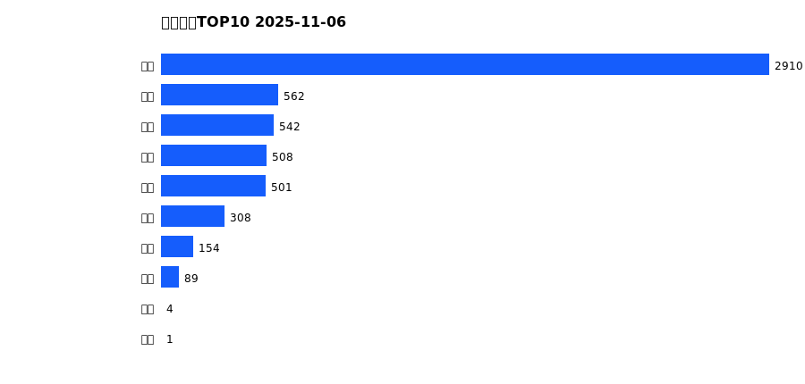
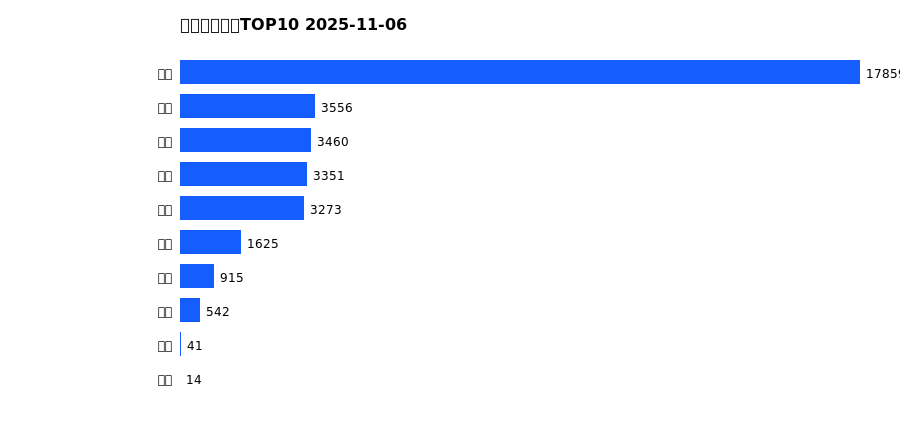
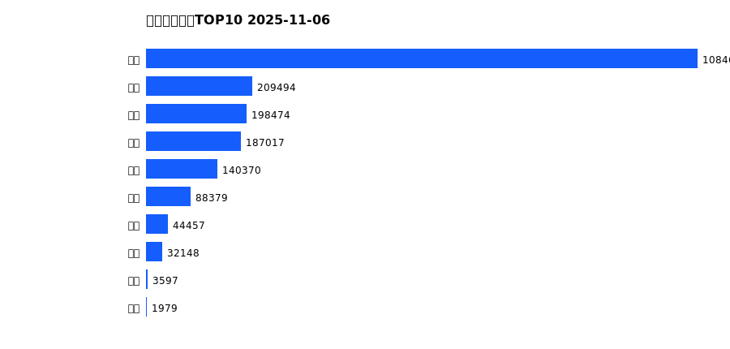
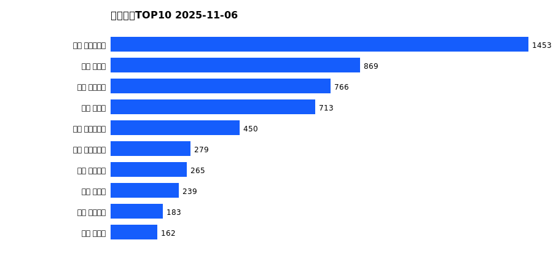
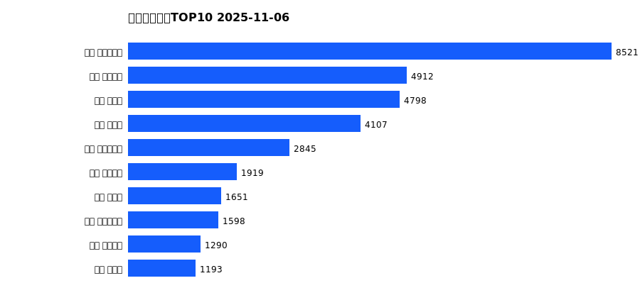
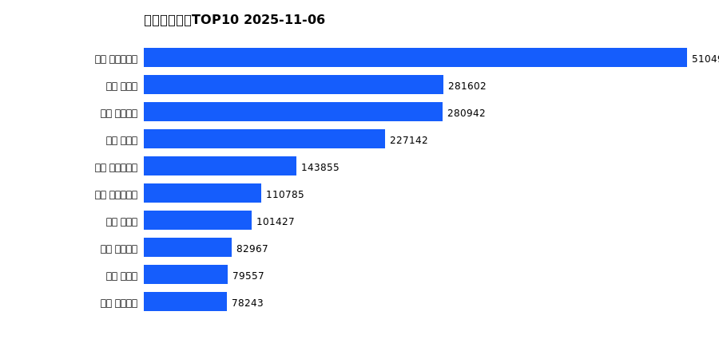

# 销售日报 2025-11-06

## 摘要

- 业态数: 10
- 门店数: 15
- 业态日销最大: 超市 2910
- 业态日销最小: 电影 1
- 门店日销最大: 许昌 时代广场店 1453
- 门店日销最小: 许昌 劳动店 24
- 同比: -
- 环比: -

## 集团合计

| period | sales_wan |
| --- | --- |
| daily | 5578.0 |
| monthly | 34636.0 |
| yearly | 1990534.0 |

## 业态 TOP10

### 日销

| rank | business_type | sales_wan |
| --- | --- | --- |
| 1 | 超市 | 2910.02 |
| 2 | 百货 | 562.16 |
| 3 | 珠宝 | 542.02 |
| 4 | 电器 | 507.66 |
| 5 | 服饰 | 501.21 |
| 6 | 茶叶 | 307.6 |
| 7 | 医药 | 154.13 |
| 8 | 餐饮 | 88.92 |
| 9 | 电玩 | 3.66 |
| 10 | 电影 | 0.77 |

### 月度累计

| rank | business_type | sales_wan |
| --- | --- | --- |
| 1 | 超市 | 17859.4 |
| 2 | 百货 | 3555.56 |
| 3 | 珠宝 | 3459.91 |
| 4 | 服饰 | 3351.07 |
| 5 | 电器 | 3272.52 |
| 6 | 茶叶 | 1624.64 |
| 7 | 医药 | 915.13 |
| 8 | 餐饮 | 542.18 |
| 9 | 电玩 | 41.48 |
| 10 | 电影 | 13.86 |

### 年度累计

| rank | business_type | sales_wan |
| --- | --- | --- |
| 1 | 超市 | 1084618.41 |
| 2 | 珠宝 | 209493.94 |
| 3 | 百货 | 198473.7 |
| 4 | 电器 | 187016.99 |
| 5 | 服饰 | 140369.92 |
| 6 | 茶叶 | 88379.37 |
| 7 | 医药 | 44456.58 |
| 8 | 餐饮 | 32148.14 |
| 9 | 电玩 | 3597.19 |
| 10 | 电影 | 1979.37 |

## 门店 TOP10

### 日销

| rank | store_name | sales_wan |
| --- | --- | --- |
| 1 | 许昌 时代广场店 | 1452.61 |
| 2 | 新乡 大胖店 | 868.63 |
| 3 | 许昌 天使城店 | 765.78 |
| 4 | 新乡 小胖店 | 713.39 |
| 5 | 许昌 生活广场店 | 450.45 |
| 6 | 许昌 实业公司店 | 279.45 |
| 7 | 许昌 线上商城 | 265.27 |
| 8 | 许昌 禹州店 | 238.81 |
| 9 | 许昌 金三角店 | 182.89 |
| 10 | 许昌 北海店 | 162.41 |

### 月度累计

| rank | store_name | sales_wan |
| --- | --- | --- |
| 1 | 许昌 时代广场店 | 8520.92 |
| 2 | 许昌 天使城店 | 4912.45 |
| 3 | 新乡 大胖店 | 4798.46 |
| 4 | 新乡 小胖店 | 4107.43 |
| 5 | 许昌 生活广场店 | 2844.7 |
| 6 | 许昌 线上商城 | 1919.39 |
| 7 | 许昌 禹州店 | 1650.98 |
| 8 | 许昌 实业公司店 | 1597.61 |
| 9 | 许昌 金三角店 | 1290.19 |
| 10 | 许昌 北海店 | 1193.3 |

### 年度累计

| rank | store_name | sales_wan |
| --- | --- | --- |
| 1 | 许昌 时代广场店 | 510491.52 |
| 2 | 新乡 大胖店 | 281601.7 |
| 3 | 许昌 天使城店 | 280941.89 |
| 4 | 新乡 小胖店 | 227142.2 |
| 5 | 许昌 生活广场店 | 143854.96 |
| 6 | 许昌 实业公司店 | 110784.6 |
| 7 | 许昌 禹州店 | 101427.06 |
| 8 | 许昌 线上商城 | 82967.39 |
| 9 | 许昌 北海店 | 79557.36 |
| 10 | 许昌 金三角店 | 78242.65 |

