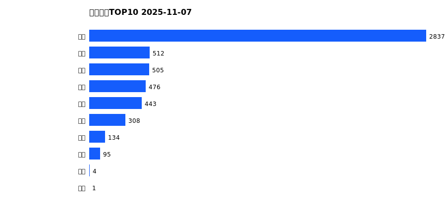
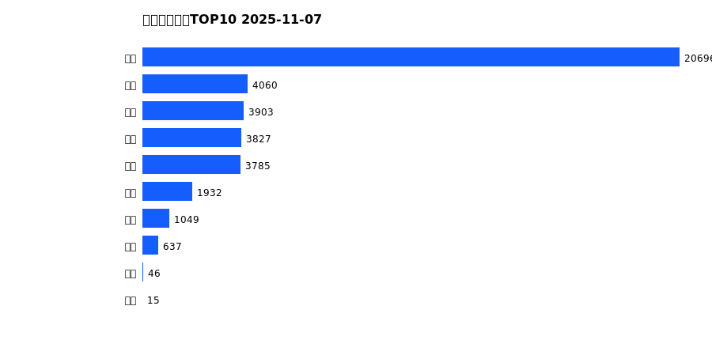
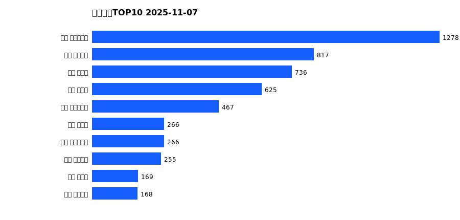
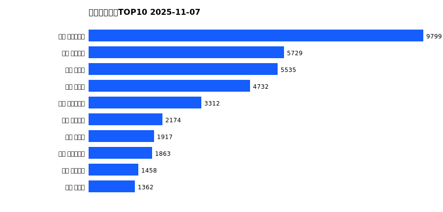
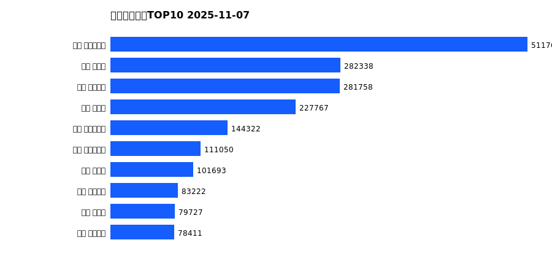

# 销售日报 2025-11-07

## 摘要

- 业态数: 10
- 门店数: 15
- 业态日销最大: 超市 2837
- 业态日销最小: 电影 1
- 门店日销最大: 许昌 时代广场店 1278
- 门店日销最小: 许昌 劳动店 31
- 同比: -
- 环比: -

## 集团合计

| period | sales_wan |
| --- | --- |
| daily | 5315.0 |
| monthly | 39951.0 |
| yearly | 1995849.0 |

## 业态 TOP10

### 日销

| rank | business_type | sales_wan |
| --- | --- | --- |
| 1 | 超市 | 2836.94 |
| 2 | 电器 | 512.18 |
| 3 | 百货 | 504.87 |
| 4 | 服饰 | 475.88 |
| 5 | 珠宝 | 443.05 |
| 6 | 茶叶 | 307.78 |
| 7 | 医药 | 133.85 |
| 8 | 餐饮 | 94.78 |
| 9 | 电玩 | 4.43 |
| 10 | 电影 | 1.27 |

### 月度累计

| rank | business_type | sales_wan |
| --- | --- | --- |
| 1 | 超市 | 20696.35 |
| 2 | 百货 | 4060.43 |
| 3 | 珠宝 | 3902.95 |
| 4 | 服饰 | 3826.95 |
| 5 | 电器 | 3784.7 |
| 6 | 茶叶 | 1932.42 |
| 7 | 医药 | 1048.98 |
| 8 | 餐饮 | 636.96 |
| 9 | 电玩 | 45.91 |
| 10 | 电影 | 15.13 |

### 年度累计

| rank | business_type | sales_wan |
| --- | --- | --- |
| 1 | 超市 | 1087455.35 |
| 2 | 珠宝 | 209936.99 |
| 3 | 百货 | 198978.58 |
| 4 | 电器 | 187529.18 |
| 5 | 服饰 | 140845.8 |
| 6 | 茶叶 | 88687.15 |
| 7 | 医药 | 44590.44 |
| 8 | 餐饮 | 32242.92 |
| 9 | 电玩 | 3601.62 |
| 10 | 电影 | 1980.64 |

## 门店 TOP10

### 日销

| rank | store_name | sales_wan |
| --- | --- | --- |
| 1 | 许昌 时代广场店 | 1277.75 |
| 2 | 许昌 天使城店 | 816.57 |
| 3 | 新乡 大胖店 | 736.1 |
| 4 | 新乡 小胖店 | 624.91 |
| 5 | 许昌 生活广场店 | 466.81 |
| 6 | 许昌 禹州店 | 265.74 |
| 7 | 许昌 实业公司店 | 265.63 |
| 8 | 许昌 线上商城 | 254.88 |
| 9 | 许昌 北海店 | 169.15 |
| 10 | 许昌 金三角店 | 168.25 |

### 月度累计

| rank | store_name | sales_wan |
| --- | --- | --- |
| 1 | 许昌 时代广场店 | 9798.66 |
| 2 | 许昌 天使城店 | 5729.02 |
| 3 | 新乡 大胖店 | 5534.56 |
| 4 | 新乡 小胖店 | 4732.34 |
| 5 | 许昌 生活广场店 | 3311.51 |
| 6 | 许昌 线上商城 | 2174.27 |
| 7 | 许昌 禹州店 | 1916.73 |
| 8 | 许昌 实业公司店 | 1863.24 |
| 9 | 许昌 金三角店 | 1458.44 |
| 10 | 许昌 北海店 | 1362.45 |

### 年度累计

| rank | store_name | sales_wan |
| --- | --- | --- |
| 1 | 许昌 时代广场店 | 511769.27 |
| 2 | 新乡 大胖店 | 282337.8 |
| 3 | 许昌 天使城店 | 281758.46 |
| 4 | 新乡 小胖店 | 227767.11 |
| 5 | 许昌 生活广场店 | 144321.77 |
| 6 | 许昌 实业公司店 | 111050.23 |
| 7 | 许昌 禹州店 | 101692.81 |
| 8 | 许昌 线上商城 | 83222.28 |
| 9 | 许昌 北海店 | 79726.51 |
| 10 | 许昌 金三角店 | 78410.9 |

