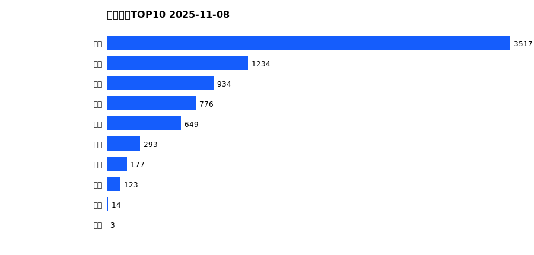
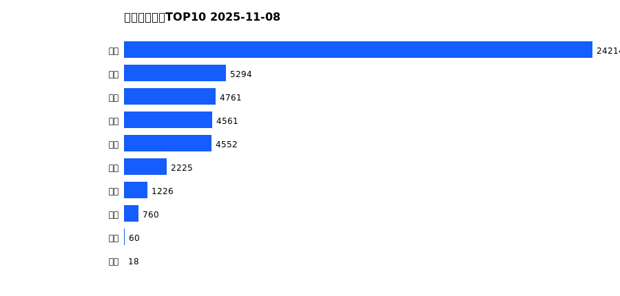
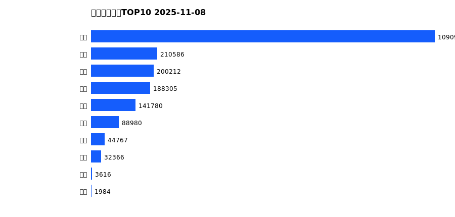
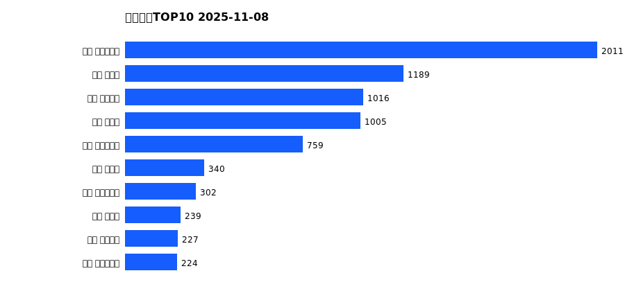
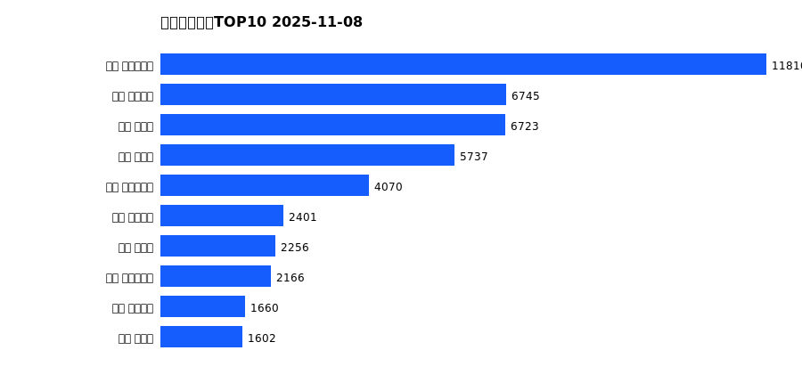
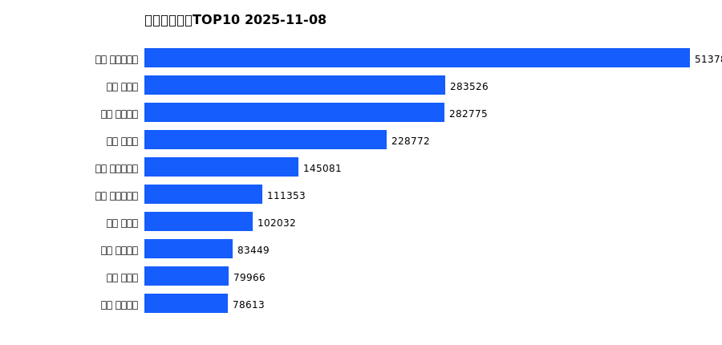

# 销售日报 2025-11-08

## 摘要

- 业态数: 10
- 门店数: 15
- 业态日销最大: 超市 3517
- 业态日销最小: 电影 3
- 门店日销最大: 许昌 时代广场店 2011
- 门店日销最小: 许昌 劳动店 38
- 同比: -
- 环比: -

## 集团合计

| period | sales_wan |
| --- | --- |
| daily | 7720.0 |
| monthly | 47671.0 |
| yearly | 2003568.0 |

## 业态 TOP10

### 日销

| rank | business_type | sales_wan |
| --- | --- | --- |
| 1 | 超市 | 3517.23 |
| 2 | 百货 | 1233.77 |
| 3 | 服饰 | 934.14 |
| 4 | 电器 | 775.9 |
| 5 | 珠宝 | 649.29 |
| 6 | 茶叶 | 292.76 |
| 7 | 医药 | 176.51 |
| 8 | 餐饮 | 123.0 |
| 9 | 电玩 | 14.24 |
| 10 | 电影 | 2.91 |

### 月度累计

| rank | business_type | sales_wan |
| --- | --- | --- |
| 1 | 超市 | 24213.58 |
| 2 | 百货 | 5294.2 |
| 3 | 服饰 | 4761.09 |
| 4 | 电器 | 4560.6 |
| 5 | 珠宝 | 4552.24 |
| 6 | 茶叶 | 2225.17 |
| 7 | 医药 | 1225.5 |
| 8 | 餐饮 | 759.96 |
| 9 | 电玩 | 60.15 |
| 10 | 电影 | 18.04 |

### 年度累计

| rank | business_type | sales_wan |
| --- | --- | --- |
| 1 | 超市 | 1090972.59 |
| 2 | 珠宝 | 210586.28 |
| 3 | 百货 | 200212.34 |
| 4 | 电器 | 188305.08 |
| 5 | 服饰 | 141779.94 |
| 6 | 茶叶 | 88979.91 |
| 7 | 医药 | 44766.96 |
| 8 | 餐饮 | 32365.92 |
| 9 | 电玩 | 3615.86 |
| 10 | 电影 | 1983.55 |

## 门店 TOP10

### 日销

| rank | store_name | sales_wan |
| --- | --- | --- |
| 1 | 许昌 时代广场店 | 2011.03 |
| 2 | 新乡 大胖店 | 1188.52 |
| 3 | 许昌 天使城店 | 1016.13 |
| 4 | 新乡 小胖店 | 1004.77 |
| 5 | 许昌 生活广场店 | 758.77 |
| 6 | 许昌 禹州店 | 339.58 |
| 7 | 许昌 实业公司店 | 302.38 |
| 8 | 许昌 北海店 | 239.4 |
| 9 | 许昌 线上商城 | 226.53 |
| 10 | 许昌 大众服饰店 | 224.26 |

### 月度累计

| rank | store_name | sales_wan |
| --- | --- | --- |
| 1 | 许昌 时代广场店 | 11809.69 |
| 2 | 许昌 天使城店 | 6745.15 |
| 3 | 新乡 大胖店 | 6723.09 |
| 4 | 新乡 小胖店 | 5737.12 |
| 5 | 许昌 生活广场店 | 4070.27 |
| 6 | 许昌 线上商城 | 2400.8 |
| 7 | 许昌 禹州店 | 2256.3 |
| 8 | 许昌 实业公司店 | 2165.62 |
| 9 | 许昌 金三角店 | 1660.41 |
| 10 | 许昌 北海店 | 1601.85 |

### 年度累计

| rank | store_name | sales_wan |
| --- | --- | --- |
| 1 | 许昌 时代广场店 | 513780.29 |
| 2 | 新乡 大胖店 | 283526.33 |
| 3 | 许昌 天使城店 | 282774.59 |
| 4 | 新乡 小胖店 | 228771.88 |
| 5 | 许昌 生活广场店 | 145080.54 |
| 6 | 许昌 实业公司店 | 111352.61 |
| 7 | 许昌 禹州店 | 102032.38 |
| 8 | 许昌 线上商城 | 83448.8 |
| 9 | 许昌 北海店 | 79965.91 |
| 10 | 许昌 金三角店 | 78612.87 |

