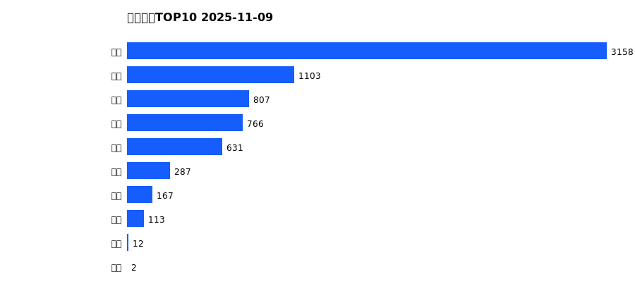
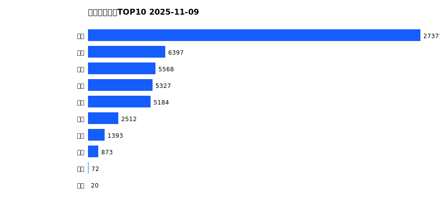
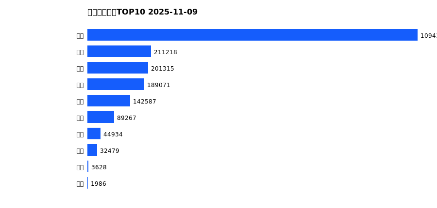
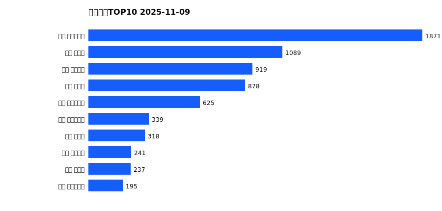
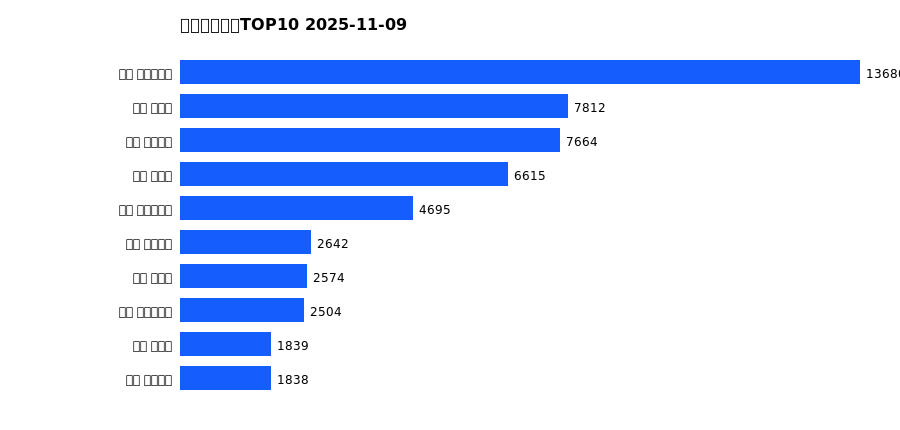
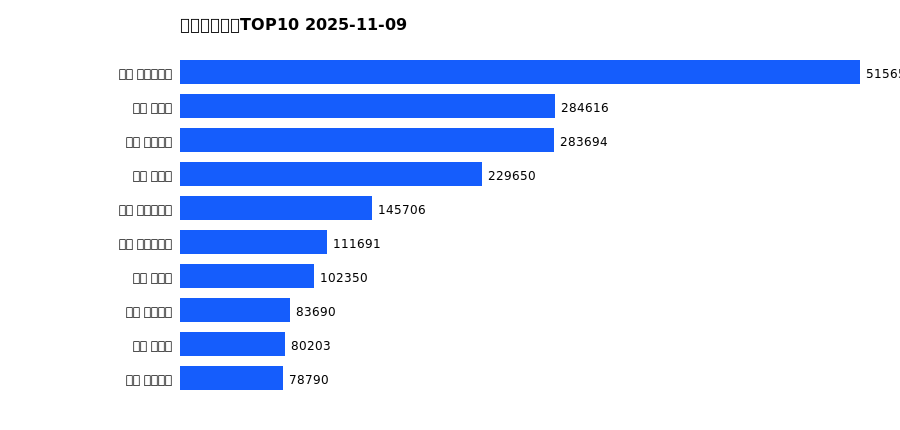

# 销售日报 2025-11-09

## 摘要

- 业态数: 10
- 门店数: 15
- 业态日销最大: 超市 3158
- 业态日销最小: 电影 2
- 门店日销最大: 许昌 时代广场店 1871
- 门店日销最小: 许昌 劳动店 34
- 同比: -
- 环比: -

## 集团合计

| period | sales_wan |
| --- | --- |
| daily | 7047.0 |
| monthly | 54717.0 |
| yearly | 2010615.0 |

## 业态 TOP10

### 日销

| rank | business_type | sales_wan |
| --- | --- | --- |
| 1 | 超市 | 3157.84 |
| 2 | 百货 | 1102.79 |
| 3 | 服饰 | 807.09 |
| 4 | 电器 | 766.05 |
| 5 | 珠宝 | 631.47 |
| 6 | 茶叶 | 286.75 |
| 7 | 医药 | 167.39 |
| 8 | 餐饮 | 112.6 |
| 9 | 电玩 | 12.29 |
| 10 | 电影 | 2.32 |

### 月度累计

| rank | business_type | sales_wan |
| --- | --- | --- |
| 1 | 超市 | 27371.42 |
| 2 | 百货 | 6396.98 |
| 3 | 服饰 | 5568.18 |
| 4 | 电器 | 5326.65 |
| 5 | 珠宝 | 5183.71 |
| 6 | 茶叶 | 2511.92 |
| 7 | 医药 | 1392.9 |
| 8 | 餐饮 | 872.55 |
| 9 | 电玩 | 72.45 |
| 10 | 电影 | 20.36 |

### 年度累计

| rank | business_type | sales_wan |
| --- | --- | --- |
| 1 | 超市 | 1094130.43 |
| 2 | 珠宝 | 211217.75 |
| 3 | 百货 | 201315.13 |
| 4 | 电器 | 189071.13 |
| 5 | 服饰 | 142587.04 |
| 6 | 茶叶 | 89266.66 |
| 7 | 医药 | 44934.36 |
| 8 | 餐饮 | 32478.51 |
| 9 | 电玩 | 3628.15 |
| 10 | 电影 | 1985.87 |

## 门店 TOP10

### 日销

| rank | store_name | sales_wan |
| --- | --- | --- |
| 1 | 许昌 时代广场店 | 1870.65 |
| 2 | 新乡 大胖店 | 1089.35 |
| 3 | 许昌 天使城店 | 918.98 |
| 4 | 新乡 小胖店 | 877.79 |
| 5 | 许昌 生活广场店 | 625.06 |
| 6 | 许昌 实业公司店 | 338.51 |
| 7 | 许昌 禹州店 | 317.72 |
| 8 | 许昌 线上商城 | 241.21 |
| 9 | 许昌 北海店 | 236.87 |
| 10 | 许昌 大众服饰店 | 194.72 |

### 月度累计

| rank | store_name | sales_wan |
| --- | --- | --- |
| 1 | 许昌 时代广场店 | 13680.34 |
| 2 | 新乡 大胖店 | 7812.44 |
| 3 | 许昌 天使城店 | 7664.13 |
| 4 | 新乡 小胖店 | 6614.91 |
| 5 | 许昌 生活广场店 | 4695.34 |
| 6 | 许昌 线上商城 | 2642.01 |
| 7 | 许昌 禹州店 | 2574.03 |
| 8 | 许昌 实业公司店 | 2504.13 |
| 9 | 许昌 北海店 | 1838.72 |
| 10 | 许昌 金三角店 | 1837.72 |

### 年度累计

| rank | store_name | sales_wan |
| --- | --- | --- |
| 1 | 许昌 时代广场店 | 515650.94 |
| 2 | 新乡 大胖店 | 284615.68 |
| 3 | 许昌 天使城店 | 283693.57 |
| 4 | 新乡 小胖店 | 229649.68 |
| 5 | 许昌 生活广场店 | 145705.6 |
| 6 | 许昌 实业公司店 | 111691.12 |
| 7 | 许昌 禹州店 | 102350.11 |
| 8 | 许昌 线上商城 | 83690.01 |
| 9 | 许昌 北海店 | 80202.78 |
| 10 | 许昌 金三角店 | 78790.18 |

