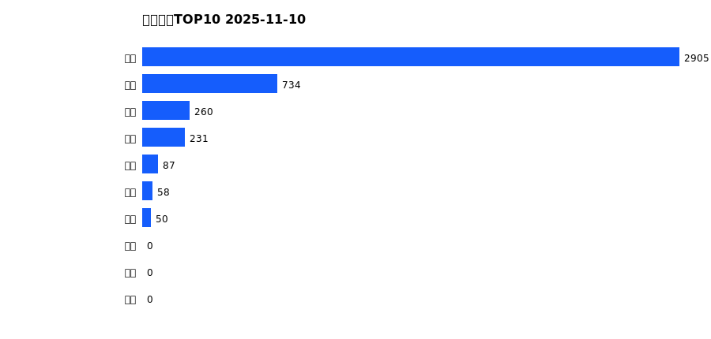
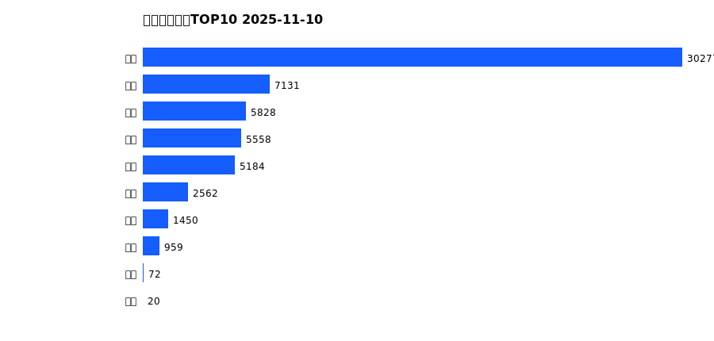
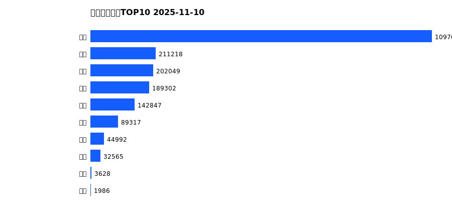
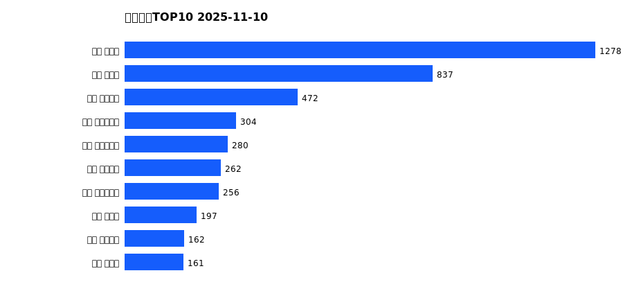
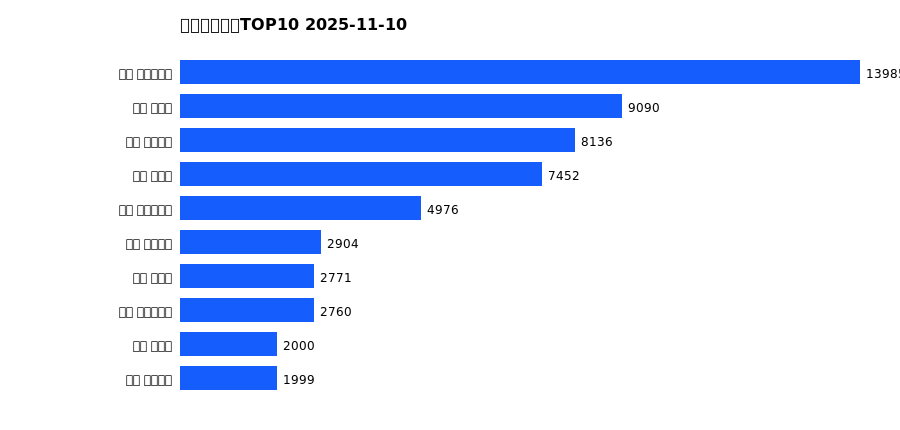
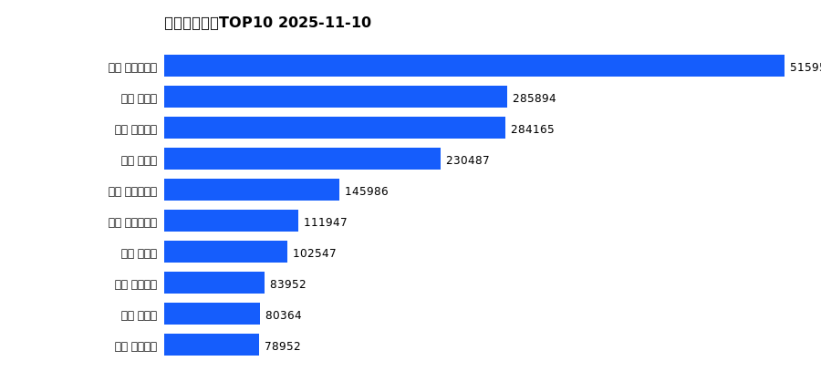

# 销售日报 2025-11-10

## 摘要

- 业态数: 10
- 门店数: 15
- 业态日销最大: 超市 2905
- 业态日销最小: 珠宝 0
- 门店日销最大: 新乡 大胖店 1278
- 门店日销最小: 许昌 大众服饰店 0
- 同比: -
- 环比: -

## 集团合计

| period | sales_wan |
| --- | --- |
| daily | 4325.0 |
| monthly | 59042.0 |
| yearly | 2014940.0 |

## 业态 TOP10

### 日销

| rank | business_type | sales_wan |
| --- | --- | --- |
| 1 | 超市 | 2905.48 |
| 2 | 百货 | 733.95 |
| 3 | 服饰 | 260.04 |
| 4 | 电器 | 230.99 |
| 5 | 餐饮 | 86.82 |
| 6 | 医药 | 57.54 |
| 7 | 茶叶 | 50.06 |
| 8 | 珠宝 | 0.0 |
| 9 | 电影 | 0.0 |
| 10 | 电玩 | 0.0 |

### 月度累计

| rank | business_type | sales_wan |
| --- | --- | --- |
| 1 | 超市 | 30276.9 |
| 2 | 百货 | 7130.93 |
| 3 | 服饰 | 5828.22 |
| 4 | 电器 | 5557.64 |
| 5 | 珠宝 | 5183.71 |
| 6 | 茶叶 | 2561.99 |
| 7 | 医药 | 1450.44 |
| 8 | 餐饮 | 959.37 |
| 9 | 电玩 | 72.45 |
| 10 | 电影 | 20.36 |

### 年度累计

| rank | business_type | sales_wan |
| --- | --- | --- |
| 1 | 超市 | 1097035.91 |
| 2 | 珠宝 | 211217.75 |
| 3 | 百货 | 202049.08 |
| 4 | 电器 | 189302.12 |
| 5 | 服饰 | 142847.08 |
| 6 | 茶叶 | 89316.72 |
| 7 | 医药 | 44991.9 |
| 8 | 餐饮 | 32565.33 |
| 9 | 电玩 | 3628.15 |
| 10 | 电影 | 1985.87 |

## 门店 TOP10

### 日销

| rank | store_name | sales_wan |
| --- | --- | --- |
| 1 | 新乡 大胖店 | 1278.06 |
| 2 | 新乡 小胖店 | 836.96 |
| 3 | 许昌 天使城店 | 471.69 |
| 4 | 许昌 时代广场店 | 304.41 |
| 5 | 许昌 生活广场店 | 280.18 |
| 6 | 许昌 线上商城 | 262.41 |
| 7 | 许昌 实业公司店 | 256.0 |
| 8 | 许昌 禹州店 | 196.76 |
| 9 | 许昌 金三角店 | 161.77 |
| 10 | 许昌 北海店 | 161.18 |

### 月度累计

| rank | store_name | sales_wan |
| --- | --- | --- |
| 1 | 许昌 时代广场店 | 13984.75 |
| 2 | 新乡 大胖店 | 9090.5 |
| 3 | 许昌 天使城店 | 8135.82 |
| 4 | 新乡 小胖店 | 7451.87 |
| 5 | 许昌 生活广场店 | 4975.51 |
| 6 | 许昌 线上商城 | 2904.42 |
| 7 | 许昌 禹州店 | 2770.79 |
| 8 | 许昌 实业公司店 | 2760.13 |
| 9 | 许昌 北海店 | 1999.9 |
| 10 | 许昌 金三角店 | 1999.49 |

### 年度累计

| rank | store_name | sales_wan |
| --- | --- | --- |
| 1 | 许昌 时代广场店 | 515955.35 |
| 2 | 新乡 大胖店 | 285893.74 |
| 3 | 许昌 天使城店 | 284165.27 |
| 4 | 新乡 小胖店 | 230486.64 |
| 5 | 许昌 生活广场店 | 145985.78 |
| 6 | 许昌 实业公司店 | 111947.12 |
| 7 | 许昌 禹州店 | 102546.87 |
| 8 | 许昌 线上商城 | 83952.43 |
| 9 | 许昌 北海店 | 80363.96 |
| 10 | 许昌 金三角店 | 78951.96 |

