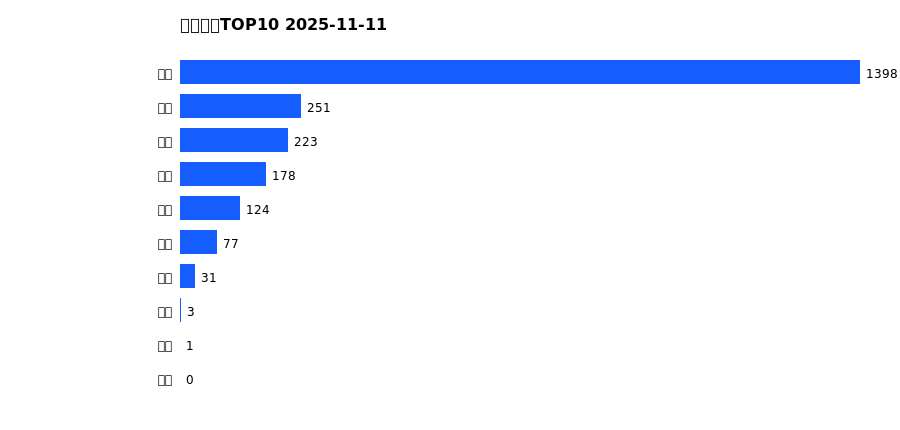
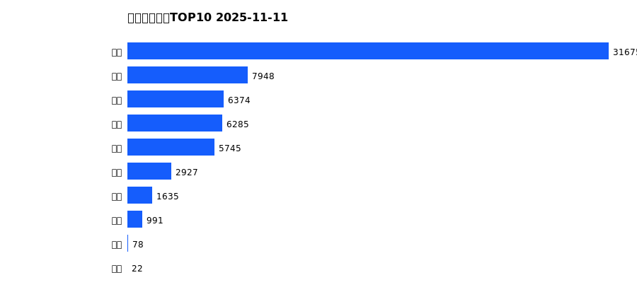
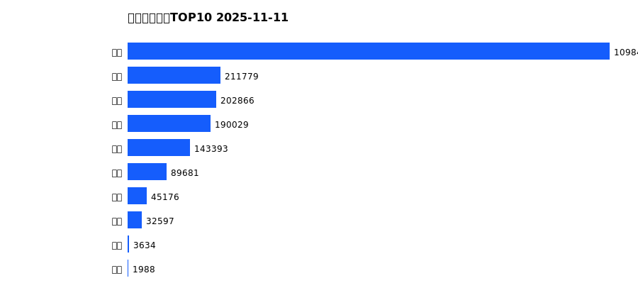
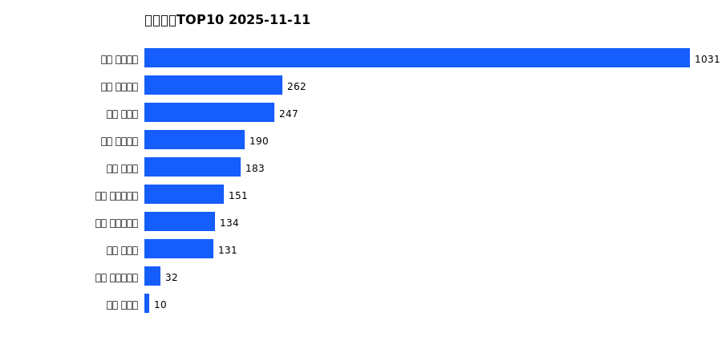
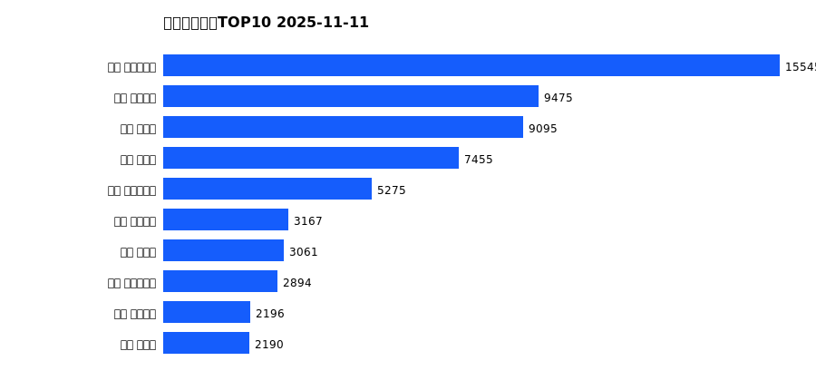
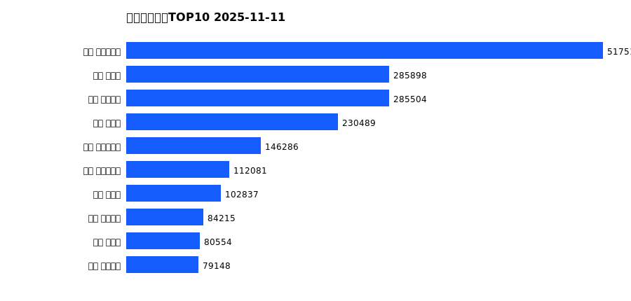

# 销售日报 2025-11-11

## 摘要

- 业态数: 10
- 门店数: 15
- 业态日销最大: 超市 1398
- 业态日销最小: 珠宝 0
- 门店日销最大: 许昌 天使城店 1031
- 门店日销最小: 许昌 生活广场店 0
- 同比: -
- 环比: -

## 集团合计

| period | sales_wan |
| --- | --- |
| daily | 2286.0 |
| monthly | 63679.0 |
| yearly | 2019577.0 |

## 业态 TOP10

### 日销

| rank | business_type | sales_wan |
| --- | --- | --- |
| 1 | 超市 | 1398.37 |
| 2 | 电器 | 250.6 |
| 3 | 百货 | 222.98 |
| 4 | 服饰 | 178.11 |
| 5 | 茶叶 | 124.11 |
| 6 | 医药 | 77.13 |
| 7 | 餐饮 | 31.42 |
| 8 | 电玩 | 2.71 |
| 9 | 电影 | 0.94 |
| 10 | 珠宝 | 0.0 |

### 月度累计

| rank | business_type | sales_wan |
| --- | --- | --- |
| 1 | 超市 | 31675.27 |
| 2 | 百货 | 7947.75 |
| 3 | 服饰 | 6373.7 |
| 4 | 电器 | 6284.77 |
| 5 | 珠宝 | 5744.56 |
| 6 | 茶叶 | 2926.56 |
| 7 | 医药 | 1634.82 |
| 8 | 餐饮 | 990.79 |
| 9 | 电玩 | 78.13 |
| 10 | 电影 | 22.43 |

### 年度累计

| rank | business_type | sales_wan |
| --- | --- | --- |
| 1 | 超市 | 1098434.28 |
| 2 | 珠宝 | 211778.59 |
| 3 | 百货 | 202865.89 |
| 4 | 电器 | 190029.25 |
| 5 | 服饰 | 143392.55 |
| 6 | 茶叶 | 89681.29 |
| 7 | 医药 | 45176.28 |
| 8 | 餐饮 | 32596.76 |
| 9 | 电玩 | 3633.84 |
| 10 | 电影 | 1987.93 |

## 门店 TOP10

### 日销

| rank | store_name | sales_wan |
| --- | --- | --- |
| 1 | 许昌 天使城店 | 1031.3 |
| 2 | 许昌 线上商城 | 262.2 |
| 3 | 许昌 禹州店 | 246.56 |
| 4 | 许昌 金三角店 | 190.33 |
| 5 | 许昌 北海店 | 183.02 |
| 6 | 许昌 大众服饰店 | 150.88 |
| 7 | 许昌 实业公司店 | 133.71 |
| 8 | 许昌 金汇店 | 131.49 |
| 9 | 许昌 时代广场店 | 31.72 |
| 10 | 许昌 魏源店 | 10.22 |

### 月度累计

| rank | store_name | sales_wan |
| --- | --- | --- |
| 1 | 许昌 时代广场店 | 15544.69 |
| 2 | 许昌 天使城店 | 9474.79 |
| 3 | 新乡 大胖店 | 9094.65 |
| 4 | 新乡 小胖店 | 7454.52 |
| 5 | 许昌 生活广场店 | 5275.24 |
| 6 | 许昌 线上商城 | 3166.62 |
| 7 | 许昌 禹州店 | 3060.52 |
| 8 | 许昌 实业公司店 | 2893.84 |
| 9 | 许昌 金三角店 | 2195.95 |
| 10 | 许昌 北海店 | 2190.3 |

### 年度累计

| rank | store_name | sales_wan |
| --- | --- | --- |
| 1 | 许昌 时代广场店 | 517515.3 |
| 2 | 新乡 大胖店 | 285897.89 |
| 3 | 许昌 天使城店 | 285504.24 |
| 4 | 新乡 小胖店 | 230489.29 |
| 5 | 许昌 生活广场店 | 146285.5 |
| 6 | 许昌 实业公司店 | 112080.83 |
| 7 | 许昌 禹州店 | 102836.6 |
| 8 | 许昌 线上商城 | 84214.63 |
| 9 | 许昌 北海店 | 80554.35 |
| 10 | 许昌 金三角店 | 79148.41 |

