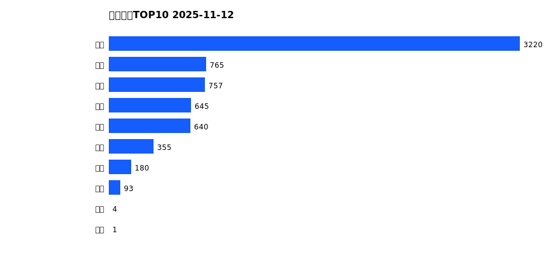
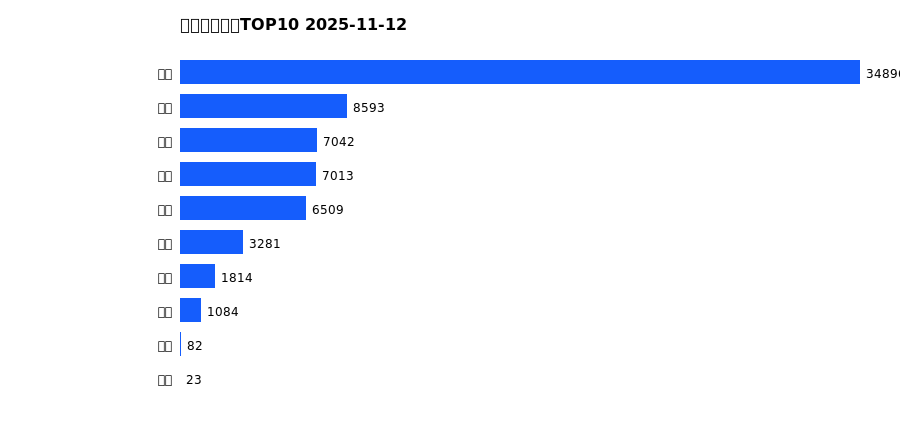
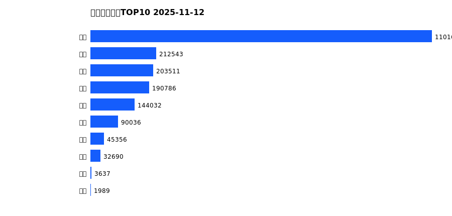
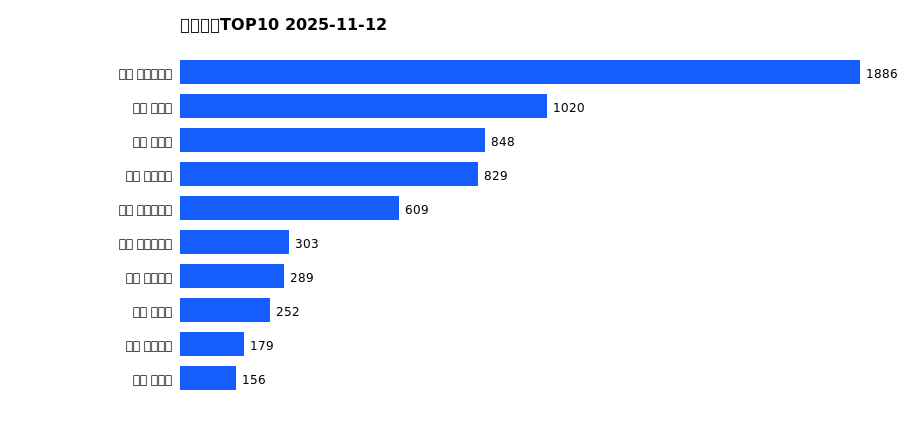
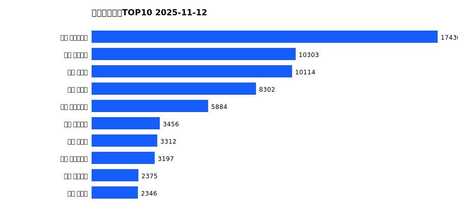
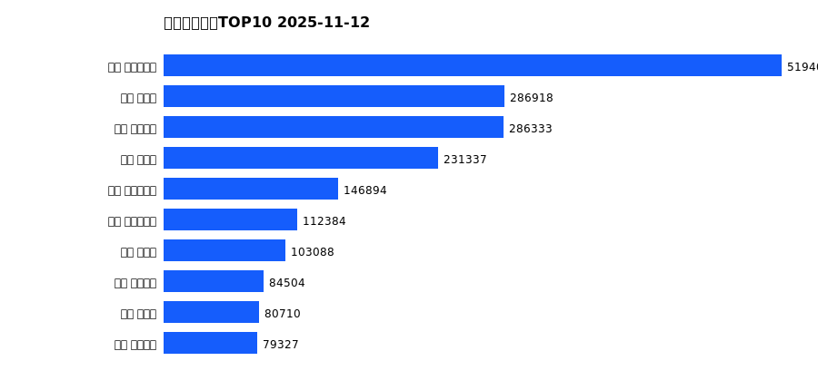

# 销售日报 2025-11-12

## 摘要

- 业态数: 10
- 门店数: 15
- 业态日销最大: 超市 3220
- 业态日销最小: 电影 1
- 门店日销最大: 许昌 时代广场店 1886
- 门店日销最小: 许昌 劳动店 34
- 同比: -
- 环比: -

## 集团合计

| period | sales_wan |
| --- | --- |
| daily | 6659.0 |
| monthly | 70337.0 |
| yearly | 2026235.0 |

## 业态 TOP10

### 日销

| rank | business_type | sales_wan |
| --- | --- | --- |
| 1 | 超市 | 3220.43 |
| 2 | 珠宝 | 764.71 |
| 3 | 电器 | 756.94 |
| 4 | 百货 | 645.16 |
| 5 | 服饰 | 639.57 |
| 6 | 茶叶 | 354.9 |
| 7 | 医药 | 179.61 |
| 8 | 餐饮 | 92.9 |
| 9 | 电玩 | 3.6 |
| 10 | 电影 | 0.89 |

### 月度累计

| rank | business_type | sales_wan |
| --- | --- | --- |
| 1 | 超市 | 34895.7 |
| 2 | 百货 | 8592.91 |
| 3 | 电器 | 7041.71 |
| 4 | 服饰 | 7013.27 |
| 5 | 珠宝 | 6509.27 |
| 6 | 茶叶 | 3281.46 |
| 7 | 医药 | 1814.43 |
| 8 | 餐饮 | 1083.7 |
| 9 | 电玩 | 81.73 |
| 10 | 电影 | 23.31 |

### 年度累计

| rank | business_type | sales_wan |
| --- | --- | --- |
| 1 | 超市 | 1101654.71 |
| 2 | 珠宝 | 212543.3 |
| 3 | 百货 | 203511.06 |
| 4 | 电器 | 190786.18 |
| 5 | 服饰 | 144032.13 |
| 6 | 茶叶 | 90036.2 |
| 7 | 医药 | 45355.89 |
| 8 | 餐饮 | 32689.66 |
| 9 | 电玩 | 3637.44 |
| 10 | 电影 | 1988.82 |

## 门店 TOP10

### 日销

| rank | store_name | sales_wan |
| --- | --- | --- |
| 1 | 许昌 时代广场店 | 1885.67 |
| 2 | 新乡 大胖店 | 1019.68 |
| 3 | 新乡 小胖店 | 847.63 |
| 4 | 许昌 天使城店 | 828.62 |
| 5 | 许昌 生活广场店 | 608.69 |
| 6 | 许昌 实业公司店 | 303.43 |
| 7 | 许昌 线上商城 | 289.49 |
| 8 | 许昌 禹州店 | 251.81 |
| 9 | 许昌 金三角店 | 178.57 |
| 10 | 许昌 北海店 | 155.94 |

### 月度累计

| rank | store_name | sales_wan |
| --- | --- | --- |
| 1 | 许昌 时代广场店 | 17430.36 |
| 2 | 许昌 天使城店 | 10303.41 |
| 3 | 新乡 大胖店 | 10114.33 |
| 4 | 新乡 小胖店 | 8302.15 |
| 5 | 许昌 生活广场店 | 5883.92 |
| 6 | 许昌 线上商城 | 3456.12 |
| 7 | 许昌 禹州店 | 3312.33 |
| 8 | 许昌 实业公司店 | 3197.27 |
| 9 | 许昌 金三角店 | 2374.52 |
| 10 | 许昌 北海店 | 2346.24 |

### 年度累计

| rank | store_name | sales_wan |
| --- | --- | --- |
| 1 | 许昌 时代广场店 | 519400.97 |
| 2 | 新乡 大胖店 | 286917.57 |
| 3 | 许昌 天使城店 | 286332.86 |
| 4 | 新乡 小胖店 | 231336.92 |
| 5 | 许昌 生活广场店 | 146894.19 |
| 6 | 许昌 实业公司店 | 112384.26 |
| 7 | 许昌 禹州店 | 103088.41 |
| 8 | 许昌 线上商城 | 84504.12 |
| 9 | 许昌 北海店 | 80710.3 |
| 10 | 许昌 金三角店 | 79326.99 |

