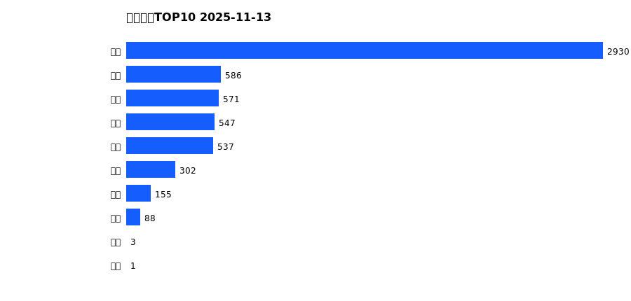
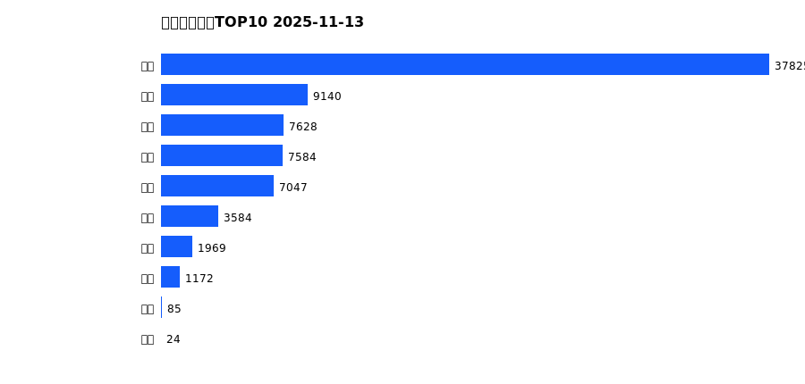
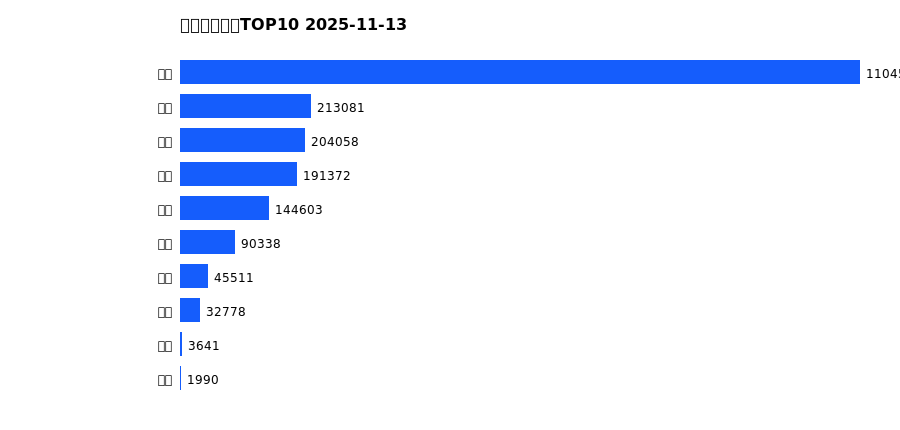
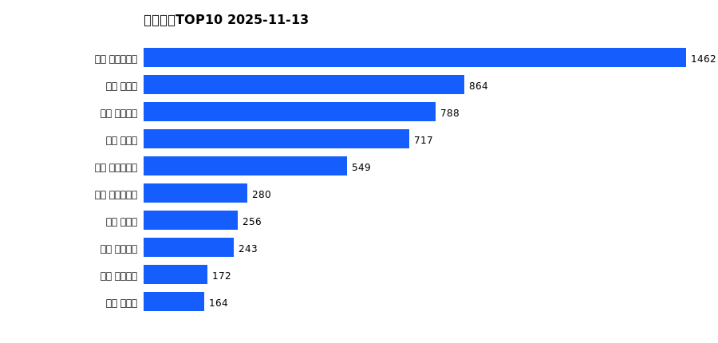
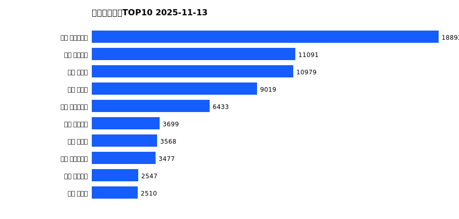
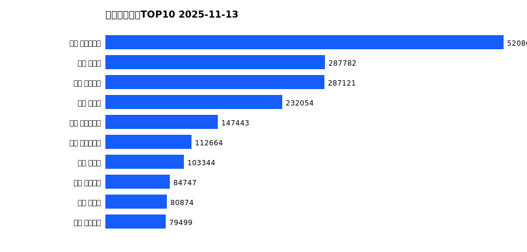

# 销售日报 2025-11-13

## 摘要

- 业态数: 10
- 门店数: 15
- 业态日销最大: 超市 2930
- 业态日销最小: 电影 1
- 门店日销最大: 许昌 时代广场店 1462
- 门店日销最小: 许昌 劳动店 34
- 同比: -
- 环比: -

## 集团合计

| period | sales_wan |
| --- | --- |
| daily | 5719.0 |
| monthly | 76057.0 |
| yearly | 2031955.0 |

## 业态 TOP10

### 日销

| rank | business_type | sales_wan |
| --- | --- | --- |
| 1 | 超市 | 2929.75 |
| 2 | 电器 | 585.88 |
| 3 | 服饰 | 570.58 |
| 4 | 百货 | 546.59 |
| 5 | 珠宝 | 537.35 |
| 6 | 茶叶 | 302.25 |
| 7 | 医药 | 154.76 |
| 8 | 餐饮 | 88.26 |
| 9 | 电玩 | 3.08 |
| 10 | 电影 | 0.96 |

### 月度累计

| rank | business_type | sales_wan |
| --- | --- | --- |
| 1 | 超市 | 37825.45 |
| 2 | 百货 | 9139.5 |
| 3 | 电器 | 7627.59 |
| 4 | 服饰 | 7583.85 |
| 5 | 珠宝 | 7046.62 |
| 6 | 茶叶 | 3583.71 |
| 7 | 医药 | 1969.19 |
| 8 | 餐饮 | 1171.95 |
| 9 | 电玩 | 84.82 |
| 10 | 电影 | 24.27 |

### 年度累计

| rank | business_type | sales_wan |
| --- | --- | --- |
| 1 | 超市 | 1104584.46 |
| 2 | 珠宝 | 213080.65 |
| 3 | 百货 | 204057.64 |
| 4 | 电器 | 191372.06 |
| 5 | 服饰 | 144602.7 |
| 6 | 茶叶 | 90338.44 |
| 7 | 医药 | 45510.64 |
| 8 | 餐饮 | 32777.92 |
| 9 | 电玩 | 3640.53 |
| 10 | 电影 | 1989.78 |

## 门店 TOP10

### 日销

| rank | store_name | sales_wan |
| --- | --- | --- |
| 1 | 许昌 时代广场店 | 1461.58 |
| 2 | 新乡 大胖店 | 864.42 |
| 3 | 许昌 天使城店 | 787.8 |
| 4 | 新乡 小胖店 | 716.73 |
| 5 | 许昌 生活广场店 | 549.29 |
| 6 | 许昌 实业公司店 | 280.22 |
| 7 | 许昌 禹州店 | 255.55 |
| 8 | 许昌 线上商城 | 242.94 |
| 9 | 许昌 金三角店 | 172.25 |
| 10 | 许昌 北海店 | 163.53 |

### 月度累计

| rank | store_name | sales_wan |
| --- | --- | --- |
| 1 | 许昌 时代广场店 | 18891.94 |
| 2 | 许昌 天使城店 | 11091.21 |
| 3 | 新乡 大胖店 | 10978.75 |
| 4 | 新乡 小胖店 | 9018.88 |
| 5 | 许昌 生活广场店 | 6433.22 |
| 6 | 许昌 线上商城 | 3699.06 |
| 7 | 许昌 禹州店 | 3567.88 |
| 8 | 许昌 实业公司店 | 3477.49 |
| 9 | 许昌 金三角店 | 2546.78 |
| 10 | 许昌 北海店 | 2509.77 |

### 年度累计

| rank | store_name | sales_wan |
| --- | --- | --- |
| 1 | 许昌 时代广场店 | 520862.55 |
| 2 | 新乡 大胖店 | 287781.99 |
| 3 | 许昌 天使城店 | 287120.66 |
| 4 | 新乡 小胖店 | 232053.65 |
| 5 | 许昌 生活广场店 | 147443.48 |
| 6 | 许昌 实业公司店 | 112664.48 |
| 7 | 许昌 禹州店 | 103343.96 |
| 8 | 许昌 线上商城 | 84747.07 |
| 9 | 许昌 北海店 | 80873.83 |
| 10 | 许昌 金三角店 | 79499.24 |

