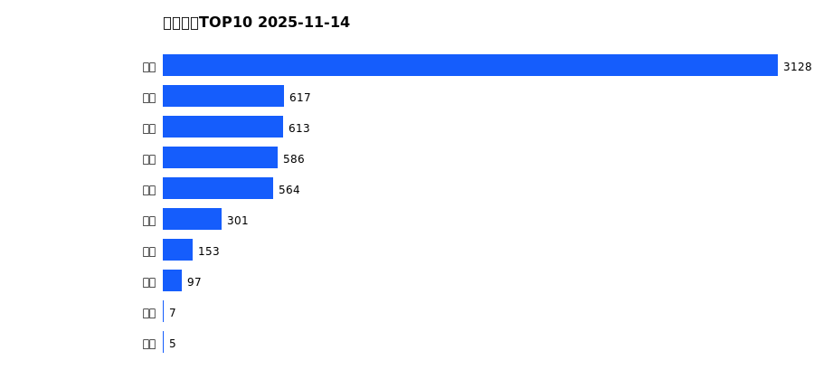
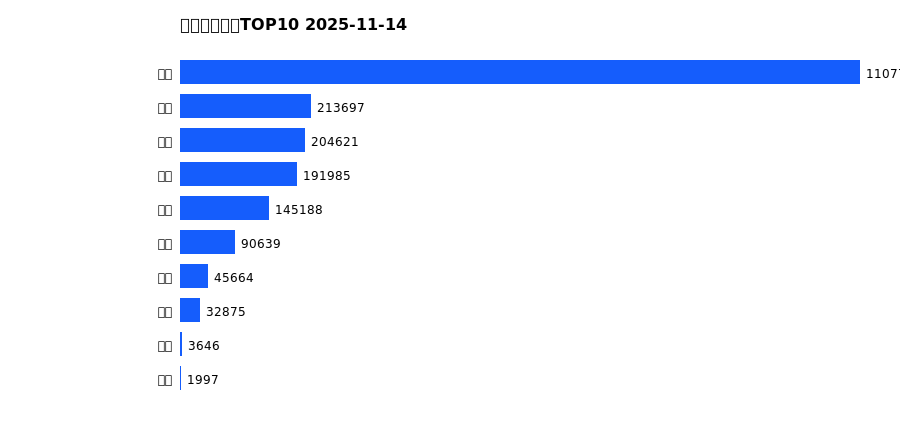
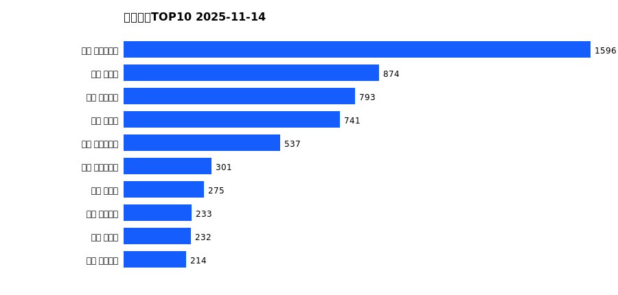
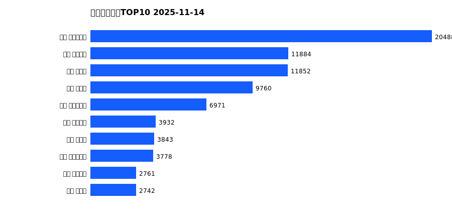
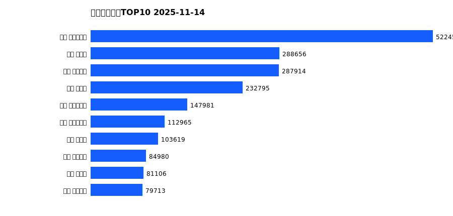

# 销售日报 2025-11-14

## 摘要

- 业态数: 10
- 门店数: 15
- 业态日销最大: 超市 3128
- 业态日销最小: 电玩 5
- 门店日销最大: 许昌 时代广场店 1596
- 门店日销最小: 许昌 劳动店 31
- 同比: -
- 环比: -

## 集团合计

| period | sales_wan |
| --- | --- |
| daily | 6070.0 |
| monthly | 82127.0 |
| yearly | 2038025.0 |

## 业态 TOP10

### 日销

| rank | business_type | sales_wan |
| --- | --- | --- |
| 1 | 超市 | 3127.75 |
| 2 | 珠宝 | 616.7 |
| 3 | 电器 | 613.08 |
| 4 | 服饰 | 585.68 |
| 5 | 百货 | 563.55 |
| 6 | 茶叶 | 300.9 |
| 7 | 医药 | 153.34 |
| 8 | 餐饮 | 97.03 |
| 9 | 电影 | 6.87 |
| 10 | 电玩 | 5.01 |

### 月度累计

| rank | business_type | sales_wan |
| --- | --- | --- |
| 1 | 超市 | 40953.19 |
| 2 | 百货 | 9703.05 |
| 3 | 电器 | 8240.67 |
| 4 | 服饰 | 8169.52 |
| 5 | 珠宝 | 7663.32 |
| 6 | 茶叶 | 3884.61 |
| 7 | 医药 | 2122.53 |
| 8 | 餐饮 | 1268.99 |
| 9 | 电玩 | 89.83 |
| 10 | 电影 | 31.14 |

### 年度累计

| rank | business_type | sales_wan |
| --- | --- | --- |
| 1 | 超市 | 1107712.2 |
| 2 | 珠宝 | 213697.35 |
| 3 | 百货 | 204621.2 |
| 4 | 电器 | 191985.14 |
| 5 | 服饰 | 145188.38 |
| 6 | 茶叶 | 90639.34 |
| 7 | 医药 | 45663.98 |
| 8 | 餐饮 | 32874.95 |
| 9 | 电玩 | 3645.54 |
| 10 | 电影 | 1996.65 |

## 门店 TOP10

### 日销

| rank | store_name | sales_wan |
| --- | --- | --- |
| 1 | 许昌 时代广场店 | 1596.31 |
| 2 | 新乡 大胖店 | 873.69 |
| 3 | 许昌 天使城店 | 793.03 |
| 4 | 新乡 小胖店 | 741.09 |
| 5 | 许昌 生活广场店 | 537.36 |
| 6 | 许昌 实业公司店 | 300.57 |
| 7 | 许昌 禹州店 | 274.66 |
| 8 | 许昌 线上商城 | 233.36 |
| 9 | 许昌 北海店 | 232.28 |
| 10 | 许昌 金三角店 | 214.15 |

### 月度累计

| rank | store_name | sales_wan |
| --- | --- | --- |
| 1 | 许昌 时代广场店 | 20488.25 |
| 2 | 许昌 天使城店 | 11884.24 |
| 3 | 新乡 大胖店 | 11852.44 |
| 4 | 新乡 小胖店 | 9759.97 |
| 5 | 许昌 生活广场店 | 6970.58 |
| 6 | 许昌 线上商城 | 3932.42 |
| 7 | 许昌 禹州店 | 3842.54 |
| 8 | 许昌 实业公司店 | 3778.07 |
| 9 | 许昌 金三角店 | 2760.93 |
| 10 | 许昌 北海店 | 2742.06 |

### 年度累计

| rank | store_name | sales_wan |
| --- | --- | --- |
| 1 | 许昌 时代广场店 | 522458.86 |
| 2 | 新乡 大胖店 | 288655.68 |
| 3 | 许昌 天使城店 | 287913.69 |
| 4 | 新乡 小胖店 | 232794.74 |
| 5 | 许昌 生活广场店 | 147980.84 |
| 6 | 许昌 实业公司店 | 112965.06 |
| 7 | 许昌 禹州店 | 103618.62 |
| 8 | 许昌 线上商城 | 84980.43 |
| 9 | 许昌 北海店 | 81106.11 |
| 10 | 许昌 金三角店 | 79713.39 |

