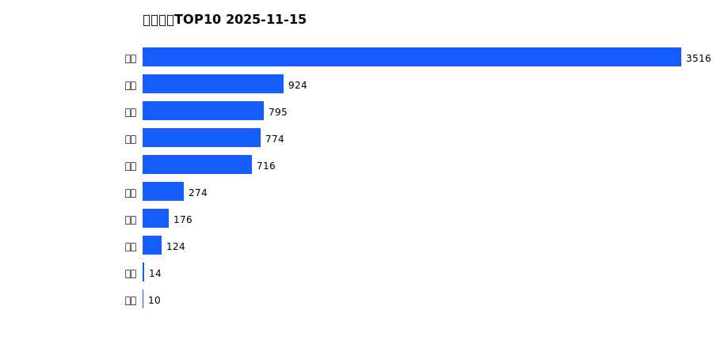
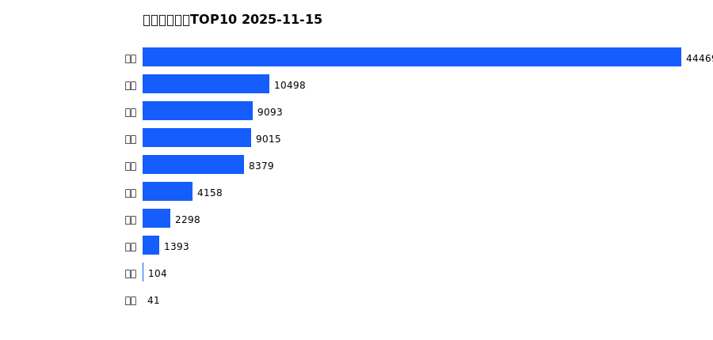
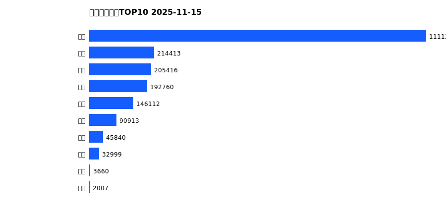
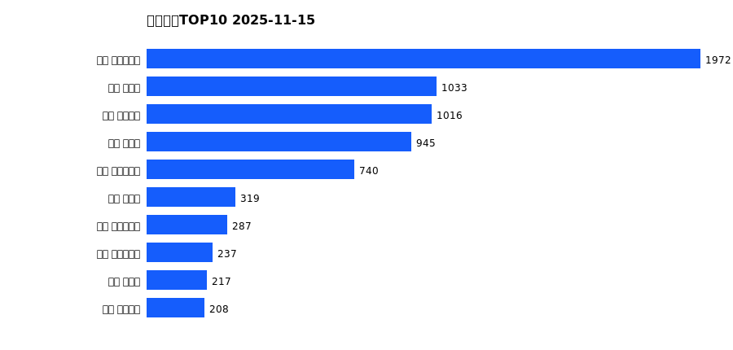
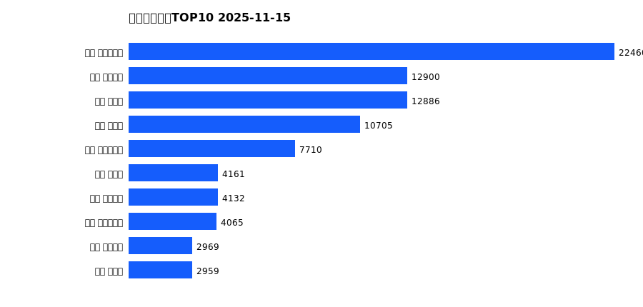
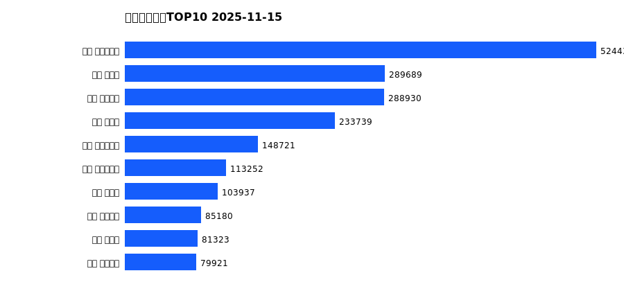

# 销售日报 2025-11-15

## 摘要

- 业态数: 10
- 门店数: 15
- 业态日销最大: 超市 3516
- 业态日销最小: 电影 10
- 门店日销最大: 许昌 时代广场店 1972
- 门店日销最小: 许昌 劳动店 35
- 同比: -
- 环比: -

## 集团合计

| period | sales_wan |
| --- | --- |
| daily | 7322.0 |
| monthly | 89449.0 |
| yearly | 2045347.0 |

## 业态 TOP10

### 日销

| rank | business_type | sales_wan |
| --- | --- | --- |
| 1 | 超市 | 3515.8 |
| 2 | 服饰 | 923.63 |
| 3 | 百货 | 794.73 |
| 4 | 电器 | 774.39 |
| 5 | 珠宝 | 715.54 |
| 6 | 茶叶 | 273.56 |
| 7 | 医药 | 175.77 |
| 8 | 餐饮 | 124.28 |
| 9 | 电玩 | 14.27 |
| 10 | 电影 | 9.93 |

### 月度累计

| rank | business_type | sales_wan |
| --- | --- | --- |
| 1 | 超市 | 44468.99 |
| 2 | 百货 | 10497.78 |
| 3 | 服饰 | 9093.16 |
| 4 | 电器 | 9015.05 |
| 5 | 珠宝 | 8378.86 |
| 6 | 茶叶 | 4158.17 |
| 7 | 医药 | 2298.3 |
| 8 | 餐饮 | 1393.27 |
| 9 | 电玩 | 104.1 |
| 10 | 电影 | 41.07 |

### 年度累计

| rank | business_type | sales_wan |
| --- | --- | --- |
| 1 | 超市 | 1111228.0 |
| 2 | 珠宝 | 214412.89 |
| 3 | 百货 | 205415.93 |
| 4 | 电器 | 192759.53 |
| 5 | 服饰 | 146112.01 |
| 6 | 茶叶 | 90912.9 |
| 7 | 医药 | 45839.76 |
| 8 | 餐饮 | 32999.23 |
| 9 | 电玩 | 3659.81 |
| 10 | 电影 | 2006.58 |

## 门店 TOP10

### 日销

| rank | store_name | sales_wan |
| --- | --- | --- |
| 1 | 许昌 时代广场店 | 1971.92 |
| 2 | 新乡 大胖店 | 1033.07 |
| 3 | 许昌 天使城店 | 1015.89 |
| 4 | 新乡 小胖店 | 944.6 |
| 5 | 许昌 生活广场店 | 739.71 |
| 6 | 许昌 禹州店 | 318.75 |
| 7 | 许昌 实业公司店 | 287.25 |
| 8 | 许昌 大众服饰店 | 237.43 |
| 9 | 许昌 北海店 | 216.59 |
| 10 | 许昌 金三角店 | 208.02 |

### 月度累计

| rank | store_name | sales_wan |
| --- | --- | --- |
| 1 | 许昌 时代广场店 | 22460.17 |
| 2 | 许昌 天使城店 | 12900.13 |
| 3 | 新乡 大胖店 | 12885.51 |
| 4 | 新乡 小胖店 | 10704.57 |
| 5 | 许昌 生活广场店 | 7710.29 |
| 6 | 许昌 禹州店 | 4161.29 |
| 7 | 许昌 线上商城 | 4132.26 |
| 8 | 许昌 实业公司店 | 4065.32 |
| 9 | 许昌 金三角店 | 2968.95 |
| 10 | 许昌 北海店 | 2958.65 |

### 年度累计

| rank | store_name | sales_wan |
| --- | --- | --- |
| 1 | 许昌 时代广场店 | 524430.77 |
| 2 | 新乡 大胖店 | 289688.75 |
| 3 | 许昌 天使城店 | 288929.58 |
| 4 | 新乡 小胖店 | 233739.34 |
| 5 | 许昌 生活广场店 | 148720.55 |
| 6 | 许昌 实业公司店 | 113252.31 |
| 7 | 许昌 禹州店 | 103937.37 |
| 8 | 许昌 线上商城 | 85180.27 |
| 9 | 许昌 北海店 | 81322.71 |
| 10 | 许昌 金三角店 | 79921.41 |

