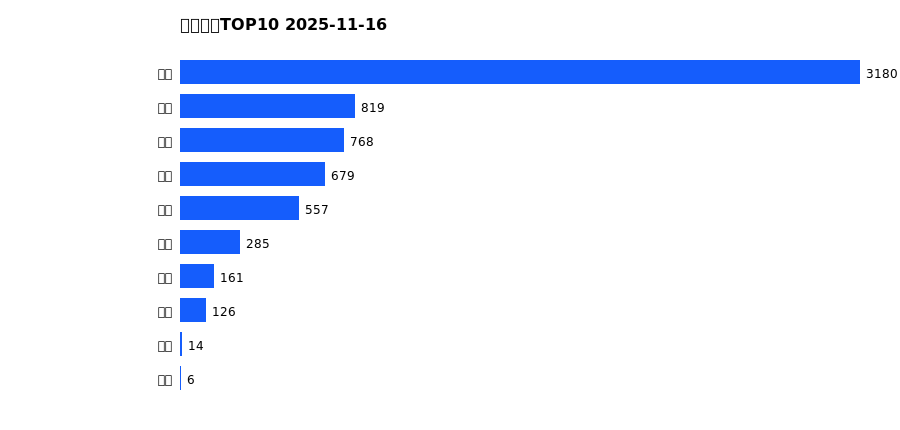
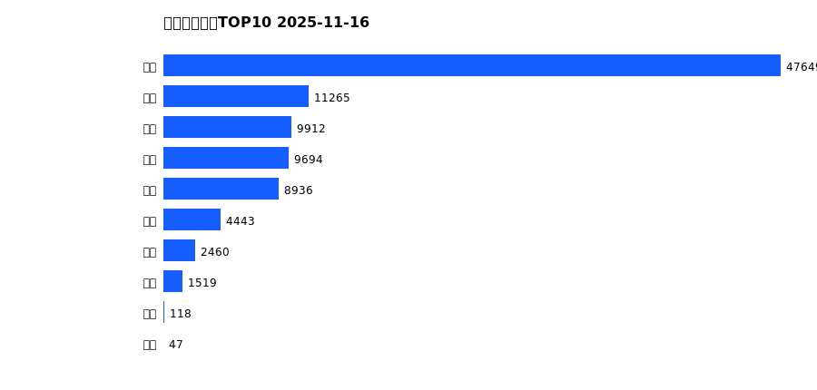
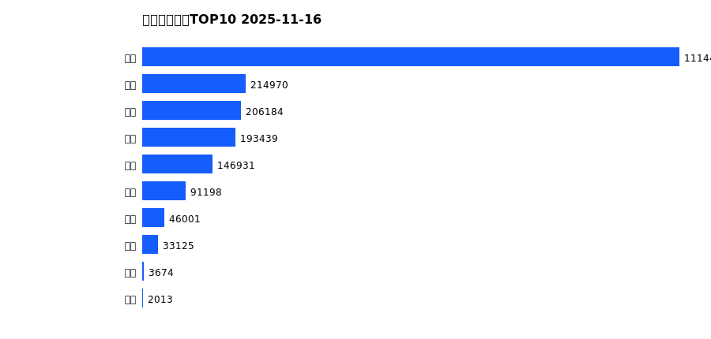
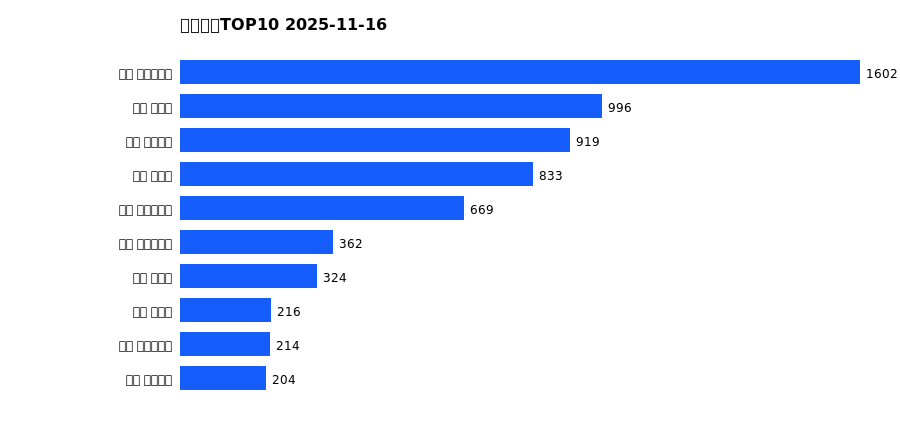
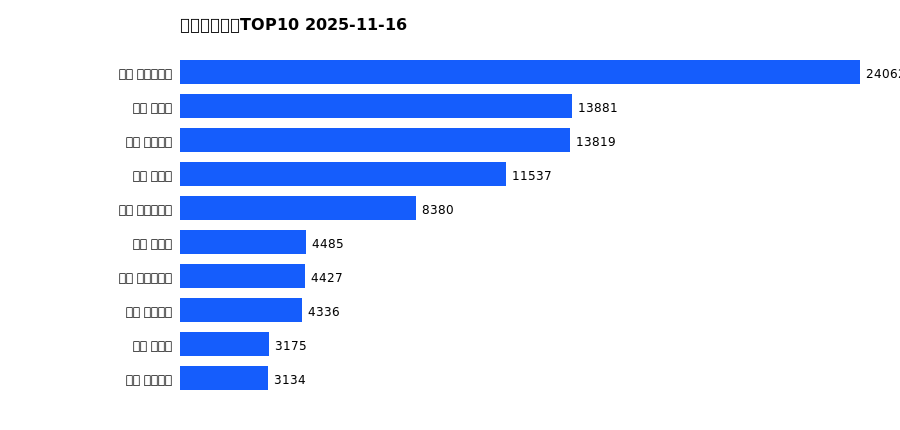
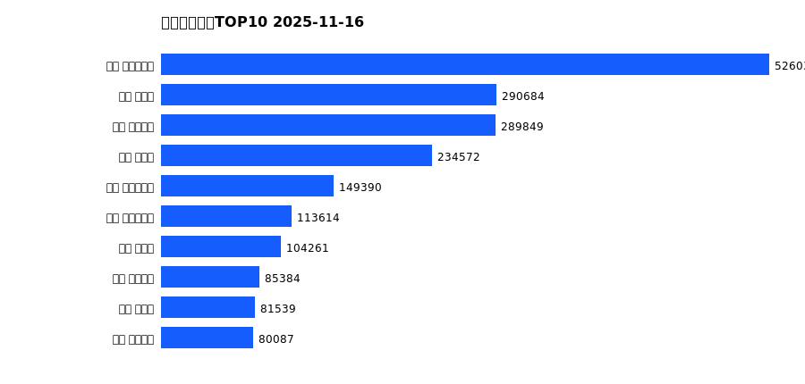

# 销售日报 2025-11-16

## 摘要

- 业态数: 10
- 门店数: 15
- 业态日销最大: 超市 3180
- 业态日销最小: 电影 6
- 门店日销最大: 许昌 时代广场店 1602
- 门店日销最小: 许昌 劳动店 36
- 同比: -
- 环比: -

## 集团合计

| period | sales_wan |
| --- | --- |
| daily | 6596.0 |
| monthly | 96044.0 |
| yearly | 2051942.0 |

## 业态 TOP10

### 日销

| rank | business_type | sales_wan |
| --- | --- | --- |
| 1 | 超市 | 3180.49 |
| 2 | 服饰 | 819.21 |
| 3 | 百货 | 767.65 |
| 4 | 电器 | 679.32 |
| 5 | 珠宝 | 557.2 |
| 6 | 茶叶 | 284.6 |
| 7 | 医药 | 161.35 |
| 8 | 餐饮 | 125.72 |
| 9 | 电玩 | 13.82 |
| 10 | 电影 | 6.36 |

### 月度累计

| rank | business_type | sales_wan |
| --- | --- | --- |
| 1 | 超市 | 47649.48 |
| 2 | 百货 | 11265.43 |
| 3 | 服饰 | 9912.37 |
| 4 | 电器 | 9694.38 |
| 5 | 珠宝 | 8936.07 |
| 6 | 茶叶 | 4442.77 |
| 7 | 医药 | 2459.64 |
| 8 | 餐饮 | 1518.98 |
| 9 | 电玩 | 117.92 |
| 10 | 电影 | 47.43 |

### 年度累计

| rank | business_type | sales_wan |
| --- | --- | --- |
| 1 | 超市 | 1114408.49 |
| 2 | 珠宝 | 214970.1 |
| 3 | 百货 | 206183.58 |
| 4 | 电器 | 193438.85 |
| 5 | 服饰 | 146931.23 |
| 6 | 茶叶 | 91197.51 |
| 7 | 医药 | 46001.1 |
| 8 | 餐饮 | 33124.95 |
| 9 | 电玩 | 3673.62 |
| 10 | 电影 | 2012.94 |

## 门店 TOP10

### 日销

| rank | store_name | sales_wan |
| --- | --- | --- |
| 1 | 许昌 时代广场店 | 1602.08 |
| 2 | 新乡 大胖店 | 995.66 |
| 3 | 许昌 天使城店 | 919.26 |
| 4 | 新乡 小胖店 | 832.69 |
| 5 | 许昌 生活广场店 | 669.3 |
| 6 | 许昌 实业公司店 | 362.1 |
| 7 | 许昌 禹州店 | 324.11 |
| 8 | 许昌 北海店 | 216.16 |
| 9 | 许昌 大众服饰店 | 214.3 |
| 10 | 许昌 线上商城 | 204.06 |

### 月度累计

| rank | store_name | sales_wan |
| --- | --- | --- |
| 1 | 许昌 时代广场店 | 24062.25 |
| 2 | 新乡 大胖店 | 13881.17 |
| 3 | 许昌 天使城店 | 13819.39 |
| 4 | 新乡 小胖店 | 11537.26 |
| 5 | 许昌 生活广场店 | 8379.58 |
| 6 | 许昌 禹州店 | 4485.41 |
| 7 | 许昌 实业公司店 | 4427.42 |
| 8 | 许昌 线上商城 | 4336.32 |
| 9 | 许昌 北海店 | 3174.81 |
| 10 | 许昌 金三角店 | 3134.06 |

### 年度累计

| rank | store_name | sales_wan |
| --- | --- | --- |
| 1 | 许昌 时代广场店 | 526032.85 |
| 2 | 新乡 大胖店 | 290684.41 |
| 3 | 许昌 天使城店 | 289848.84 |
| 4 | 新乡 小胖店 | 234572.03 |
| 5 | 许昌 生活广场店 | 149389.84 |
| 6 | 许昌 实业公司店 | 113614.41 |
| 7 | 许昌 禹州店 | 104261.49 |
| 8 | 许昌 线上商城 | 85384.32 |
| 9 | 许昌 北海店 | 81538.86 |
| 10 | 许昌 金三角店 | 80086.53 |

