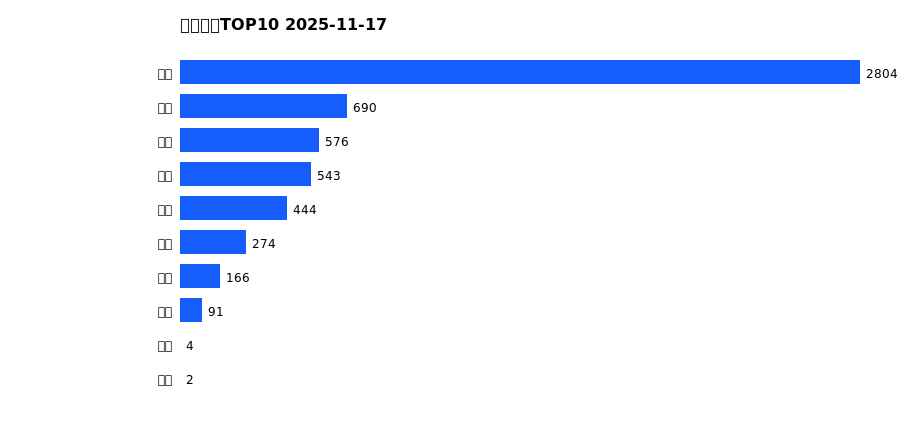
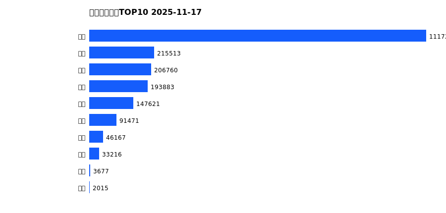
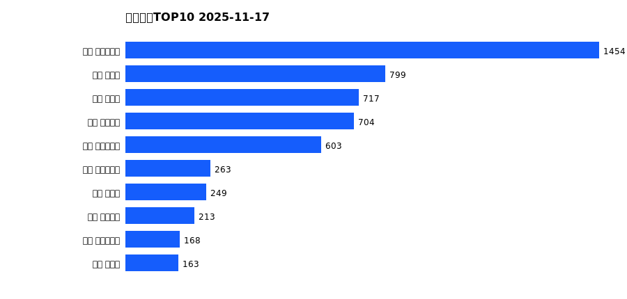
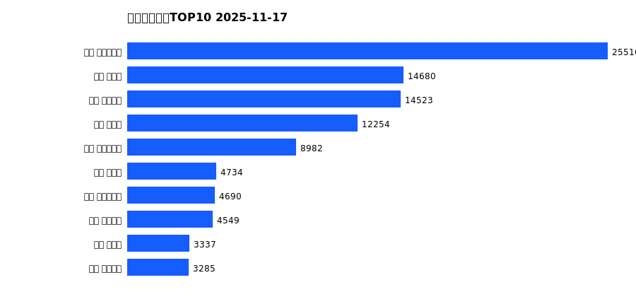
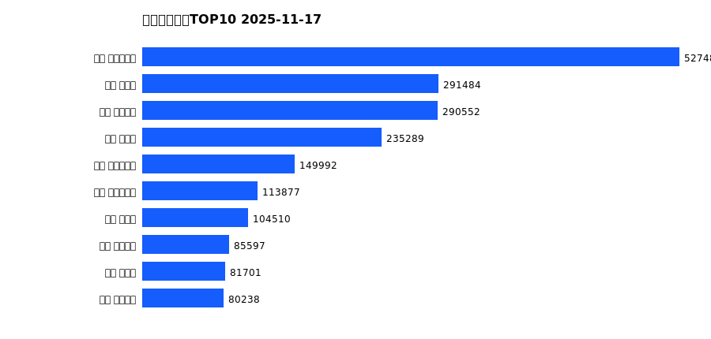

# 销售日报 2025-11-17

## 摘要

- 业态数: 10
- 门店数: 15
- 业态日销最大: 超市 2804
- 业态日销最小: 电影 2
- 门店日销最大: 许昌 时代广场店 1454
- 门店日销最小: 许昌 劳动店 30
- 同比: -
- 环比: -

## 集团合计

| period | sales_wan |
| --- | --- |
| daily | 5593.0 |
| monthly | 101638.0 |
| yearly | 2057536.0 |

## 业态 TOP10

### 日销

| rank | business_type | sales_wan |
| --- | --- | --- |
| 1 | 超市 | 2803.51 |
| 2 | 服饰 | 690.08 |
| 3 | 百货 | 576.18 |
| 4 | 珠宝 | 543.19 |
| 5 | 电器 | 443.82 |
| 6 | 茶叶 | 273.99 |
| 7 | 医药 | 165.73 |
| 8 | 餐饮 | 90.98 |
| 9 | 电玩 | 3.64 |
| 10 | 电影 | 2.19 |

### 月度累计

| rank | business_type | sales_wan |
| --- | --- | --- |
| 1 | 超市 | 50452.99 |
| 2 | 百货 | 11841.61 |
| 3 | 服饰 | 10602.45 |
| 4 | 电器 | 10138.2 |
| 5 | 珠宝 | 9479.26 |
| 6 | 茶叶 | 4716.76 |
| 7 | 医药 | 2625.37 |
| 8 | 餐饮 | 1609.97 |
| 9 | 电玩 | 121.56 |
| 10 | 电影 | 49.62 |

### 年度累计

| rank | business_type | sales_wan |
| --- | --- | --- |
| 1 | 超市 | 1117212.0 |
| 2 | 珠宝 | 215513.29 |
| 3 | 百货 | 206759.75 |
| 4 | 电器 | 193882.68 |
| 5 | 服饰 | 147621.31 |
| 6 | 茶叶 | 91471.49 |
| 7 | 医药 | 46166.83 |
| 8 | 餐饮 | 33215.93 |
| 9 | 电玩 | 3677.26 |
| 10 | 电影 | 2015.13 |

## 门店 TOP10

### 日销

| rank | store_name | sales_wan |
| --- | --- | --- |
| 1 | 许昌 时代广场店 | 1454.16 |
| 2 | 新乡 大胖店 | 799.15 |
| 3 | 新乡 小胖店 | 717.01 |
| 4 | 许昌 天使城店 | 703.55 |
| 5 | 许昌 生活广场店 | 602.63 |
| 6 | 许昌 实业公司店 | 263.03 |
| 7 | 许昌 禹州店 | 248.62 |
| 8 | 许昌 线上商城 | 213.12 |
| 9 | 许昌 大众服饰店 | 167.98 |
| 10 | 许昌 北海店 | 162.54 |

### 月度累计

| rank | store_name | sales_wan |
| --- | --- | --- |
| 1 | 许昌 时代广场店 | 25516.4 |
| 2 | 新乡 大胖店 | 14680.32 |
| 3 | 许昌 天使城店 | 14522.94 |
| 4 | 新乡 小胖店 | 12254.27 |
| 5 | 许昌 生活广场店 | 8982.21 |
| 6 | 许昌 禹州店 | 4734.03 |
| 7 | 许昌 实业公司店 | 4690.45 |
| 8 | 许昌 线上商城 | 4549.44 |
| 9 | 许昌 北海店 | 3337.35 |
| 10 | 许昌 金三角店 | 3285.2 |

### 年度累计

| rank | store_name | sales_wan |
| --- | --- | --- |
| 1 | 许昌 时代广场店 | 527487.01 |
| 2 | 新乡 大胖店 | 291483.56 |
| 3 | 许昌 天使城店 | 290552.39 |
| 4 | 新乡 小胖店 | 235289.04 |
| 5 | 许昌 生活广场店 | 149992.47 |
| 6 | 许昌 实业公司店 | 113877.44 |
| 7 | 许昌 禹州店 | 104510.11 |
| 8 | 许昌 线上商城 | 85597.45 |
| 9 | 许昌 北海店 | 81701.41 |
| 10 | 许昌 金三角店 | 80237.67 |

