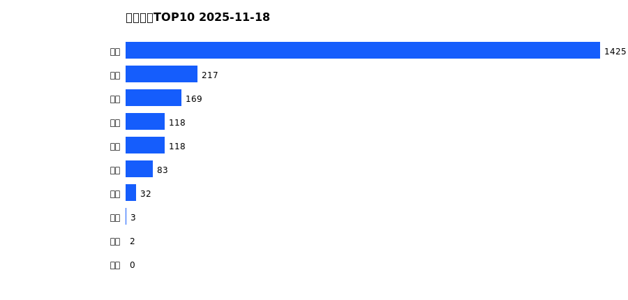
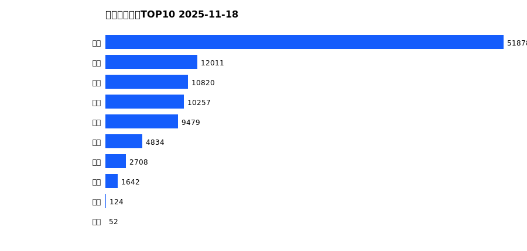
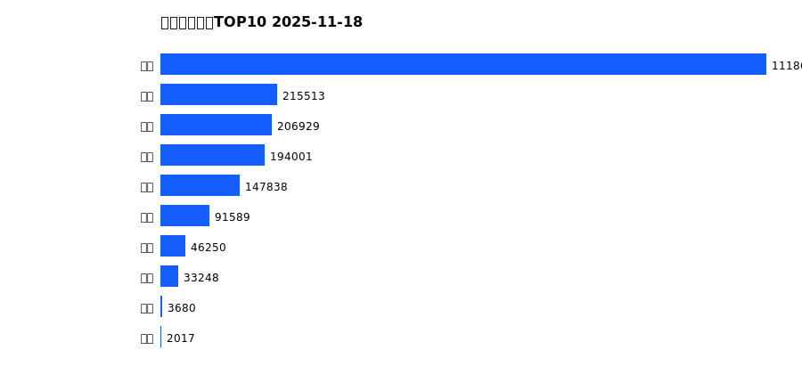
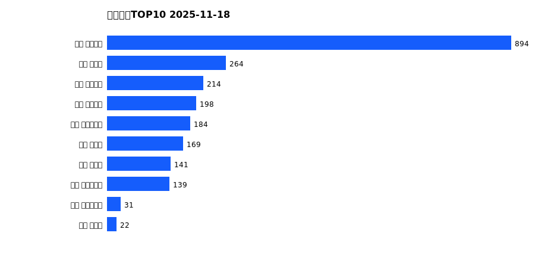
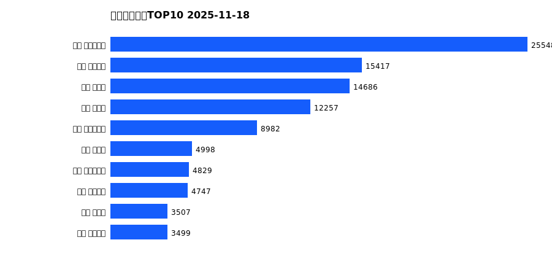
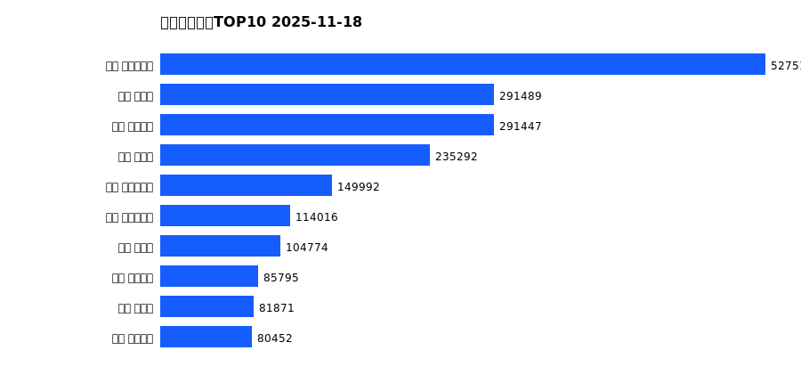

# 销售日报 2025-11-18

## 摘要

- 业态数: 10
- 门店数: 15
- 业态日销最大: 超市 1425
- 业态日销最小: 珠宝 0
- 门店日销最大: 许昌 天使城店 894
- 门店日销最小: 许昌 生活广场店 0
- 同比: -
- 环比: -

## 集团合计

| period | sales_wan |
| --- | --- |
| daily | 2168.0 |
| monthly | 103806.0 |
| yearly | 2059704.0 |

## 业态 TOP10

### 日销

| rank | business_type | sales_wan |
| --- | --- | --- |
| 1 | 超市 | 1425.24 |
| 2 | 服饰 | 217.15 |
| 3 | 百货 | 169.3 |
| 4 | 电器 | 118.43 |
| 5 | 茶叶 | 117.65 |
| 6 | 医药 | 83.12 |
| 7 | 餐饮 | 32.43 |
| 8 | 电玩 | 2.91 |
| 9 | 电影 | 2.03 |
| 10 | 珠宝 | 0.0 |

### 月度累计

| rank | business_type | sales_wan |
| --- | --- | --- |
| 1 | 超市 | 51878.24 |
| 2 | 百货 | 12010.91 |
| 3 | 服饰 | 10819.6 |
| 4 | 电器 | 10256.64 |
| 5 | 珠宝 | 9479.26 |
| 6 | 茶叶 | 4834.41 |
| 7 | 医药 | 2708.49 |
| 8 | 餐饮 | 1642.4 |
| 9 | 电玩 | 124.46 |
| 10 | 电影 | 51.64 |

### 年度累计

| rank | business_type | sales_wan |
| --- | --- | --- |
| 1 | 超市 | 1118637.24 |
| 2 | 珠宝 | 215513.29 |
| 3 | 百货 | 206929.06 |
| 4 | 电器 | 194001.11 |
| 5 | 服饰 | 147838.46 |
| 6 | 茶叶 | 91589.15 |
| 7 | 医药 | 46249.95 |
| 8 | 餐饮 | 33248.36 |
| 9 | 电玩 | 3680.17 |
| 10 | 电影 | 2017.15 |

## 门店 TOP10

### 日销

| rank | store_name | sales_wan |
| --- | --- | --- |
| 1 | 许昌 天使城店 | 894.3 |
| 2 | 许昌 禹州店 | 263.95 |
| 3 | 许昌 金三角店 | 213.86 |
| 4 | 许昌 线上商城 | 197.87 |
| 5 | 许昌 大众服饰店 | 184.33 |
| 6 | 许昌 北海店 | 169.43 |
| 7 | 许昌 金汇店 | 141.21 |
| 8 | 许昌 实业公司店 | 138.58 |
| 9 | 许昌 时代广场店 | 31.39 |
| 10 | 许昌 魏源店 | 21.58 |

### 月度累计

| rank | store_name | sales_wan |
| --- | --- | --- |
| 1 | 许昌 时代广场店 | 25547.79 |
| 2 | 许昌 天使城店 | 15417.24 |
| 3 | 新乡 大胖店 | 14685.69 |
| 4 | 新乡 小胖店 | 12257.36 |
| 5 | 许昌 生活广场店 | 8982.21 |
| 6 | 许昌 禹州店 | 4997.98 |
| 7 | 许昌 实业公司店 | 4829.03 |
| 8 | 许昌 线上商城 | 4747.31 |
| 9 | 许昌 北海店 | 3506.78 |
| 10 | 许昌 金三角店 | 3499.06 |

### 年度累计

| rank | store_name | sales_wan |
| --- | --- | --- |
| 1 | 许昌 时代广场店 | 527518.39 |
| 2 | 新乡 大胖店 | 291488.93 |
| 3 | 许昌 天使城店 | 291446.69 |
| 4 | 新乡 小胖店 | 235292.13 |
| 5 | 许昌 生活广场店 | 149992.47 |
| 6 | 许昌 实业公司店 | 114016.02 |
| 7 | 许昌 禹州店 | 104774.06 |
| 8 | 许昌 线上商城 | 85795.32 |
| 9 | 许昌 北海店 | 81870.84 |
| 10 | 许昌 金三角店 | 80451.52 |

