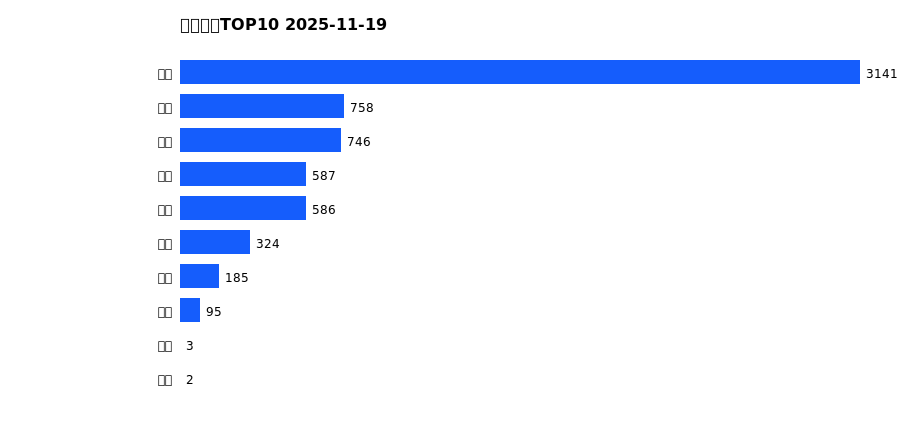
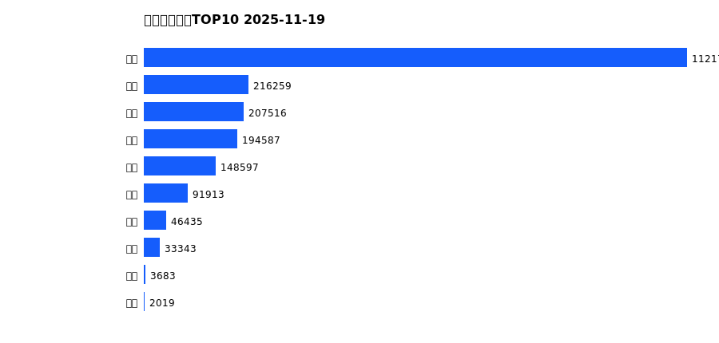
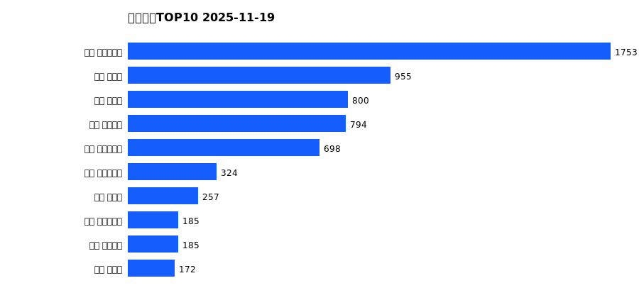
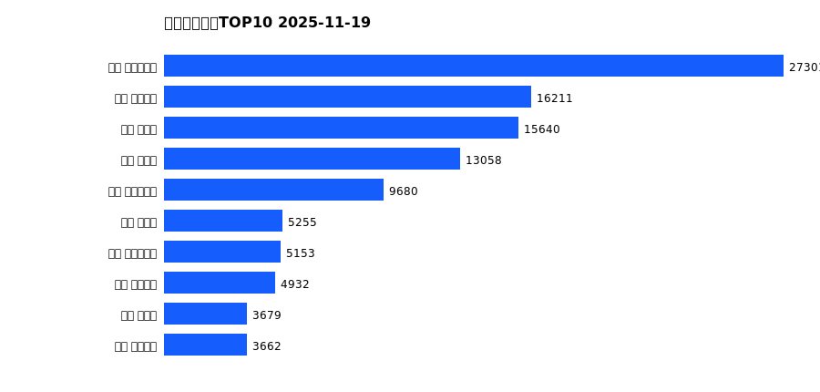
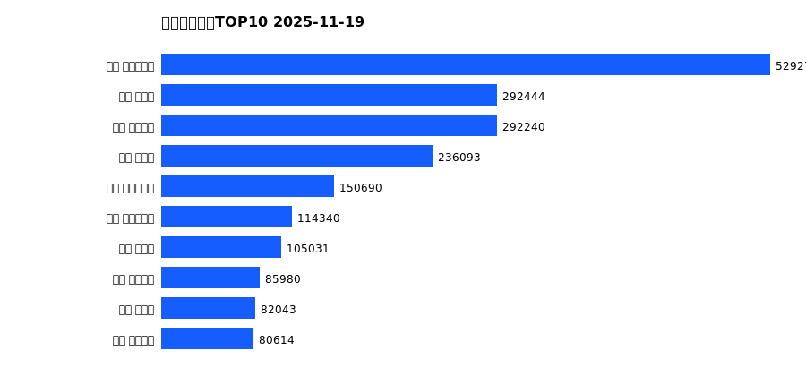

# 销售日报 2025-11-19

## 摘要

- 业态数: 10
- 门店数: 15
- 业态日销最大: 超市 3141
- 业态日销最小: 电影 2
- 门店日销最大: 许昌 时代广场店 1753
- 门店日销最小: 许昌 劳动店 36
- 同比: -
- 环比: -

## 集团合计

| period | sales_wan |
| --- | --- |
| daily | 6427.0 |
| monthly | 110233.0 |
| yearly | 2066131.0 |

## 业态 TOP10

### 日销

| rank | business_type | sales_wan |
| --- | --- | --- |
| 1 | 超市 | 3141.13 |
| 2 | 服饰 | 758.34 |
| 3 | 珠宝 | 745.78 |
| 4 | 百货 | 586.58 |
| 5 | 电器 | 586.01 |
| 6 | 茶叶 | 324.09 |
| 7 | 医药 | 184.69 |
| 8 | 餐饮 | 95.07 |
| 9 | 电玩 | 3.2 |
| 10 | 电影 | 1.82 |

### 月度累计

| rank | business_type | sales_wan |
| --- | --- | --- |
| 1 | 超市 | 55019.36 |
| 2 | 百货 | 12597.49 |
| 3 | 服饰 | 11577.95 |
| 4 | 电器 | 10842.64 |
| 5 | 珠宝 | 10225.04 |
| 6 | 茶叶 | 5158.5 |
| 7 | 医药 | 2893.18 |
| 8 | 餐饮 | 1737.47 |
| 9 | 电玩 | 127.67 |
| 10 | 电影 | 53.47 |

### 年度累计

| rank | business_type | sales_wan |
| --- | --- | --- |
| 1 | 超市 | 1121778.37 |
| 2 | 珠宝 | 216259.07 |
| 3 | 百货 | 207515.63 |
| 4 | 电器 | 194587.12 |
| 5 | 服饰 | 148596.8 |
| 6 | 茶叶 | 91913.24 |
| 7 | 医药 | 46434.64 |
| 8 | 餐饮 | 33343.43 |
| 9 | 电玩 | 3683.37 |
| 10 | 电影 | 2018.98 |

## 门店 TOP10

### 日销

| rank | store_name | sales_wan |
| --- | --- | --- |
| 1 | 许昌 时代广场店 | 1753.48 |
| 2 | 新乡 大胖店 | 954.61 |
| 3 | 新乡 小胖店 | 800.5 |
| 4 | 许昌 天使城店 | 793.67 |
| 5 | 许昌 生活广场店 | 697.72 |
| 6 | 许昌 实业公司店 | 323.86 |
| 7 | 许昌 禹州店 | 257.0 |
| 8 | 许昌 大众服饰店 | 185.28 |
| 9 | 许昌 线上商城 | 184.93 |
| 10 | 许昌 北海店 | 171.76 |

### 月度累计

| rank | store_name | sales_wan |
| --- | --- | --- |
| 1 | 许昌 时代广场店 | 27301.27 |
| 2 | 许昌 天使城店 | 16210.91 |
| 3 | 新乡 大胖店 | 15640.3 |
| 4 | 新乡 小胖店 | 13057.86 |
| 5 | 许昌 生活广场店 | 9679.93 |
| 6 | 许昌 禹州店 | 5254.98 |
| 7 | 许昌 实业公司店 | 5152.89 |
| 8 | 许昌 线上商城 | 4932.24 |
| 9 | 许昌 北海店 | 3678.54 |
| 10 | 许昌 金三角店 | 3662.04 |

### 年度累计

| rank | store_name | sales_wan |
| --- | --- | --- |
| 1 | 许昌 时代广场店 | 529271.88 |
| 2 | 新乡 大胖店 | 292443.54 |
| 3 | 许昌 天使城店 | 292240.36 |
| 4 | 新乡 小胖店 | 236092.63 |
| 5 | 许昌 生活广场店 | 150690.2 |
| 6 | 许昌 实业公司店 | 114339.88 |
| 7 | 许昌 禹州店 | 105031.06 |
| 8 | 许昌 线上商城 | 85980.24 |
| 9 | 许昌 北海店 | 82042.6 |
| 10 | 许昌 金三角店 | 80614.5 |

