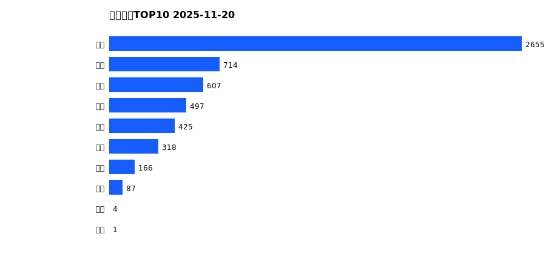
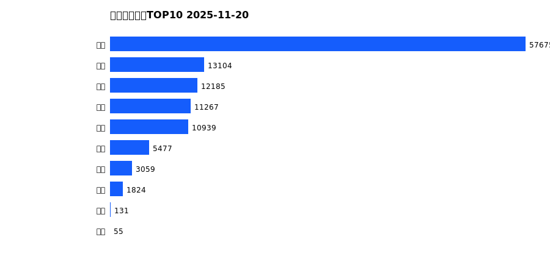
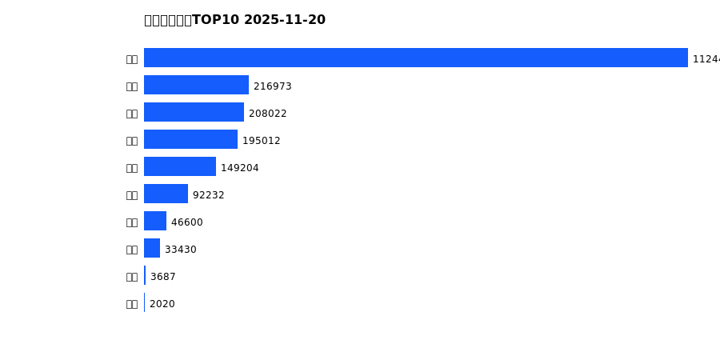
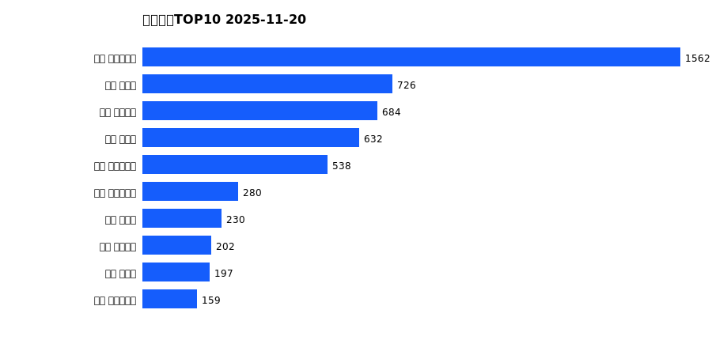
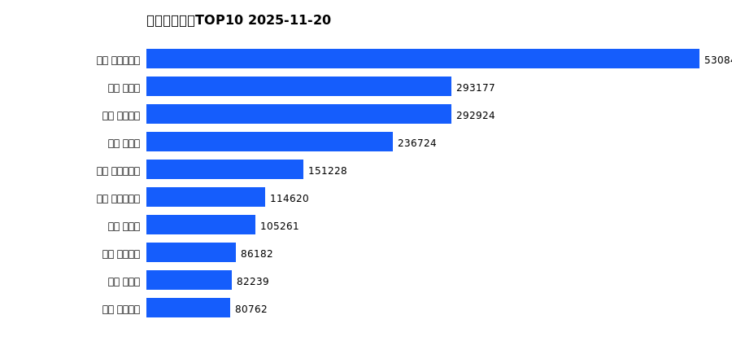

# 销售日报 2025-11-20

## 摘要

- 业态数: 10
- 门店数: 15
- 业态日销最大: 超市 2655
- 业态日销最小: 电影 1
- 门店日销最大: 许昌 时代广场店 1562
- 门店日销最小: 许昌 劳动店 34
- 同比: -
- 环比: -

## 集团合计

| period | sales_wan |
| --- | --- |
| daily | 5473.0 |
| monthly | 115716.0 |
| yearly | 2071614.0 |

## 业态 TOP10

### 日销

| rank | business_type | sales_wan |
| --- | --- | --- |
| 1 | 超市 | 2655.2 |
| 2 | 珠宝 | 714.19 |
| 3 | 服饰 | 606.84 |
| 4 | 百货 | 496.57 |
| 5 | 电器 | 424.66 |
| 6 | 茶叶 | 318.28 |
| 7 | 医药 | 165.58 |
| 8 | 餐饮 | 86.72 |
| 9 | 电玩 | 3.53 |
| 10 | 电影 | 1.27 |

### 月度累计

| rank | business_type | sales_wan |
| --- | --- | --- |
| 1 | 超市 | 57674.56 |
| 2 | 百货 | 13104.12 |
| 3 | 服饰 | 12184.79 |
| 4 | 电器 | 11267.3 |
| 5 | 珠宝 | 10939.22 |
| 6 | 茶叶 | 5476.78 |
| 7 | 医药 | 3058.77 |
| 8 | 餐饮 | 1824.19 |
| 9 | 电玩 | 131.19 |
| 10 | 电影 | 54.74 |

### 年度累计

| rank | business_type | sales_wan |
| --- | --- | --- |
| 1 | 超市 | 1124433.57 |
| 2 | 珠宝 | 216973.26 |
| 3 | 百货 | 208022.27 |
| 4 | 电器 | 195011.78 |
| 5 | 服饰 | 149203.64 |
| 6 | 茶叶 | 92231.51 |
| 7 | 医药 | 46600.23 |
| 8 | 餐饮 | 33430.15 |
| 9 | 电玩 | 3686.9 |
| 10 | 电影 | 2020.24 |

## 门店 TOP10

### 日销

| rank | store_name | sales_wan |
| --- | --- | --- |
| 1 | 许昌 时代广场店 | 1562.31 |
| 2 | 新乡 大胖店 | 726.03 |
| 3 | 许昌 天使城店 | 684.11 |
| 4 | 新乡 小胖店 | 631.63 |
| 5 | 许昌 生活广场店 | 538.22 |
| 6 | 许昌 实业公司店 | 280.04 |
| 7 | 许昌 禹州店 | 229.76 |
| 8 | 许昌 线上商城 | 201.61 |
| 9 | 许昌 北海店 | 196.65 |
| 10 | 许昌 大众服饰店 | 159.18 |

### 月度累计

| rank | store_name | sales_wan |
| --- | --- | --- |
| 1 | 许昌 时代广场店 | 28874.29 |
| 2 | 许昌 天使城店 | 16895.03 |
| 3 | 新乡 大胖店 | 16374.11 |
| 4 | 新乡 小胖店 | 13689.5 |
| 5 | 许昌 生活广场店 | 10218.15 |
| 6 | 许昌 禹州店 | 5484.74 |
| 7 | 许昌 实业公司店 | 5432.93 |
| 8 | 许昌 线上商城 | 5133.85 |
| 9 | 许昌 北海店 | 3875.19 |
| 10 | 许昌 金三角店 | 3809.52 |

### 年度累计

| rank | store_name | sales_wan |
| --- | --- | --- |
| 1 | 许昌 时代广场店 | 530844.9 |
| 2 | 新乡 大胖店 | 293177.36 |
| 3 | 许昌 天使城店 | 292924.47 |
| 4 | 新乡 小胖店 | 236724.26 |
| 5 | 许昌 生活广场店 | 151228.41 |
| 6 | 许昌 实业公司店 | 114619.92 |
| 7 | 许昌 禹州店 | 105260.82 |
| 8 | 许昌 线上商城 | 86181.85 |
| 9 | 许昌 北海店 | 82239.24 |
| 10 | 许昌 金三角店 | 80761.99 |

