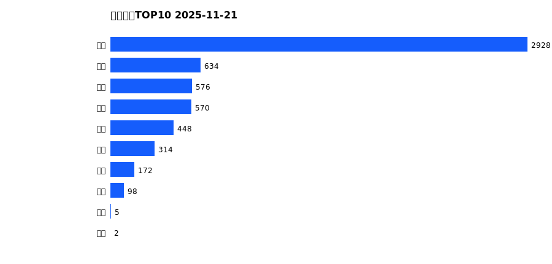
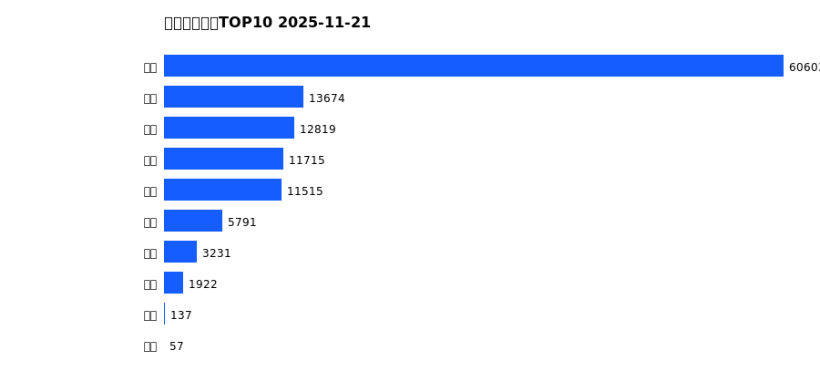
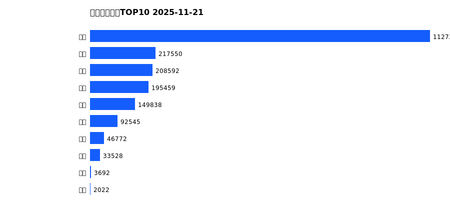
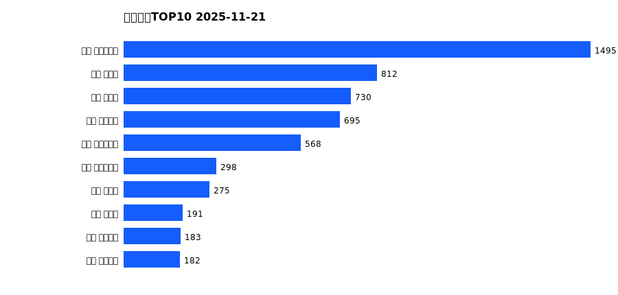
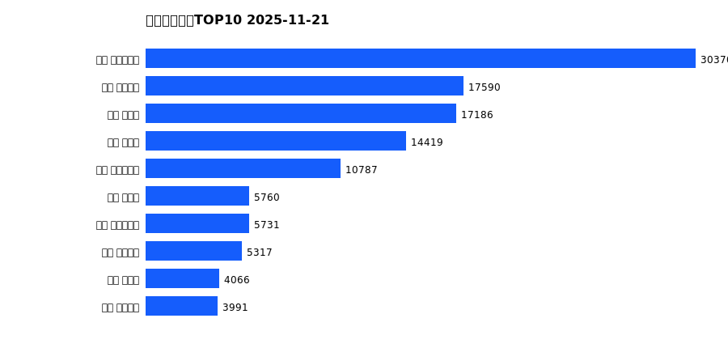
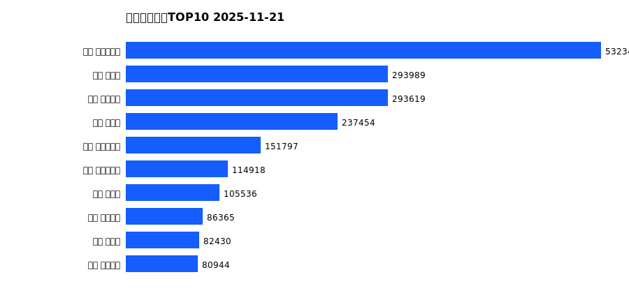

# 销售日报 2025-11-21

## 摘要

- 业态数: 10
- 门店数: 15
- 业态日销最大: 超市 2928
- 业态日销最小: 电影 2
- 门店日销最大: 许昌 时代广场店 1495
- 门店日销最小: 许昌 劳动店 35
- 同比: -
- 环比: -

## 集团合计

| period | sales_wan |
| --- | --- |
| daily | 5747.0 |
| monthly | 121463.0 |
| yearly | 2077361.0 |

## 业态 TOP10

### 日销

| rank | business_type | sales_wan |
| --- | --- | --- |
| 1 | 超市 | 2928.11 |
| 2 | 服饰 | 634.34 |
| 3 | 珠宝 | 576.25 |
| 4 | 百货 | 569.86 |
| 5 | 电器 | 447.51 |
| 6 | 茶叶 | 313.76 |
| 7 | 医药 | 171.9 |
| 8 | 餐饮 | 98.17 |
| 9 | 电玩 | 5.47 |
| 10 | 电影 | 1.85 |

### 月度累计

| rank | business_type | sales_wan |
| --- | --- | --- |
| 1 | 超市 | 60602.67 |
| 2 | 百货 | 13673.99 |
| 3 | 服饰 | 12819.12 |
| 4 | 电器 | 11714.81 |
| 5 | 珠宝 | 11515.48 |
| 6 | 茶叶 | 5790.54 |
| 7 | 医药 | 3230.67 |
| 8 | 餐饮 | 1922.36 |
| 9 | 电玩 | 136.67 |
| 10 | 电影 | 56.58 |

### 年度累计

| rank | business_type | sales_wan |
| --- | --- | --- |
| 1 | 超市 | 1127361.68 |
| 2 | 珠宝 | 217549.51 |
| 3 | 百货 | 208592.13 |
| 4 | 电器 | 195459.28 |
| 5 | 服饰 | 149837.98 |
| 6 | 茶叶 | 92545.27 |
| 7 | 医药 | 46772.13 |
| 8 | 餐饮 | 33528.32 |
| 9 | 电玩 | 3692.37 |
| 10 | 电影 | 2022.09 |

## 门店 TOP10

### 日销

| rank | store_name | sales_wan |
| --- | --- | --- |
| 1 | 许昌 时代广场店 | 1495.3 |
| 2 | 新乡 大胖店 | 811.95 |
| 3 | 新乡 小胖店 | 729.68 |
| 4 | 许昌 天使城店 | 694.56 |
| 5 | 许昌 生活广场店 | 568.49 |
| 6 | 许昌 实业公司店 | 298.21 |
| 7 | 许昌 禹州店 | 275.29 |
| 8 | 许昌 北海店 | 190.74 |
| 9 | 许昌 线上商城 | 183.08 |
| 10 | 许昌 金三角店 | 181.88 |

### 月度累计

| rank | store_name | sales_wan |
| --- | --- | --- |
| 1 | 许昌 时代广场店 | 30369.59 |
| 2 | 许昌 天使城店 | 17589.58 |
| 3 | 新乡 大胖店 | 17186.07 |
| 4 | 新乡 小胖店 | 14419.17 |
| 5 | 许昌 生活广场店 | 10786.63 |
| 6 | 许昌 禹州店 | 5760.03 |
| 7 | 许昌 实业公司店 | 5731.14 |
| 8 | 许昌 线上商城 | 5316.92 |
| 9 | 许昌 北海店 | 4065.93 |
| 10 | 许昌 金三角店 | 3991.41 |

### 年度累计

| rank | store_name | sales_wan |
| --- | --- | --- |
| 1 | 许昌 时代广场店 | 532340.19 |
| 2 | 新乡 大胖店 | 293989.31 |
| 3 | 许昌 天使城店 | 293619.03 |
| 4 | 新乡 小胖店 | 237453.94 |
| 5 | 许昌 生活广场店 | 151796.9 |
| 6 | 许昌 实业公司店 | 114918.13 |
| 7 | 许昌 禹州店 | 105536.11 |
| 8 | 许昌 线上商城 | 86364.93 |
| 9 | 许昌 北海店 | 82429.98 |
| 10 | 许昌 金三角店 | 80943.87 |

