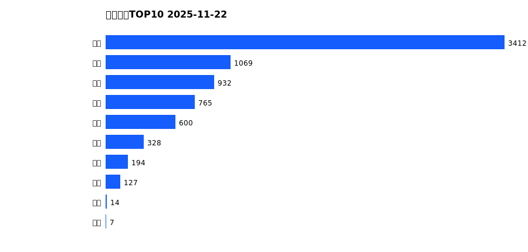
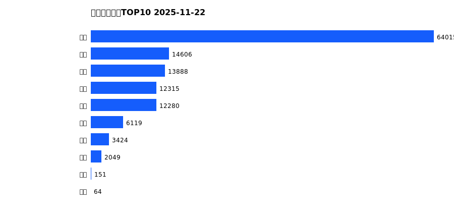
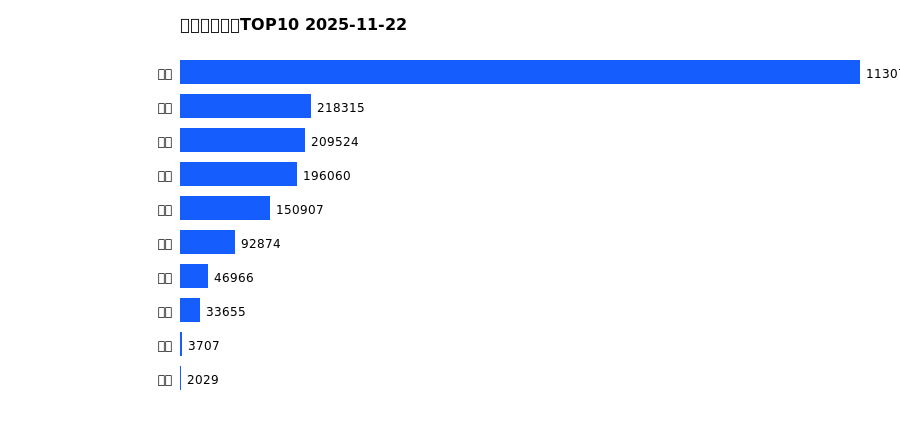
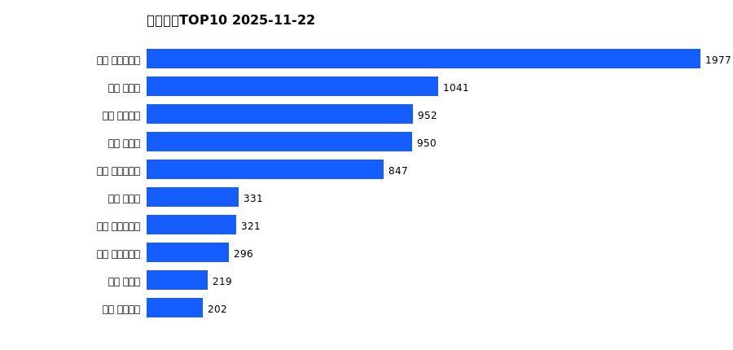
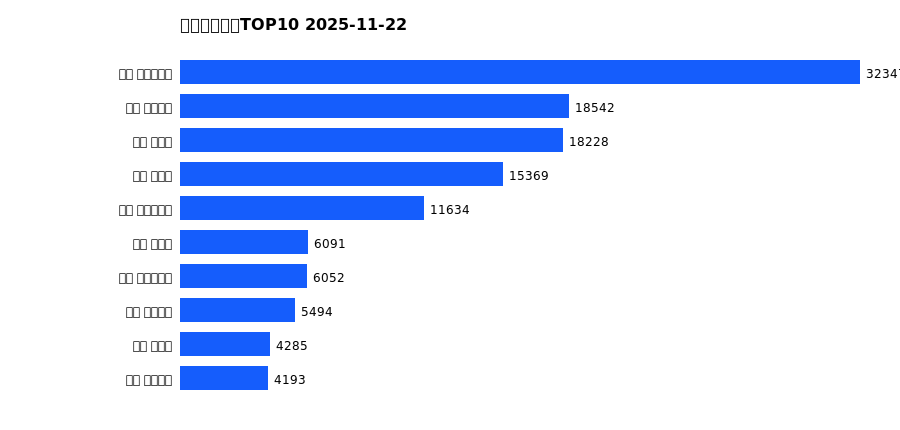
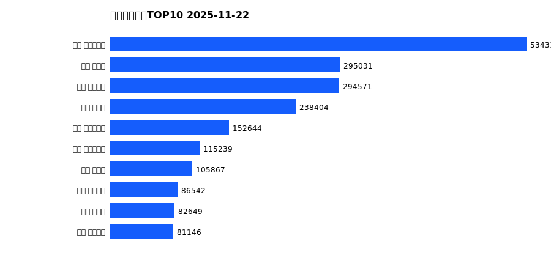

# 销售日报 2025-11-22

## 摘要

- 业态数: 10
- 门店数: 15
- 业态日销最大: 超市 3412
- 业态日销最小: 电影 7
- 门店日销最大: 许昌 时代广场店 1977
- 门店日销最小: 许昌 劳动店 39
- 同比: -
- 环比: -

## 集团合计

| period | sales_wan |
| --- | --- |
| daily | 7449.0 |
| monthly | 128912.0 |
| yearly | 2084810.0 |

## 业态 TOP10

### 日销

| rank | business_type | sales_wan |
| --- | --- | --- |
| 1 | 超市 | 3412.02 |
| 2 | 服饰 | 1069.02 |
| 3 | 百货 | 932.12 |
| 4 | 珠宝 | 765.03 |
| 5 | 电器 | 600.45 |
| 6 | 茶叶 | 328.23 |
| 7 | 医药 | 193.75 |
| 8 | 餐饮 | 126.71 |
| 9 | 电玩 | 14.5 |
| 10 | 电影 | 7.37 |

### 月度累计

| rank | business_type | sales_wan |
| --- | --- | --- |
| 1 | 超市 | 64014.69 |
| 2 | 百货 | 14606.11 |
| 3 | 服饰 | 13888.14 |
| 4 | 电器 | 12315.26 |
| 5 | 珠宝 | 12280.5 |
| 6 | 茶叶 | 6118.77 |
| 7 | 医药 | 3424.42 |
| 8 | 餐饮 | 2049.07 |
| 9 | 电玩 | 151.16 |
| 10 | 电影 | 63.95 |

### 年度累计

| rank | business_type | sales_wan |
| --- | --- | --- |
| 1 | 超市 | 1130773.7 |
| 2 | 珠宝 | 218314.54 |
| 3 | 百货 | 209524.25 |
| 4 | 电器 | 196059.73 |
| 5 | 服饰 | 150906.99 |
| 6 | 茶叶 | 92873.5 |
| 7 | 医药 | 46965.88 |
| 8 | 餐饮 | 33655.03 |
| 9 | 电玩 | 3706.87 |
| 10 | 电影 | 2029.46 |

## 门店 TOP10

### 日销

| rank | store_name | sales_wan |
| --- | --- | --- |
| 1 | 许昌 时代广场店 | 1977.33 |
| 2 | 新乡 大胖店 | 1041.44 |
| 3 | 许昌 天使城店 | 952.29 |
| 4 | 新乡 小胖店 | 949.64 |
| 5 | 许昌 生活广场店 | 847.2 |
| 6 | 许昌 禹州店 | 330.58 |
| 7 | 许昌 实业公司店 | 320.58 |
| 8 | 许昌 大众服饰店 | 295.88 |
| 9 | 许昌 北海店 | 219.1 |
| 10 | 许昌 金三角店 | 201.89 |

### 月度累计

| rank | store_name | sales_wan |
| --- | --- | --- |
| 1 | 许昌 时代广场店 | 32346.92 |
| 2 | 许昌 天使城店 | 18541.88 |
| 3 | 新乡 大胖店 | 18227.51 |
| 4 | 新乡 小胖店 | 15368.81 |
| 5 | 许昌 生活广场店 | 11633.83 |
| 6 | 许昌 禹州店 | 6090.6 |
| 7 | 许昌 实业公司店 | 6051.72 |
| 8 | 许昌 线上商城 | 5493.66 |
| 9 | 许昌 北海店 | 4285.03 |
| 10 | 许昌 金三角店 | 4193.3 |

### 年度累计

| rank | store_name | sales_wan |
| --- | --- | --- |
| 1 | 许昌 时代广场店 | 534317.53 |
| 2 | 新乡 大胖店 | 295030.75 |
| 3 | 许昌 天使城店 | 294571.32 |
| 4 | 新乡 小胖店 | 238403.58 |
| 5 | 许昌 生活广场店 | 152644.1 |
| 6 | 许昌 实业公司店 | 115238.71 |
| 7 | 许昌 禹州店 | 105866.68 |
| 8 | 许昌 线上商城 | 86541.67 |
| 9 | 许昌 北海店 | 82649.09 |
| 10 | 许昌 金三角店 | 81145.76 |

