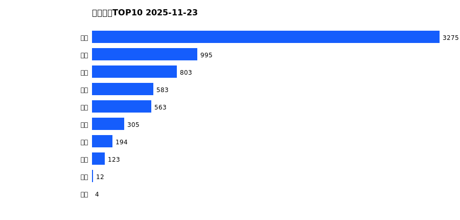
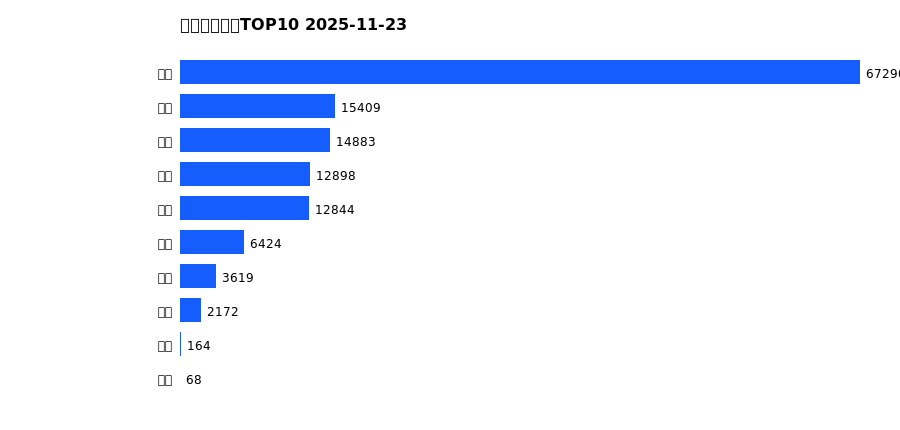
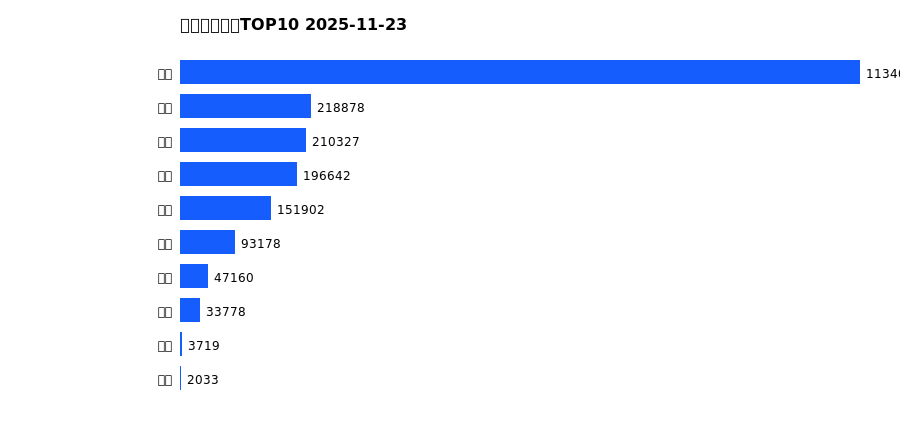
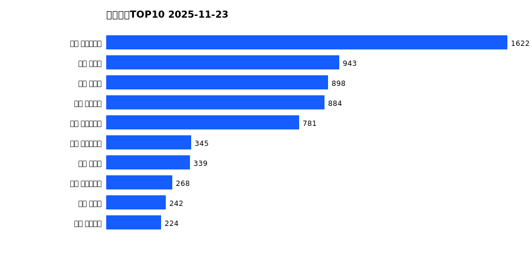
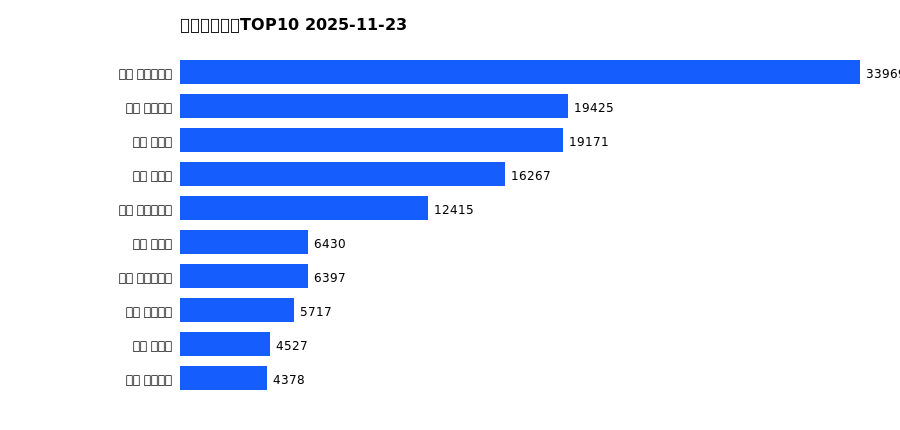

# 销售日报 2025-11-23

## 摘要

- 业态数: 10
- 门店数: 15
- 业态日销最大: 超市 3275
- 业态日销最小: 电影 4
- 门店日销最大: 许昌 时代广场店 1622
- 门店日销最小: 许昌 劳动店 34
- 同比: -
- 环比: -

## 集团合计

| period | sales_wan |
| --- | --- |
| daily | 6857.0 |
| monthly | 135769.0 |
| yearly | 2091667.0 |

## 业态 TOP10

### 日销

| rank | business_type | sales_wan |
| --- | --- | --- |
| 1 | 超市 | 3275.25 |
| 2 | 服饰 | 995.01 |
| 3 | 百货 | 802.63 |
| 4 | 电器 | 582.56 |
| 5 | 珠宝 | 563.45 |
| 6 | 茶叶 | 304.83 |
| 7 | 医药 | 194.14 |
| 8 | 餐饮 | 122.96 |
| 9 | 电玩 | 12.41 |
| 10 | 电影 | 3.87 |

### 月度累计

| rank | business_type | sales_wan |
| --- | --- | --- |
| 1 | 超市 | 67289.94 |
| 2 | 百货 | 15408.74 |
| 3 | 服饰 | 14883.15 |
| 4 | 电器 | 12897.82 |
| 5 | 珠宝 | 12843.95 |
| 6 | 茶叶 | 6423.6 |
| 7 | 医药 | 3618.56 |
| 8 | 餐饮 | 2172.03 |
| 9 | 电玩 | 163.58 |
| 10 | 电影 | 67.82 |

### 年度累计

| rank | business_type | sales_wan |
| --- | --- | --- |
| 1 | 超市 | 1134048.95 |
| 2 | 珠宝 | 218877.98 |
| 3 | 百货 | 210326.88 |
| 4 | 电器 | 196642.3 |
| 5 | 服饰 | 151902.0 |
| 6 | 茶叶 | 93178.34 |
| 7 | 医药 | 47160.02 |
| 8 | 餐饮 | 33777.99 |
| 9 | 电玩 | 3719.28 |
| 10 | 电影 | 2033.33 |

## 门店 TOP10

### 日销

| rank | store_name | sales_wan |
| --- | --- | --- |
| 1 | 许昌 时代广场店 | 1621.99 |
| 2 | 新乡 大胖店 | 943.18 |
| 3 | 新乡 小胖店 | 898.03 |
| 4 | 许昌 天使城店 | 883.5 |
| 5 | 许昌 生活广场店 | 780.86 |
| 6 | 许昌 实业公司店 | 344.92 |
| 7 | 许昌 禹州店 | 339.29 |
| 8 | 许昌 大众服饰店 | 268.2 |
| 9 | 许昌 北海店 | 242.06 |
| 10 | 许昌 线上商城 | 223.55 |

### 月度累计

| rank | store_name | sales_wan |
| --- | --- | --- |
| 1 | 许昌 时代广场店 | 33968.91 |
| 2 | 许昌 天使城店 | 19425.38 |
| 3 | 新乡 大胖店 | 19170.7 |
| 4 | 新乡 小胖店 | 16266.84 |
| 5 | 许昌 生活广场店 | 12414.7 |
| 6 | 许昌 禹州店 | 6429.89 |
| 7 | 许昌 实业公司店 | 6396.64 |
| 8 | 许昌 线上商城 | 5717.21 |
| 9 | 许昌 北海店 | 4527.09 |
| 10 | 许昌 金三角店 | 4377.93 |

### 年度累计

| rank | store_name | sales_wan |
| --- | --- | --- |
| 1 | 许昌 时代广场店 | 535939.51 |
| 2 | 新乡 大胖店 | 295973.94 |
| 3 | 许昌 天使城店 | 295454.82 |
| 4 | 新乡 小胖店 | 239301.6 |
| 5 | 许昌 生活广场店 | 153424.96 |
| 6 | 许昌 实业公司店 | 115583.63 |
| 7 | 许昌 禹州店 | 106205.98 |
| 8 | 许昌 线上商城 | 86765.22 |
| 9 | 许昌 北海店 | 82891.15 |
| 10 | 许昌 金三角店 | 81330.39 |

