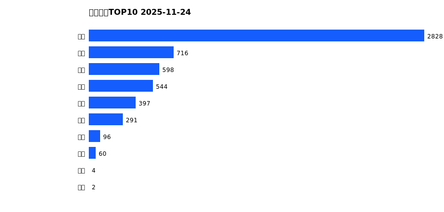
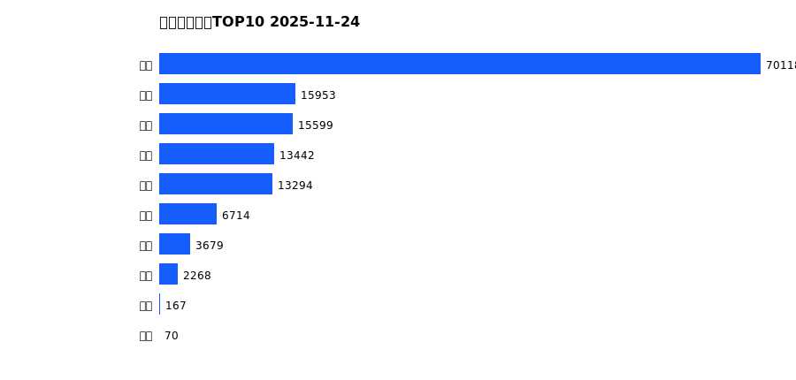
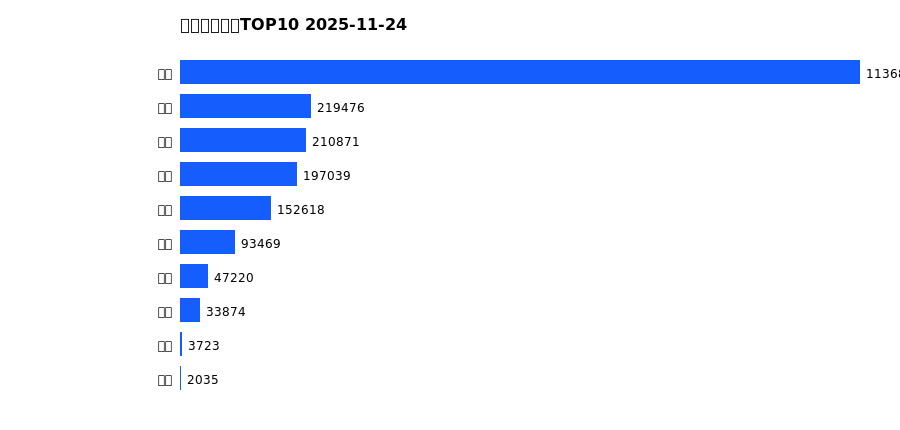
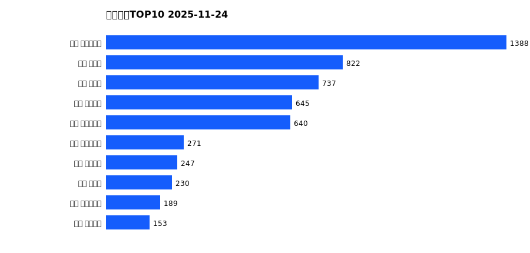
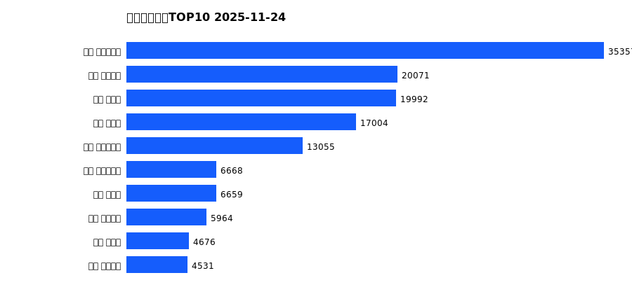
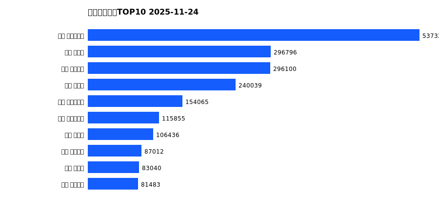

# 销售日报 2025-11-24

## 摘要

- 业态数: 10
- 门店数: 15
- 业态日销最大: 超市 2828
- 业态日销最小: 电影 2
- 门店日销最大: 许昌 时代广场店 1388
- 门店日销最小: 许昌 劳动店 32
- 同比: -
- 环比: -

## 集团合计

| period | sales_wan |
| --- | --- |
| daily | 5535.0 |
| monthly | 141304.0 |
| yearly | 2097202.0 |

## 业态 TOP10

### 日销

| rank | business_type | sales_wan |
| --- | --- | --- |
| 1 | 超市 | 2828.28 |
| 2 | 服饰 | 715.57 |
| 3 | 珠宝 | 597.68 |
| 4 | 百货 | 544.02 |
| 5 | 电器 | 396.57 |
| 6 | 茶叶 | 290.7 |
| 7 | 餐饮 | 96.39 |
| 8 | 医药 | 60.32 |
| 9 | 电玩 | 3.75 |
| 10 | 电影 | 1.75 |

### 月度累计

| rank | business_type | sales_wan |
| --- | --- | --- |
| 1 | 超市 | 70118.23 |
| 2 | 百货 | 15952.75 |
| 3 | 服饰 | 15598.72 |
| 4 | 珠宝 | 13441.64 |
| 5 | 电器 | 13294.4 |
| 6 | 茶叶 | 6714.3 |
| 7 | 医药 | 3678.89 |
| 8 | 餐饮 | 2268.42 |
| 9 | 电玩 | 167.32 |
| 10 | 电影 | 69.56 |

### 年度累计

| rank | business_type | sales_wan |
| --- | --- | --- |
| 1 | 超市 | 1136877.24 |
| 2 | 珠宝 | 219475.67 |
| 3 | 百货 | 210870.9 |
| 4 | 电器 | 197038.87 |
| 5 | 服饰 | 152617.58 |
| 6 | 茶叶 | 93469.04 |
| 7 | 医药 | 47220.34 |
| 8 | 餐饮 | 33874.38 |
| 9 | 电玩 | 3723.03 |
| 10 | 电影 | 2035.07 |

## 门店 TOP10

### 日销

| rank | store_name | sales_wan |
| --- | --- | --- |
| 1 | 许昌 时代广场店 | 1388.49 |
| 2 | 新乡 大胖店 | 821.67 |
| 3 | 新乡 小胖店 | 737.24 |
| 4 | 许昌 天使城店 | 645.38 |
| 5 | 许昌 生活广场店 | 640.06 |
| 6 | 许昌 实业公司店 | 271.48 |
| 7 | 许昌 线上商城 | 247.14 |
| 8 | 许昌 禹州店 | 229.55 |
| 9 | 许昌 大众服饰店 | 189.41 |
| 10 | 许昌 金三角店 | 152.64 |

### 月度累计

| rank | store_name | sales_wan |
| --- | --- | --- |
| 1 | 许昌 时代广场店 | 35357.39 |
| 2 | 许昌 天使城店 | 20070.76 |
| 3 | 新乡 大胖店 | 19992.37 |
| 4 | 新乡 小胖店 | 17004.07 |
| 5 | 许昌 生活广场店 | 13054.76 |
| 6 | 许昌 实业公司店 | 6668.11 |
| 7 | 许昌 禹州店 | 6659.44 |
| 8 | 许昌 线上商城 | 5964.36 |
| 9 | 许昌 北海店 | 4676.4 |
| 10 | 许昌 金三角店 | 4530.56 |

### 年度累计

| rank | store_name | sales_wan |
| --- | --- | --- |
| 1 | 许昌 时代广场店 | 537328.0 |
| 2 | 新乡 大胖店 | 296795.61 |
| 3 | 许昌 天使城店 | 296100.21 |
| 4 | 新乡 小胖店 | 240038.84 |
| 5 | 许昌 生活广场店 | 154065.02 |
| 6 | 许昌 实业公司店 | 115855.1 |
| 7 | 许昌 禹州店 | 106435.52 |
| 8 | 许昌 线上商城 | 87012.36 |
| 9 | 许昌 北海店 | 83040.46 |
| 10 | 许昌 金三角店 | 81483.03 |

