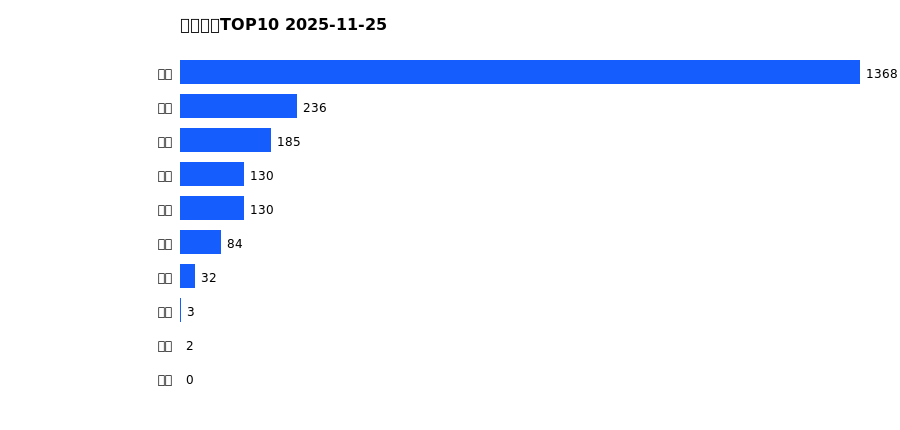
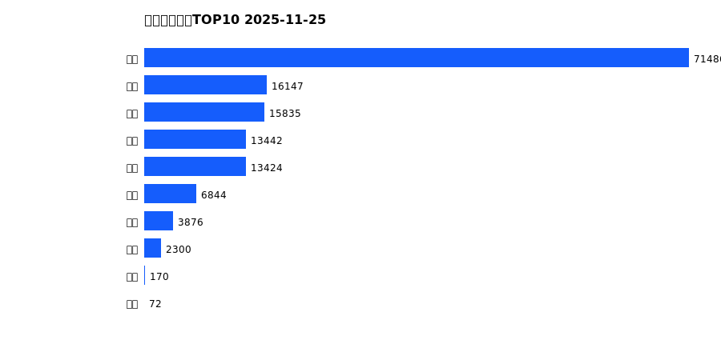
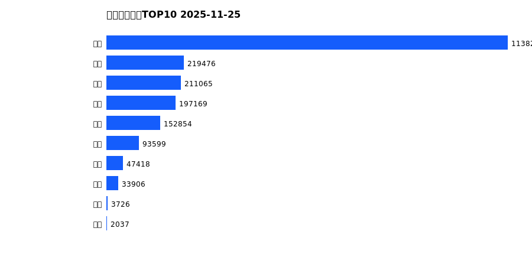
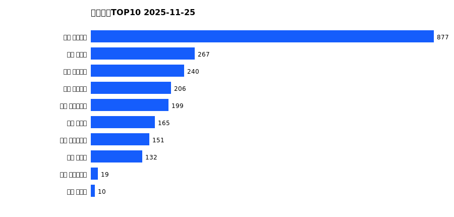
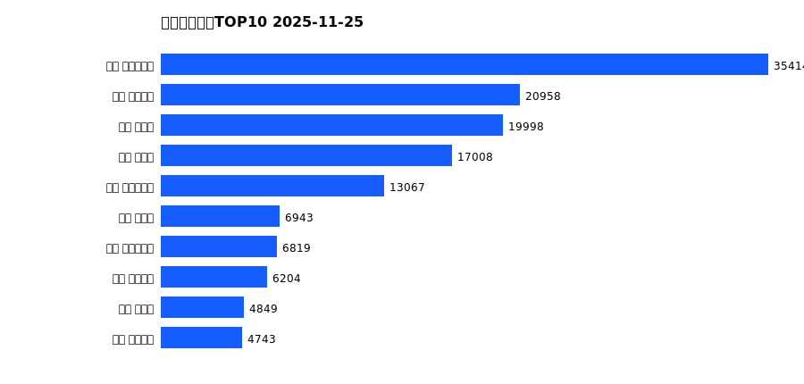
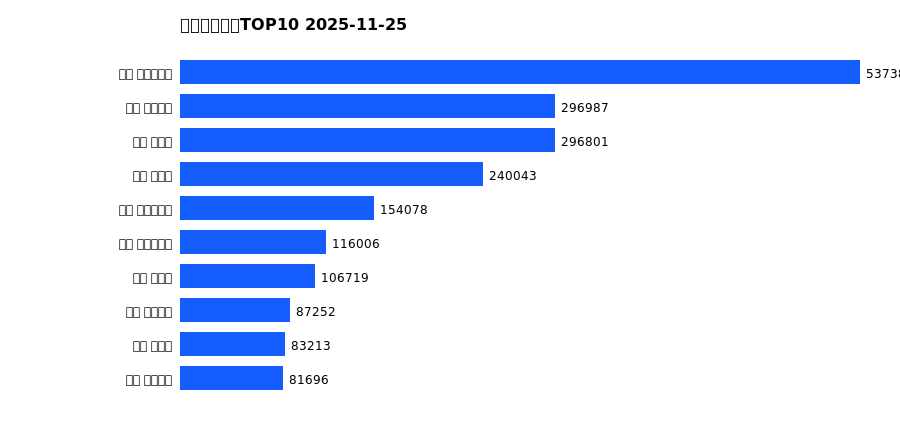

# 销售日报 2025-11-25

## 摘要

- 业态数: 10
- 门店数: 15
- 业态日销最大: 超市 1368
- 业态日销最小: 珠宝 0
- 门店日销最大: 许昌 天使城店 877
- 门店日销最小: 许昌 生活广场店 0
- 同比: -
- 环比: -

## 集团合计

| period | sales_wan |
| --- | --- |
| daily | 2170.0 |
| monthly | 143597.0 |
| yearly | 2099494.0 |

## 业态 TOP10

### 日销

| rank | business_type | sales_wan |
| --- | --- | --- |
| 1 | 超市 | 1368.04 |
| 2 | 服饰 | 236.06 |
| 3 | 百货 | 184.89 |
| 4 | 茶叶 | 130.14 |
| 5 | 电器 | 129.82 |
| 6 | 医药 | 83.74 |
| 7 | 餐饮 | 31.98 |
| 8 | 电玩 | 3.04 |
| 9 | 电影 | 2.0 |
| 10 | 珠宝 | 0.0 |

### 月度累计

| rank | business_type | sales_wan |
| --- | --- | --- |
| 1 | 超市 | 71486.27 |
| 2 | 百货 | 16146.71 |
| 3 | 服饰 | 15834.78 |
| 4 | 珠宝 | 13441.64 |
| 5 | 电器 | 13424.21 |
| 6 | 茶叶 | 6844.45 |
| 7 | 医药 | 3876.15 |
| 8 | 餐饮 | 2300.4 |
| 9 | 电玩 | 170.36 |
| 10 | 电影 | 71.56 |

### 年度累计

| rank | business_type | sales_wan |
| --- | --- | --- |
| 1 | 超市 | 1138245.27 |
| 2 | 珠宝 | 219475.67 |
| 3 | 百货 | 211064.85 |
| 4 | 电器 | 197168.69 |
| 5 | 服饰 | 152853.64 |
| 6 | 茶叶 | 93599.18 |
| 7 | 医药 | 47417.61 |
| 8 | 餐饮 | 33906.36 |
| 9 | 电玩 | 3726.07 |
| 10 | 电影 | 2037.07 |

## 门店 TOP10

### 日销

| rank | store_name | sales_wan |
| --- | --- | --- |
| 1 | 许昌 天使城店 | 877.35 |
| 2 | 许昌 禹州店 | 266.84 |
| 3 | 许昌 线上商城 | 239.52 |
| 4 | 许昌 金三角店 | 206.07 |
| 5 | 许昌 大众服饰店 | 199.25 |
| 6 | 许昌 北海店 | 164.97 |
| 7 | 许昌 实业公司店 | 150.51 |
| 8 | 许昌 金汇店 | 132.05 |
| 9 | 许昌 时代广场店 | 18.83 |
| 10 | 许昌 魏源店 | 10.34 |

### 月度累计

| rank | store_name | sales_wan |
| --- | --- | --- |
| 1 | 许昌 时代广场店 | 35413.98 |
| 2 | 许昌 天使城店 | 20957.5 |
| 3 | 新乡 大胖店 | 19997.52 |
| 4 | 新乡 小胖店 | 17007.78 |
| 5 | 许昌 生活广场店 | 13067.36 |
| 6 | 许昌 禹州店 | 6943.08 |
| 7 | 许昌 实业公司店 | 6818.62 |
| 8 | 许昌 线上商城 | 6203.88 |
| 9 | 许昌 北海店 | 4849.43 |
| 10 | 许昌 金三角店 | 4743.26 |

### 年度累计

| rank | store_name | sales_wan |
| --- | --- | --- |
| 1 | 许昌 时代广场店 | 537384.58 |
| 2 | 许昌 天使城店 | 296986.95 |
| 3 | 新乡 大胖店 | 296800.76 |
| 4 | 新乡 小胖店 | 240042.54 |
| 5 | 许昌 生活广场店 | 154077.62 |
| 6 | 许昌 实业公司店 | 116005.61 |
| 7 | 许昌 禹州店 | 106719.16 |
| 8 | 许昌 线上商城 | 87251.88 |
| 9 | 许昌 北海店 | 83213.48 |
| 10 | 许昌 金三角店 | 81695.72 |

