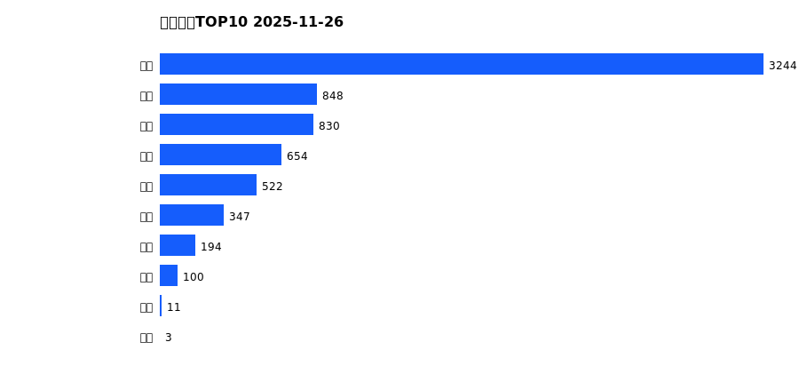
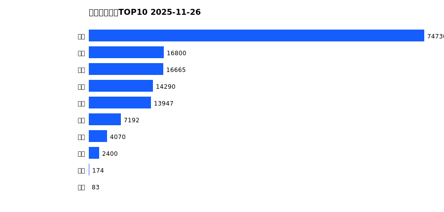
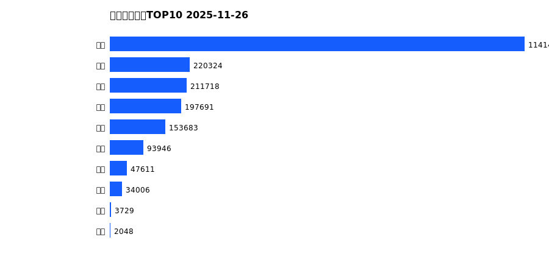
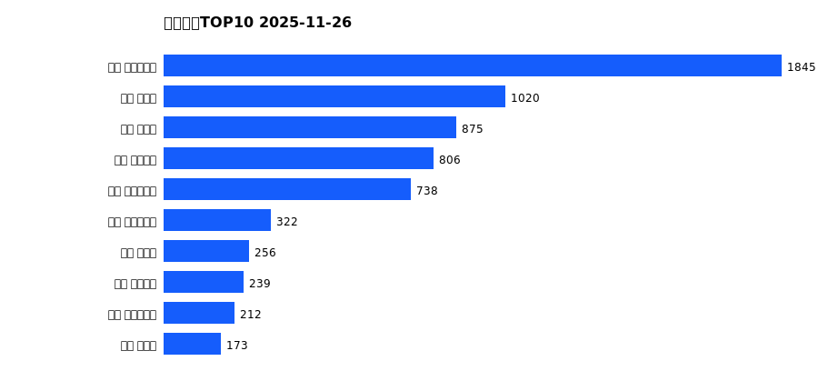
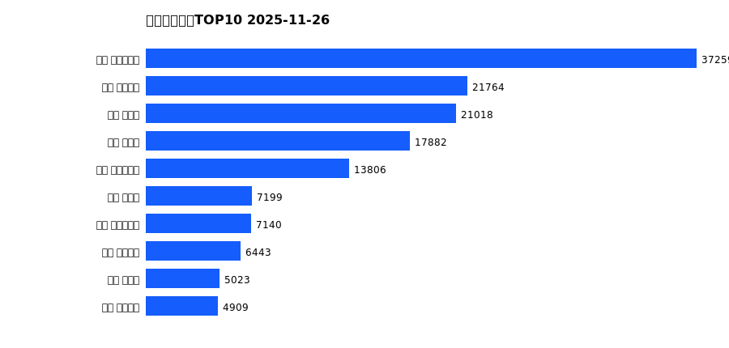
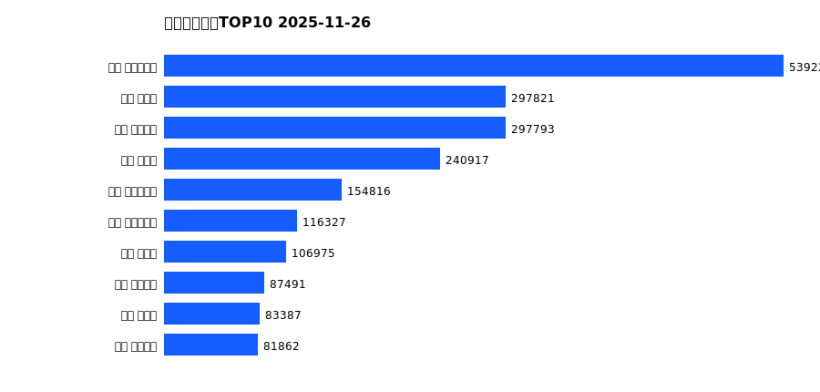

# 销售日报 2025-11-26

## 摘要

- 业态数: 10
- 门店数: 15
- 业态日销最大: 超市 3244
- 业态日销最小: 电玩 3
- 门店日销最大: 许昌 时代广场店 1845
- 门店日销最小: 许昌 劳动店 33
- 同比: -
- 环比: -

## 集团合计

| period | sales_wan |
| --- | --- |
| daily | 6752.0 |
| monthly | 150349.0 |
| yearly | 2106247.0 |

## 业态 TOP10

### 日销

| rank | business_type | sales_wan |
| --- | --- | --- |
| 1 | 超市 | 3243.5 |
| 2 | 珠宝 | 847.96 |
| 3 | 服饰 | 829.76 |
| 4 | 百货 | 653.6 |
| 5 | 电器 | 522.43 |
| 6 | 茶叶 | 347.29 |
| 7 | 医药 | 193.75 |
| 8 | 餐饮 | 99.61 |
| 9 | 电影 | 11.26 |
| 10 | 电玩 | 3.31 |

### 月度累计

| rank | business_type | sales_wan |
| --- | --- | --- |
| 1 | 超市 | 74729.76 |
| 2 | 百货 | 16800.34 |
| 3 | 服饰 | 16664.54 |
| 4 | 珠宝 | 14289.59 |
| 5 | 电器 | 13946.65 |
| 6 | 茶叶 | 7191.74 |
| 7 | 医药 | 4069.89 |
| 8 | 餐饮 | 2400.02 |
| 9 | 电玩 | 173.67 |
| 10 | 电影 | 82.82 |

### 年度累计

| rank | business_type | sales_wan |
| --- | --- | --- |
| 1 | 超市 | 1141488.77 |
| 2 | 珠宝 | 220323.62 |
| 3 | 百货 | 211718.48 |
| 4 | 电器 | 197691.12 |
| 5 | 服饰 | 153683.4 |
| 6 | 茶叶 | 93946.48 |
| 7 | 医药 | 47611.35 |
| 8 | 餐饮 | 34005.98 |
| 9 | 电玩 | 3729.37 |
| 10 | 电影 | 2048.33 |

## 门店 TOP10

### 日销

| rank | store_name | sales_wan |
| --- | --- | --- |
| 1 | 许昌 时代广场店 | 1844.55 |
| 2 | 新乡 大胖店 | 1020.02 |
| 3 | 新乡 小胖店 | 874.68 |
| 4 | 许昌 天使城店 | 805.99 |
| 5 | 许昌 生活广场店 | 738.26 |
| 6 | 许昌 实业公司店 | 321.77 |
| 7 | 许昌 禹州店 | 255.52 |
| 8 | 许昌 线上商城 | 239.46 |
| 9 | 许昌 大众服饰店 | 212.26 |
| 10 | 许昌 北海店 | 173.46 |

### 月度累计

| rank | store_name | sales_wan |
| --- | --- | --- |
| 1 | 许昌 时代广场店 | 37258.53 |
| 2 | 许昌 天使城店 | 21763.52 |
| 3 | 新乡 大胖店 | 21017.54 |
| 4 | 新乡 小胖店 | 17882.45 |
| 5 | 许昌 生活广场店 | 13805.62 |
| 6 | 许昌 禹州店 | 7198.6 |
| 7 | 许昌 实业公司店 | 7140.39 |
| 8 | 许昌 线上商城 | 6443.33 |
| 9 | 许昌 北海店 | 5022.89 |
| 10 | 许昌 金三角店 | 4909.3 |

### 年度累计

| rank | store_name | sales_wan |
| --- | --- | --- |
| 1 | 许昌 时代广场店 | 539229.14 |
| 2 | 新乡 大胖店 | 297820.78 |
| 3 | 许昌 天使城店 | 297792.97 |
| 4 | 新乡 小胖店 | 240917.22 |
| 5 | 许昌 生活广场店 | 154815.88 |
| 6 | 许昌 实业公司店 | 116327.38 |
| 7 | 许昌 禹州店 | 106974.68 |
| 8 | 许昌 线上商城 | 87491.34 |
| 9 | 许昌 北海店 | 83386.94 |
| 10 | 许昌 金三角店 | 81861.76 |

