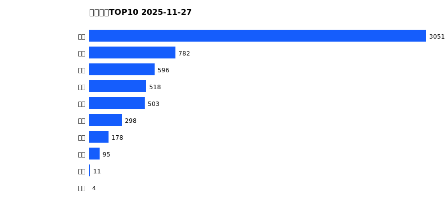
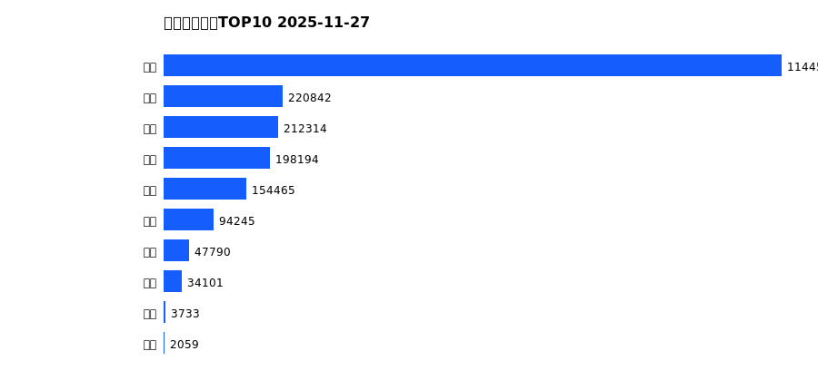
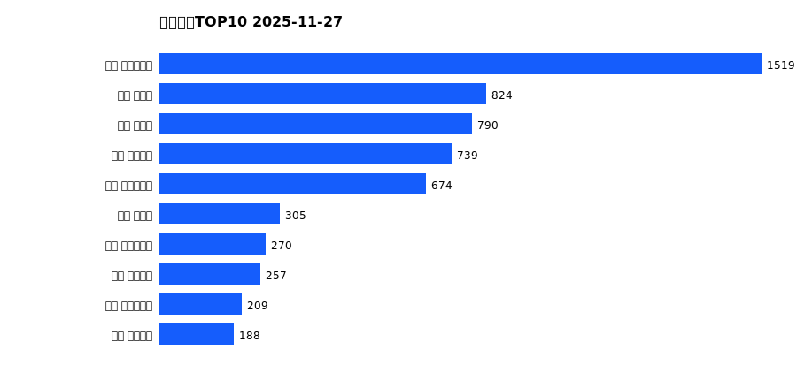
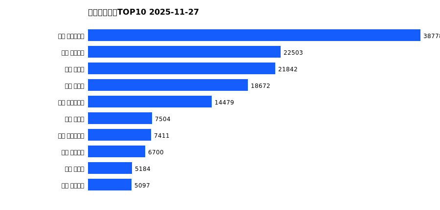
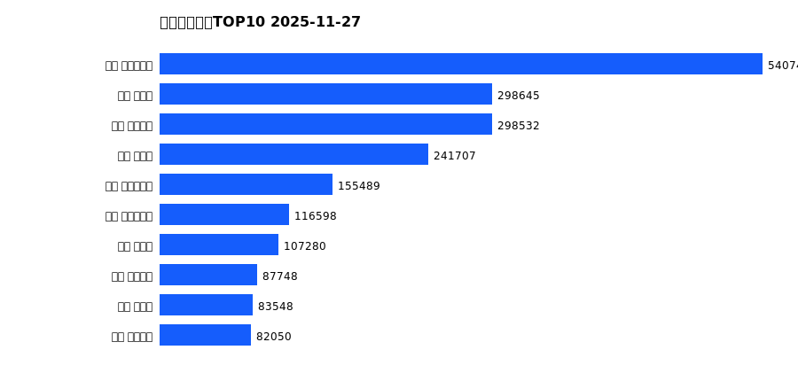

# 销售日报 2025-11-27

## 摘要

- 业态数: 10
- 门店数: 15
- 业态日销最大: 超市 3051
- 业态日销最小: 电玩 4
- 门店日销最大: 许昌 时代广场店 1519
- 门店日销最小: 许昌 劳动店 31
- 同比: -
- 环比: -

## 集团合计

| period | sales_wan |
| --- | --- |
| daily | 6036.0 |
| monthly | 156385.0 |
| yearly | 2112283.0 |

## 业态 TOP10

### 日销

| rank | business_type | sales_wan |
| --- | --- | --- |
| 1 | 超市 | 3051.19 |
| 2 | 服饰 | 781.85 |
| 3 | 百货 | 595.68 |
| 4 | 珠宝 | 518.42 |
| 5 | 电器 | 502.86 |
| 6 | 茶叶 | 298.5 |
| 7 | 医药 | 178.18 |
| 8 | 餐饮 | 94.53 |
| 9 | 电影 | 10.82 |
| 10 | 电玩 | 3.89 |

### 月度累计

| rank | business_type | sales_wan |
| --- | --- | --- |
| 1 | 超市 | 77780.95 |
| 2 | 服饰 | 17446.39 |
| 3 | 百货 | 17396.01 |
| 4 | 珠宝 | 14808.01 |
| 5 | 电器 | 14449.51 |
| 6 | 茶叶 | 7490.24 |
| 7 | 医药 | 4248.07 |
| 8 | 餐饮 | 2494.55 |
| 9 | 电玩 | 177.55 |
| 10 | 电影 | 93.64 |

### 年度累计

| rank | business_type | sales_wan |
| --- | --- | --- |
| 1 | 超市 | 1144539.96 |
| 2 | 珠宝 | 220842.05 |
| 3 | 百货 | 212314.16 |
| 4 | 电器 | 198193.98 |
| 5 | 服饰 | 154465.24 |
| 6 | 茶叶 | 94244.97 |
| 7 | 医药 | 47789.53 |
| 8 | 餐饮 | 34100.51 |
| 9 | 电玩 | 3733.26 |
| 10 | 电影 | 2059.15 |

## 门店 TOP10

### 日销

| rank | store_name | sales_wan |
| --- | --- | --- |
| 1 | 许昌 时代广场店 | 1519.09 |
| 2 | 新乡 大胖店 | 824.35 |
| 3 | 新乡 小胖店 | 789.56 |
| 4 | 许昌 天使城店 | 739.15 |
| 5 | 许昌 生活广场店 | 673.51 |
| 6 | 许昌 禹州店 | 305.08 |
| 7 | 许昌 实业公司店 | 270.13 |
| 8 | 许昌 线上商城 | 256.75 |
| 9 | 许昌 大众服饰店 | 208.58 |
| 10 | 许昌 金三角店 | 187.81 |

### 月度累计

| rank | store_name | sales_wan |
| --- | --- | --- |
| 1 | 许昌 时代广场店 | 38777.62 |
| 2 | 许昌 天使城店 | 22502.68 |
| 3 | 新乡 大胖店 | 21841.89 |
| 4 | 新乡 小胖店 | 18672.01 |
| 5 | 许昌 生活广场店 | 14479.13 |
| 6 | 许昌 禹州店 | 7503.67 |
| 7 | 许昌 实业公司店 | 7410.52 |
| 8 | 许昌 线上商城 | 6700.08 |
| 9 | 许昌 北海店 | 5184.17 |
| 10 | 许昌 金三角店 | 5097.11 |

### 年度累计

| rank | store_name | sales_wan |
| --- | --- | --- |
| 1 | 许昌 时代广场店 | 540748.23 |
| 2 | 新乡 大胖店 | 298645.14 |
| 3 | 许昌 天使城店 | 298532.12 |
| 4 | 新乡 小胖店 | 241706.78 |
| 5 | 许昌 生活广场店 | 155489.4 |
| 6 | 许昌 实业公司店 | 116597.52 |
| 7 | 许昌 禹州店 | 107279.75 |
| 8 | 许昌 线上商城 | 87748.09 |
| 9 | 许昌 北海店 | 83548.23 |
| 10 | 许昌 金三角店 | 82049.58 |

