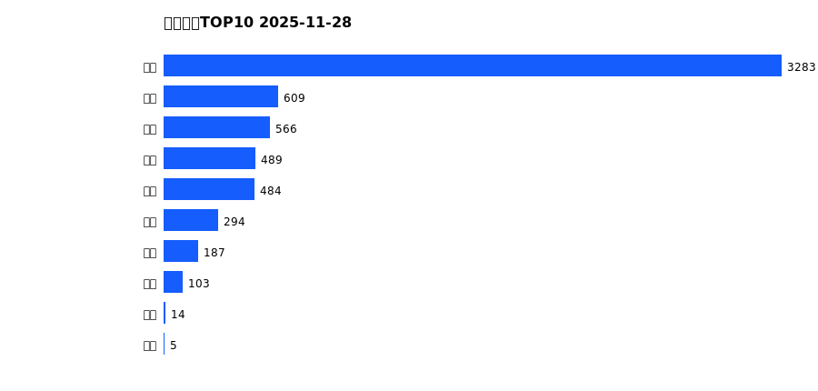
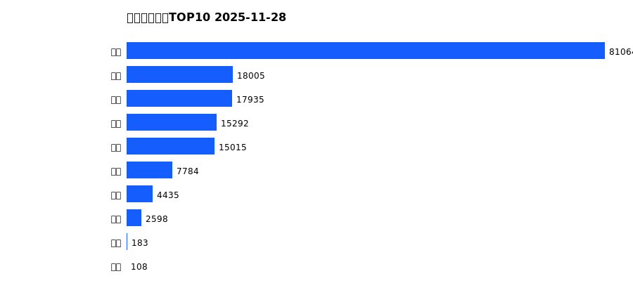
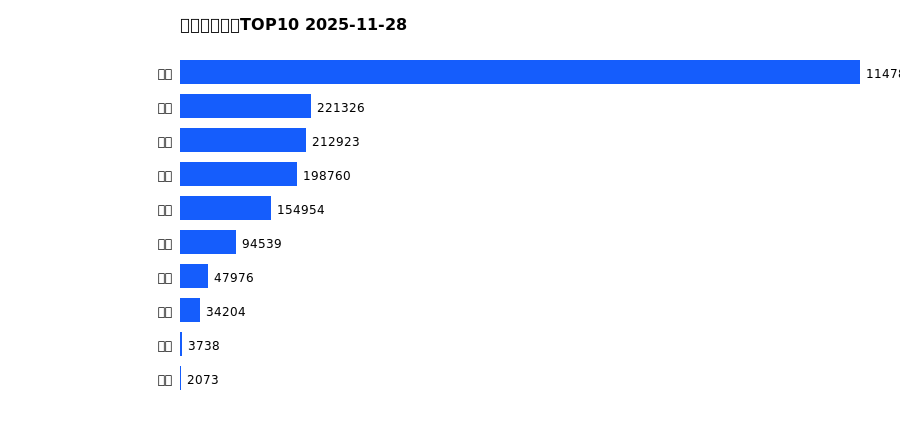
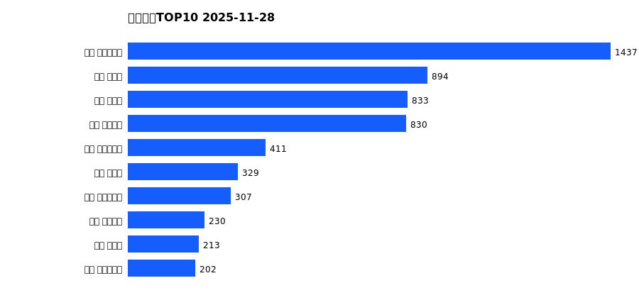
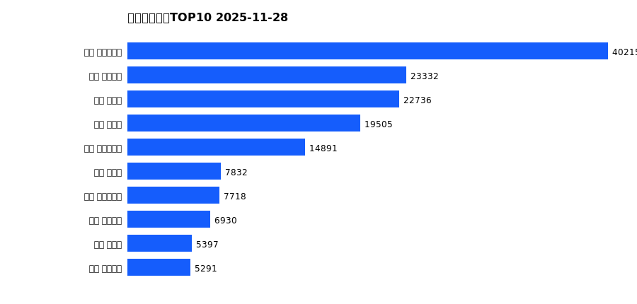
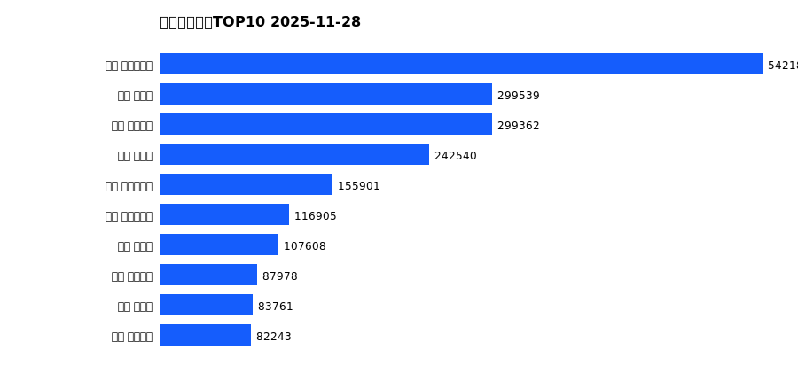

# 销售日报 2025-11-28

## 摘要

- 业态数: 10
- 门店数: 15
- 业态日销最大: 超市 3283
- 业态日销最小: 电玩 5
- 门店日销最大: 许昌 时代广场店 1437
- 门店日销最小: 许昌 劳动店 35
- 同比: -
- 环比: -

## 集团合计

| period | sales_wan |
| --- | --- |
| daily | 6034.0 |
| monthly | 162419.0 |
| yearly | 2118317.0 |

## 业态 TOP10

### 日销

| rank | business_type | sales_wan |
| --- | --- | --- |
| 1 | 超市 | 3282.96 |
| 2 | 百货 | 609.09 |
| 3 | 电器 | 565.9 |
| 4 | 服饰 | 489.06 |
| 5 | 珠宝 | 483.79 |
| 6 | 茶叶 | 294.08 |
| 7 | 医药 | 186.69 |
| 8 | 餐饮 | 103.04 |
| 9 | 电影 | 13.93 |
| 10 | 电玩 | 5.23 |

### 月度累计

| rank | business_type | sales_wan |
| --- | --- | --- |
| 1 | 超市 | 81063.91 |
| 2 | 百货 | 18005.1 |
| 3 | 服饰 | 17935.45 |
| 4 | 珠宝 | 15291.8 |
| 5 | 电器 | 15015.4 |
| 6 | 茶叶 | 7784.32 |
| 7 | 医药 | 4434.77 |
| 8 | 餐饮 | 2597.59 |
| 9 | 电玩 | 182.79 |
| 10 | 电影 | 107.58 |

### 年度累计

| rank | business_type | sales_wan |
| --- | --- | --- |
| 1 | 超市 | 1147822.92 |
| 2 | 珠宝 | 221325.84 |
| 3 | 百货 | 212923.25 |
| 4 | 电器 | 198759.88 |
| 5 | 服饰 | 154954.3 |
| 6 | 茶叶 | 94539.06 |
| 7 | 医药 | 47976.22 |
| 8 | 餐饮 | 34203.55 |
| 9 | 电玩 | 3738.49 |
| 10 | 电影 | 2073.08 |

## 门店 TOP10

### 日销

| rank | store_name | sales_wan |
| --- | --- | --- |
| 1 | 许昌 时代广场店 | 1437.0 |
| 2 | 新乡 大胖店 | 893.66 |
| 3 | 新乡 小胖店 | 833.47 |
| 4 | 许昌 天使城店 | 829.77 |
| 5 | 许昌 生活广场店 | 411.41 |
| 6 | 许昌 禹州店 | 328.57 |
| 7 | 许昌 实业公司店 | 307.41 |
| 8 | 许昌 线上商城 | 230.18 |
| 9 | 许昌 北海店 | 212.94 |
| 10 | 许昌 大众服饰店 | 202.25 |

### 月度累计

| rank | store_name | sales_wan |
| --- | --- | --- |
| 1 | 许昌 时代广场店 | 40214.62 |
| 2 | 许昌 天使城店 | 23332.44 |
| 3 | 新乡 大胖店 | 22735.55 |
| 4 | 新乡 小胖店 | 19505.48 |
| 5 | 许昌 生活广场店 | 14890.55 |
| 6 | 许昌 禹州店 | 7832.24 |
| 7 | 许昌 实业公司店 | 7717.93 |
| 8 | 许昌 线上商城 | 6930.26 |
| 9 | 许昌 北海店 | 5397.11 |
| 10 | 许昌 金三角店 | 5290.87 |

### 年度累计

| rank | store_name | sales_wan |
| --- | --- | --- |
| 1 | 许昌 时代广场店 | 542185.23 |
| 2 | 新乡 大胖店 | 299538.8 |
| 3 | 许昌 天使城店 | 299361.89 |
| 4 | 新乡 小胖店 | 242540.24 |
| 5 | 许昌 生活广场店 | 155900.81 |
| 6 | 许昌 实业公司店 | 116904.92 |
| 7 | 许昌 禹州店 | 107608.32 |
| 8 | 许昌 线上商城 | 87978.27 |
| 9 | 许昌 北海店 | 83761.17 |
| 10 | 许昌 金三角店 | 82243.33 |

