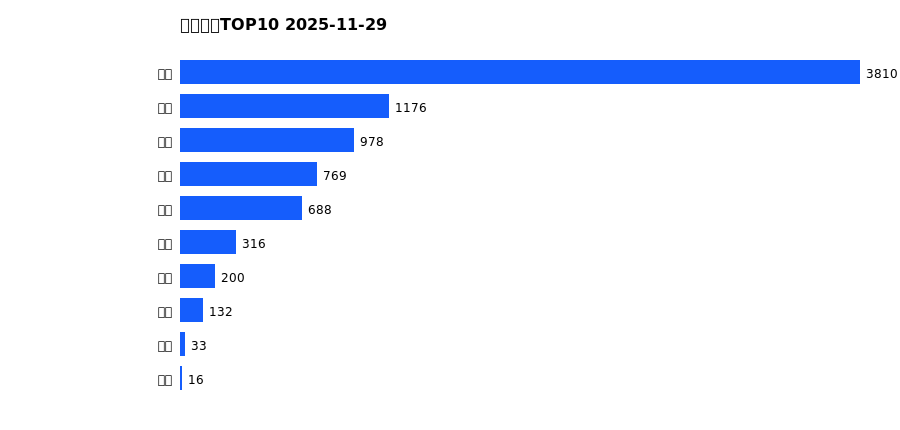
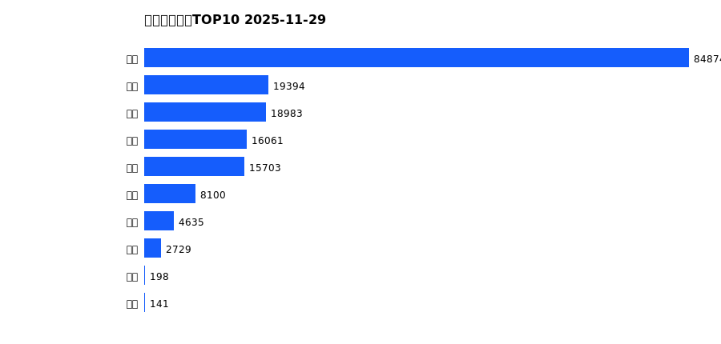
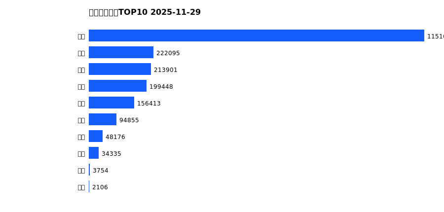
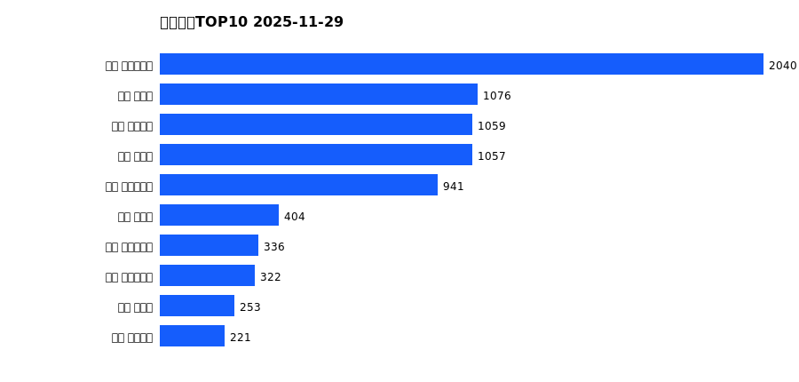
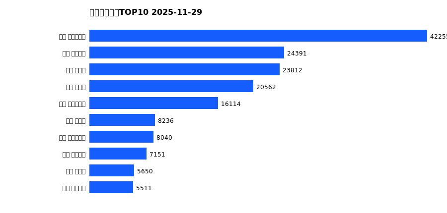
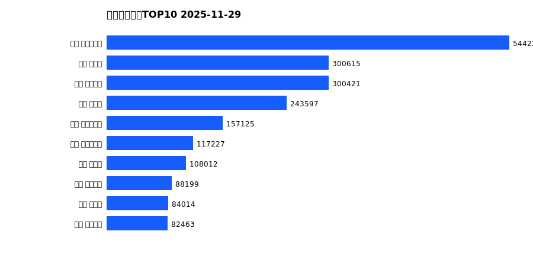

# 销售日报 2025-11-29

## 摘要

- 业态数: 10
- 门店数: 15
- 业态日销最大: 超市 3810
- 业态日销最小: 电玩 16
- 门店日销最大: 许昌 时代广场店 2040
- 门店日销最小: 许昌 劳动店 40
- 同比: -
- 环比: -

## 集团合计

| period | sales_wan |
| --- | --- |
| daily | 8117.0 |
| monthly | 170819.0 |
| yearly | 2126717.0 |

## 业态 TOP10

### 日销

| rank | business_type | sales_wan |
| --- | --- | --- |
| 1 | 超市 | 3809.76 |
| 2 | 服饰 | 1175.94 |
| 3 | 百货 | 978.04 |
| 4 | 珠宝 | 769.05 |
| 5 | 电器 | 687.93 |
| 6 | 茶叶 | 315.88 |
| 7 | 医药 | 200.21 |
| 8 | 餐饮 | 131.82 |
| 9 | 电影 | 32.98 |
| 10 | 电玩 | 15.67 |

### 月度累计

| rank | business_type | sales_wan |
| --- | --- | --- |
| 1 | 超市 | 84873.67 |
| 2 | 服饰 | 19394.15 |
| 3 | 百货 | 18983.14 |
| 4 | 珠宝 | 16060.85 |
| 5 | 电器 | 15703.33 |
| 6 | 茶叶 | 8100.2 |
| 7 | 医药 | 4634.98 |
| 8 | 餐饮 | 2729.4 |
| 9 | 电玩 | 198.46 |
| 10 | 电影 | 140.56 |

### 年度累计

| rank | business_type | sales_wan |
| --- | --- | --- |
| 1 | 超市 | 1151632.68 |
| 2 | 珠宝 | 222094.89 |
| 3 | 百货 | 213901.29 |
| 4 | 电器 | 199447.81 |
| 5 | 服饰 | 156413.0 |
| 6 | 茶叶 | 94854.94 |
| 7 | 医药 | 48176.44 |
| 8 | 餐饮 | 34335.37 |
| 9 | 电玩 | 3754.17 |
| 10 | 电影 | 2106.07 |

## 门店 TOP10

### 日销

| rank | store_name | sales_wan |
| --- | --- | --- |
| 1 | 许昌 时代广场店 | 2040.33 |
| 2 | 新乡 大胖店 | 1076.43 |
| 3 | 许昌 天使城店 | 1058.93 |
| 4 | 新乡 小胖店 | 1056.86 |
| 5 | 许昌 生活广场店 | 940.96 |
| 6 | 许昌 禹州店 | 403.54 |
| 7 | 许昌 大众服饰店 | 335.75 |
| 8 | 许昌 实业公司店 | 321.73 |
| 9 | 许昌 北海店 | 252.71 |
| 10 | 许昌 线上商城 | 220.65 |

### 月度累计

| rank | store_name | sales_wan |
| --- | --- | --- |
| 1 | 许昌 时代广场店 | 42254.95 |
| 2 | 许昌 天使城店 | 24391.37 |
| 3 | 新乡 大胖店 | 23811.98 |
| 4 | 新乡 小胖店 | 20562.34 |
| 5 | 许昌 生活广场店 | 16114.27 |
| 6 | 许昌 禹州店 | 8235.79 |
| 7 | 许昌 实业公司店 | 8039.66 |
| 8 | 许昌 线上商城 | 7150.91 |
| 9 | 许昌 北海店 | 5649.82 |
| 10 | 许昌 金三角店 | 5510.6 |

### 年度累计

| rank | store_name | sales_wan |
| --- | --- | --- |
| 1 | 许昌 时代广场店 | 544225.56 |
| 2 | 新乡 大胖店 | 300615.23 |
| 3 | 许昌 天使城店 | 300420.82 |
| 4 | 新乡 小胖店 | 243597.1 |
| 5 | 许昌 生活广场店 | 157124.53 |
| 6 | 许昌 实业公司店 | 117226.65 |
| 7 | 许昌 禹州店 | 108011.87 |
| 8 | 许昌 线上商城 | 88198.92 |
| 9 | 许昌 北海店 | 84013.88 |
| 10 | 许昌 金三角店 | 82463.07 |

