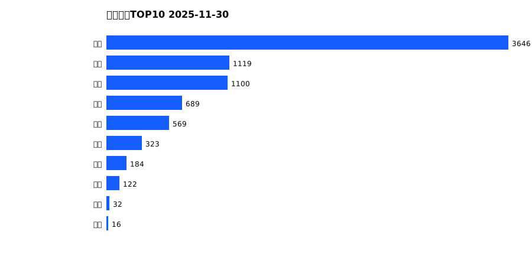
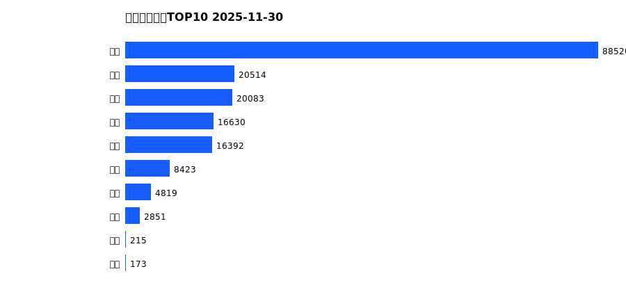
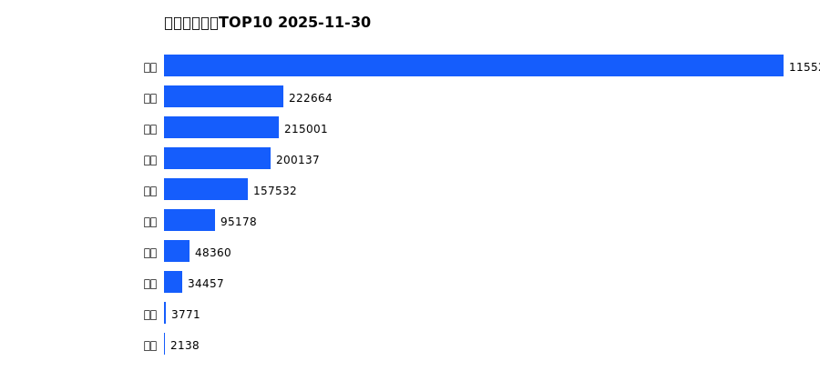
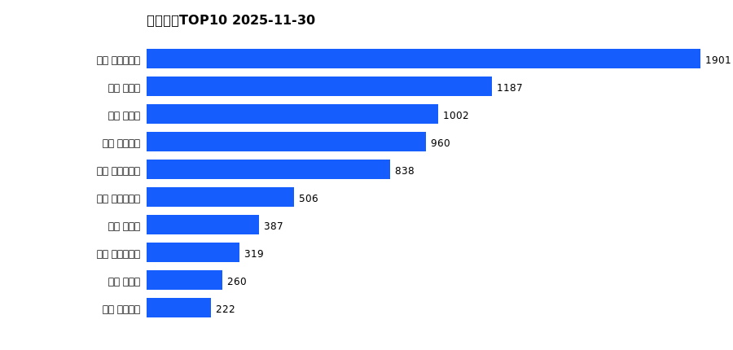
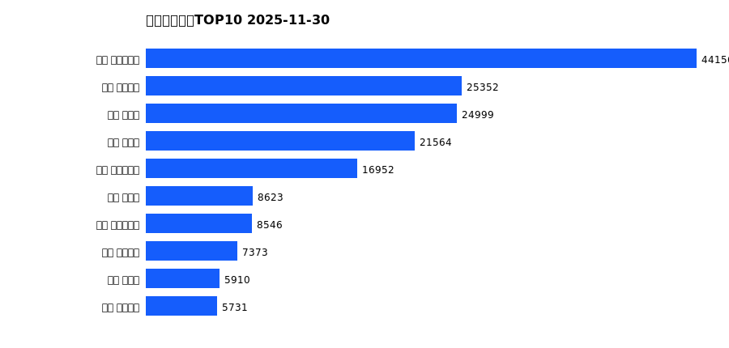
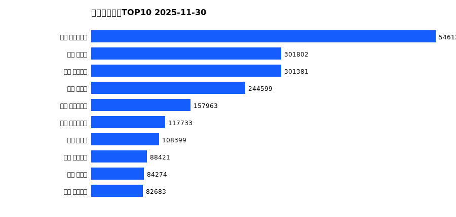

# 销售日报 2025-11-30

## 摘要

- 业态数: 10
- 门店数: 15
- 业态日销最大: 超市 3646
- 业态日销最小: 电玩 16
- 门店日销最大: 许昌 时代广场店 1901
- 门店日销最小: 许昌 劳动店 41
- 同比: -
- 环比: -

## 集团合计

| period | sales_wan |
| --- | --- |
| daily | 7801.0 |
| monthly | 178619.0 |
| yearly | 2134517.0 |

## 业态 TOP10

### 日销

| rank | business_type | sales_wan |
| --- | --- | --- |
| 1 | 超市 | 3646.23 |
| 2 | 服饰 | 1119.49 |
| 3 | 百货 | 1099.97 |
| 4 | 电器 | 688.8 |
| 5 | 珠宝 | 569.42 |
| 6 | 茶叶 | 322.58 |
| 7 | 医药 | 183.69 |
| 8 | 餐饮 | 122.01 |
| 9 | 电影 | 32.07 |
| 10 | 电玩 | 16.41 |

### 月度累计

| rank | business_type | sales_wan |
| --- | --- | --- |
| 1 | 超市 | 88519.91 |
| 2 | 服饰 | 20513.63 |
| 3 | 百货 | 20083.12 |
| 4 | 珠宝 | 16630.27 |
| 5 | 电器 | 16392.13 |
| 6 | 茶叶 | 8422.79 |
| 7 | 医药 | 4818.67 |
| 8 | 餐饮 | 2851.41 |
| 9 | 电玩 | 214.88 |
| 10 | 电影 | 172.63 |

### 年度累计

| rank | business_type | sales_wan |
| --- | --- | --- |
| 1 | 超市 | 1155278.92 |
| 2 | 珠宝 | 222664.31 |
| 3 | 百货 | 215001.26 |
| 4 | 电器 | 200136.61 |
| 5 | 服饰 | 157532.49 |
| 6 | 茶叶 | 95177.52 |
| 7 | 医药 | 48360.13 |
| 8 | 餐饮 | 34457.37 |
| 9 | 电玩 | 3770.58 |
| 10 | 电影 | 2138.14 |

## 门店 TOP10

### 日销

| rank | store_name | sales_wan |
| --- | --- | --- |
| 1 | 许昌 时代广场店 | 1900.57 |
| 2 | 新乡 大胖店 | 1187.19 |
| 3 | 新乡 小胖店 | 1002.16 |
| 4 | 许昌 天使城店 | 960.42 |
| 5 | 许昌 生活广场店 | 838.17 |
| 6 | 许昌 实业公司店 | 505.91 |
| 7 | 许昌 禹州店 | 387.06 |
| 8 | 许昌 大众服饰店 | 318.9 |
| 9 | 许昌 北海店 | 260.44 |
| 10 | 许昌 线上商城 | 221.91 |

### 月度累计

| rank | store_name | sales_wan |
| --- | --- | --- |
| 1 | 许昌 时代广场店 | 44155.53 |
| 2 | 许昌 天使城店 | 25351.8 |
| 3 | 新乡 大胖店 | 24999.18 |
| 4 | 新乡 小胖店 | 21564.49 |
| 5 | 许昌 生活广场店 | 16952.44 |
| 6 | 许昌 禹州店 | 8622.85 |
| 7 | 许昌 实业公司店 | 8545.57 |
| 8 | 许昌 线上商城 | 7372.82 |
| 9 | 许昌 北海店 | 5910.26 |
| 10 | 许昌 金三角店 | 5730.94 |

### 年度累计

| rank | store_name | sales_wan |
| --- | --- | --- |
| 1 | 许昌 时代广场店 | 546126.13 |
| 2 | 新乡 大胖店 | 301802.42 |
| 3 | 许昌 天使城店 | 301381.24 |
| 4 | 新乡 小胖店 | 244599.26 |
| 5 | 许昌 生活广场店 | 157962.7 |
| 6 | 许昌 实业公司店 | 117732.56 |
| 7 | 许昌 禹州店 | 108398.93 |
| 8 | 许昌 线上商城 | 88420.83 |
| 9 | 许昌 北海店 | 84274.32 |
| 10 | 许昌 金三角店 | 82683.4 |

