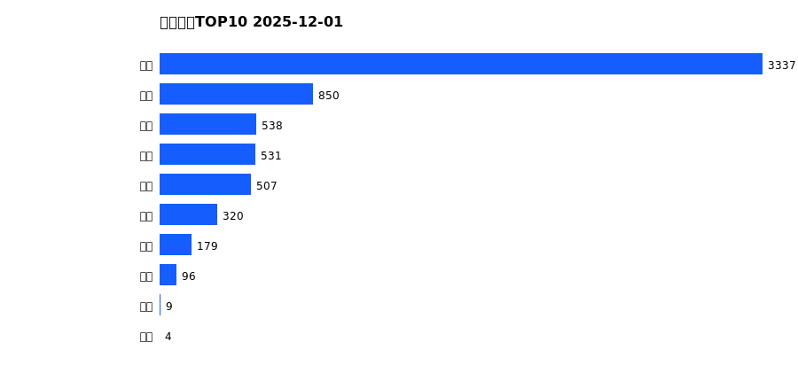
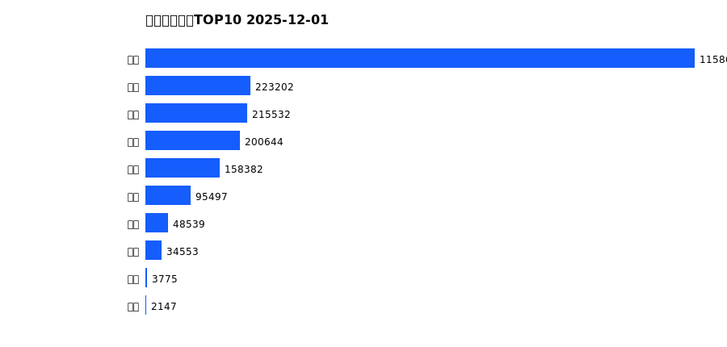
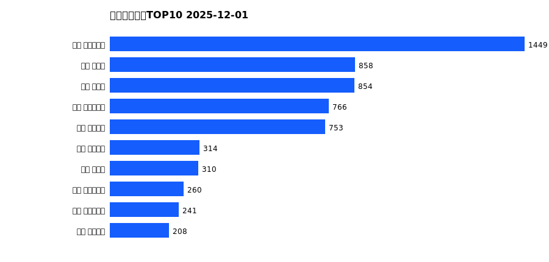
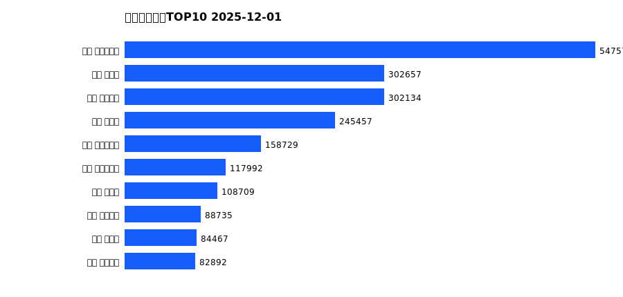

# 销售日报 2025-12-01

## 摘要

- 业态数: 10
- 门店数: 15
- 业态日销最大: 超市 3337
- 业态日销最小: 电玩 4
- 门店日销最大: 许昌 时代广场店 1449
- 门店日销最小: 许昌 劳动店 32
- 同比: -
- 环比: -

## 集团合计

| period | sales_wan |
| --- | --- |
| daily | 6369.0 |
| monthly | 6369.0 |
| yearly | 2140886.0 |

## 业态 TOP10

### 日销

| rank | business_type | sales_wan |
| --- | --- | --- |
| 1 | 超市 | 3336.57 |
| 2 | 服饰 | 849.62 |
| 3 | 珠宝 | 537.8 |
| 4 | 百货 | 530.53 |
| 5 | 电器 | 507.05 |
| 6 | 茶叶 | 319.52 |
| 7 | 医药 | 178.66 |
| 8 | 餐饮 | 96.1 |
| 9 | 电影 | 8.77 |
| 10 | 电玩 | 4.18 |

### 月度累计

| rank | business_type | sales_wan |
| --- | --- | --- |
| 1 | 超市 | 3336.57 |
| 2 | 服饰 | 849.62 |
| 3 | 珠宝 | 537.8 |
| 4 | 百货 | 530.53 |
| 5 | 电器 | 507.05 |
| 6 | 茶叶 | 319.52 |
| 7 | 医药 | 178.66 |
| 8 | 餐饮 | 96.1 |
| 9 | 电影 | 8.77 |
| 10 | 电玩 | 4.18 |

### 年度累计

| rank | business_type | sales_wan |
| --- | --- | --- |
| 1 | 超市 | 1158615.48 |
| 2 | 珠宝 | 223202.11 |
| 3 | 百货 | 215531.79 |
| 4 | 电器 | 200643.66 |
| 5 | 服饰 | 158382.11 |
| 6 | 茶叶 | 95497.04 |
| 7 | 医药 | 48538.78 |
| 8 | 餐饮 | 34553.48 |
| 9 | 电玩 | 3774.77 |
| 10 | 电影 | 2146.91 |

## 门店 TOP10

### 日销

| rank | store_name | sales_wan |
| --- | --- | --- |
| 1 | 许昌 时代广场店 | 1448.94 |
| 2 | 新乡 小胖店 | 858.08 |
| 3 | 新乡 大胖店 | 854.5 |
| 4 | 许昌 生活广场店 | 765.99 |
| 5 | 许昌 天使城店 | 752.6 |
| 6 | 许昌 线上商城 | 314.15 |
| 7 | 许昌 禹州店 | 309.59 |
| 8 | 许昌 实业公司店 | 259.9 |
| 9 | 许昌 大众服饰店 | 240.99 |
| 10 | 许昌 金三角店 | 208.49 |

### 月度累计

| rank | store_name | sales_wan |
| --- | --- | --- |
| 1 | 许昌 时代广场店 | 1448.94 |
| 2 | 新乡 小胖店 | 858.08 |
| 3 | 新乡 大胖店 | 854.5 |
| 4 | 许昌 生活广场店 | 765.99 |
| 5 | 许昌 天使城店 | 752.6 |
| 6 | 许昌 线上商城 | 314.15 |
| 7 | 许昌 禹州店 | 309.59 |
| 8 | 许昌 实业公司店 | 259.9 |
| 9 | 许昌 大众服饰店 | 240.99 |
| 10 | 许昌 金三角店 | 208.49 |

### 年度累计

| rank | store_name | sales_wan |
| --- | --- | --- |
| 1 | 许昌 时代广场店 | 547575.07 |
| 2 | 新乡 大胖店 | 302656.92 |
| 3 | 许昌 天使城店 | 302133.84 |
| 4 | 新乡 小胖店 | 245457.34 |
| 5 | 许昌 生活广场店 | 158728.69 |
| 6 | 许昌 实业公司店 | 117992.46 |
| 7 | 许昌 禹州店 | 108708.52 |
| 8 | 许昌 线上商城 | 88734.98 |
| 9 | 许昌 北海店 | 84467.29 |
| 10 | 许昌 金三角店 | 82891.89 |

