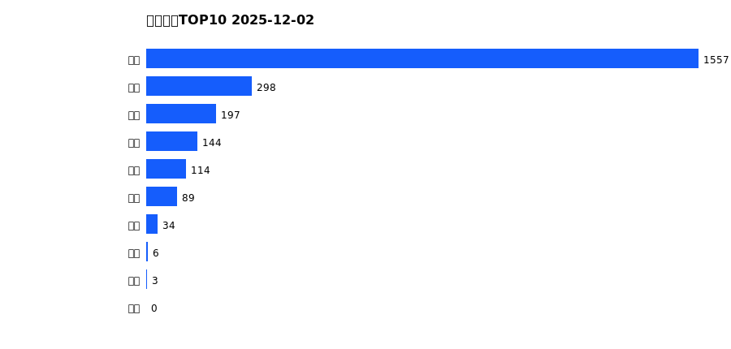
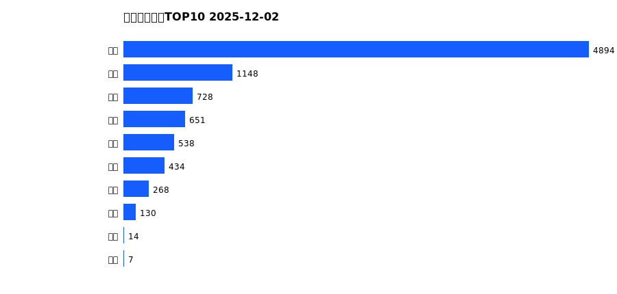
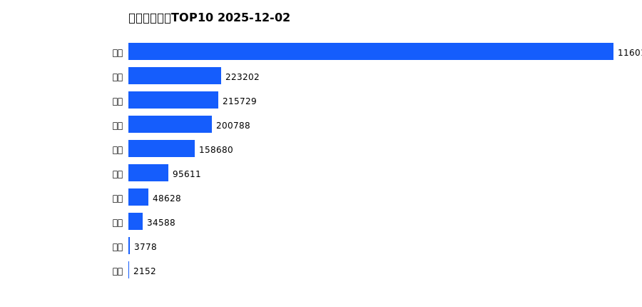
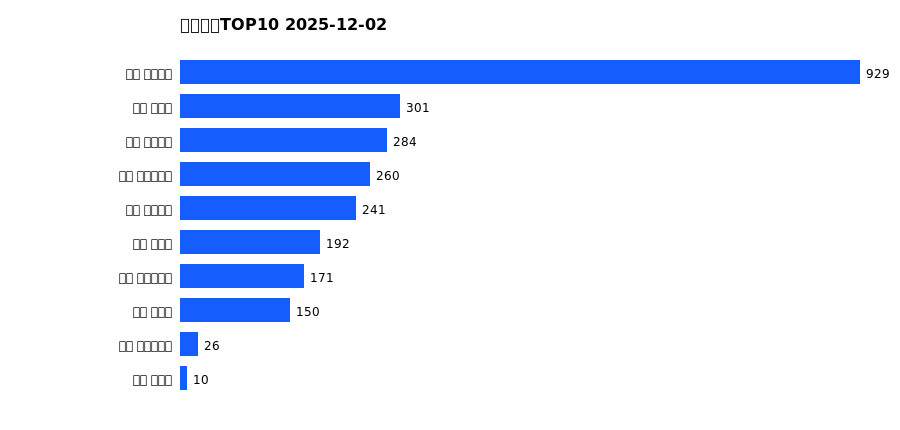
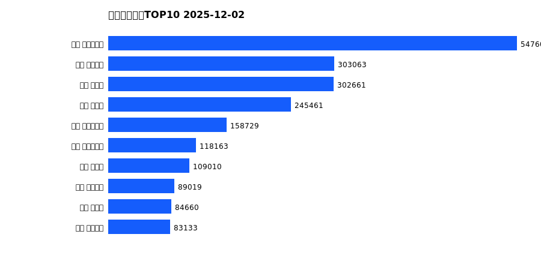

# 销售日报 2025-12-02

## 摘要

- 业态数: 10
- 门店数: 15
- 业态日销最大: 超市 1557
- 业态日销最小: 珠宝 0
- 门店日销最大: 许昌 天使城店 929
- 门店日销最小: 许昌 生活广场店 0
- 同比: -
- 环比: -

## 集团合计

| period | sales_wan |
| --- | --- |
| daily | 2443.0 |
| monthly | 8812.0 |
| yearly | 2143329.0 |

## 业态 TOP10

### 日销

| rank | business_type | sales_wan |
| --- | --- | --- |
| 1 | 超市 | 1557.27 |
| 2 | 服饰 | 297.9 |
| 3 | 百货 | 197.42 |
| 4 | 电器 | 144.44 |
| 5 | 茶叶 | 114.08 |
| 6 | 医药 | 88.84 |
| 7 | 餐饮 | 34.31 |
| 8 | 电影 | 5.5 |
| 9 | 电玩 | 3.02 |
| 10 | 珠宝 | 0.0 |

### 月度累计

| rank | business_type | sales_wan |
| --- | --- | --- |
| 1 | 超市 | 4893.84 |
| 2 | 服饰 | 1147.52 |
| 3 | 百货 | 727.95 |
| 4 | 电器 | 651.48 |
| 5 | 珠宝 | 537.8 |
| 6 | 茶叶 | 433.59 |
| 7 | 医药 | 267.5 |
| 8 | 餐饮 | 130.42 |
| 9 | 电影 | 14.27 |
| 10 | 电玩 | 7.21 |

### 年度累计

| rank | business_type | sales_wan |
| --- | --- | --- |
| 1 | 超市 | 1160172.75 |
| 2 | 珠宝 | 223202.11 |
| 3 | 百货 | 215729.21 |
| 4 | 电器 | 200788.09 |
| 5 | 服饰 | 158680.01 |
| 6 | 茶叶 | 95611.12 |
| 7 | 医药 | 48627.62 |
| 8 | 餐饮 | 34587.79 |
| 9 | 电玩 | 3777.79 |
| 10 | 电影 | 2152.41 |

## 门店 TOP10

### 日销

| rank | store_name | sales_wan |
| --- | --- | --- |
| 1 | 许昌 天使城店 | 929.37 |
| 2 | 许昌 禹州店 | 300.99 |
| 3 | 许昌 线上商城 | 284.25 |
| 4 | 许昌 大众服饰店 | 260.49 |
| 5 | 许昌 金三角店 | 240.66 |
| 6 | 许昌 北海店 | 192.33 |
| 7 | 许昌 实业公司店 | 170.61 |
| 8 | 许昌 金汇店 | 150.42 |
| 9 | 许昌 时代广场店 | 25.7 |
| 10 | 许昌 魏源店 | 9.68 |

### 月度累计

| rank | store_name | sales_wan |
| --- | --- | --- |
| 1 | 许昌 天使城店 | 1681.97 |
| 2 | 许昌 时代广场店 | 1474.64 |
| 3 | 新乡 小胖店 | 861.33 |
| 4 | 新乡 大胖店 | 858.73 |
| 5 | 许昌 生活广场店 | 765.99 |
| 6 | 许昌 禹州店 | 610.58 |
| 7 | 许昌 线上商城 | 598.4 |
| 8 | 许昌 大众服饰店 | 501.49 |
| 9 | 许昌 金三角店 | 449.15 |
| 10 | 许昌 实业公司店 | 430.51 |

### 年度累计

| rank | store_name | sales_wan |
| --- | --- | --- |
| 1 | 许昌 时代广场店 | 547600.77 |
| 2 | 许昌 天使城店 | 303063.21 |
| 3 | 新乡 大胖店 | 302661.14 |
| 4 | 新乡 小胖店 | 245460.59 |
| 5 | 许昌 生活广场店 | 158728.69 |
| 6 | 许昌 实业公司店 | 118163.07 |
| 7 | 许昌 禹州店 | 109009.51 |
| 8 | 许昌 线上商城 | 89019.23 |
| 9 | 许昌 北海店 | 84659.63 |
| 10 | 许昌 金三角店 | 83132.56 |

