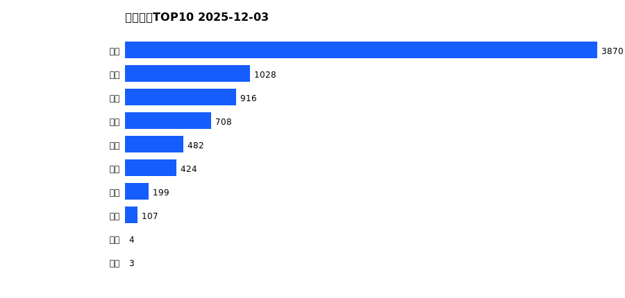
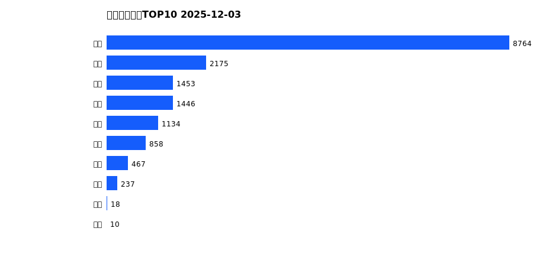
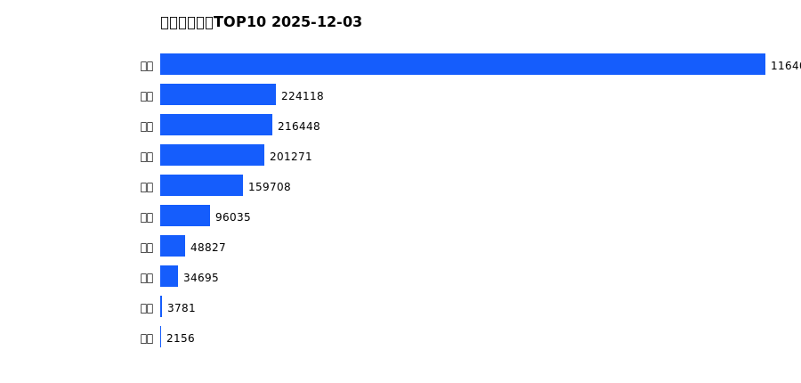
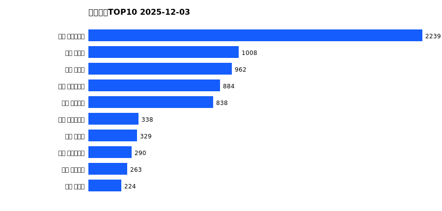
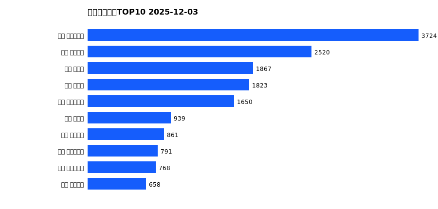

# 销售日报 2025-12-03

## 摘要

- 业态数: 10
- 门店数: 15
- 业态日销最大: 超市 3870
- 业态日销最小: 电玩 3
- 门店日销最大: 许昌 时代广场店 2239
- 门店日销最小: 许昌 劳动店 38
- 同比: -
- 环比: -

## 集团合计

| period | sales_wan |
| --- | --- |
| daily | 7741.0 |
| monthly | 16563.0 |
| yearly | 2151080.0 |

## 业态 TOP10

### 日销

| rank | business_type | sales_wan |
| --- | --- | --- |
| 1 | 超市 | 3870.12 |
| 2 | 服饰 | 1027.59 |
| 3 | 珠宝 | 915.53 |
| 4 | 百货 | 708.05 |
| 5 | 电器 | 482.5 |
| 6 | 茶叶 | 424.09 |
| 7 | 医药 | 199.04 |
| 8 | 餐饮 | 106.72 |
| 9 | 电影 | 3.92 |
| 10 | 电玩 | 3.21 |

### 月度累计

| rank | business_type | sales_wan |
| --- | --- | --- |
| 1 | 超市 | 8763.96 |
| 2 | 服饰 | 2175.11 |
| 3 | 珠宝 | 1453.33 |
| 4 | 百货 | 1446.34 |
| 5 | 电器 | 1133.98 |
| 6 | 茶叶 | 857.68 |
| 7 | 医药 | 466.54 |
| 8 | 餐饮 | 237.14 |
| 9 | 电影 | 18.19 |
| 10 | 电玩 | 10.41 |

### 年度累计

| rank | business_type | sales_wan |
| --- | --- | --- |
| 1 | 超市 | 1164042.88 |
| 2 | 珠宝 | 224117.64 |
| 3 | 百货 | 216447.59 |
| 4 | 电器 | 201270.59 |
| 5 | 服饰 | 159707.6 |
| 6 | 茶叶 | 96035.21 |
| 7 | 医药 | 48826.66 |
| 8 | 餐饮 | 34694.52 |
| 9 | 电玩 | 3781.0 |
| 10 | 电影 | 2156.33 |

## 门店 TOP10

### 日销

| rank | store_name | sales_wan |
| --- | --- | --- |
| 1 | 许昌 时代广场店 | 2238.7 |
| 2 | 新乡 大胖店 | 1008.44 |
| 3 | 新乡 小胖店 | 961.7 |
| 4 | 许昌 生活广场店 | 883.84 |
| 5 | 许昌 天使城店 | 837.73 |
| 6 | 许昌 实业公司店 | 337.75 |
| 7 | 许昌 禹州店 | 328.86 |
| 8 | 许昌 大众服饰店 | 289.9 |
| 9 | 许昌 线上商城 | 262.89 |
| 10 | 许昌 北海店 | 223.86 |

### 月度累计

| rank | store_name | sales_wan |
| --- | --- | --- |
| 1 | 许昌 时代广场店 | 3723.67 |
| 2 | 许昌 天使城店 | 2519.7 |
| 3 | 新乡 大胖店 | 1867.16 |
| 4 | 新乡 小胖店 | 1823.03 |
| 5 | 许昌 生活广场店 | 1649.83 |
| 6 | 许昌 禹州店 | 939.44 |
| 7 | 许昌 线上商城 | 861.3 |
| 8 | 许昌 大众服饰店 | 791.39 |
| 9 | 许昌 实业公司店 | 768.27 |
| 10 | 许昌 金三角店 | 657.88 |

### 年度累计

| rank | store_name | sales_wan |
| --- | --- | --- |
| 1 | 许昌 时代广场店 | 549849.8 |
| 2 | 许昌 天使城店 | 303900.94 |
| 3 | 新乡 大胖店 | 303669.58 |
| 4 | 新乡 小胖店 | 246422.29 |
| 5 | 许昌 生活广场店 | 159612.53 |
| 6 | 许昌 实业公司店 | 118500.83 |
| 7 | 许昌 禹州店 | 109338.37 |
| 8 | 许昌 线上商城 | 89282.13 |
| 9 | 许昌 北海店 | 84883.48 |
| 10 | 许昌 金三角店 | 83341.28 |

