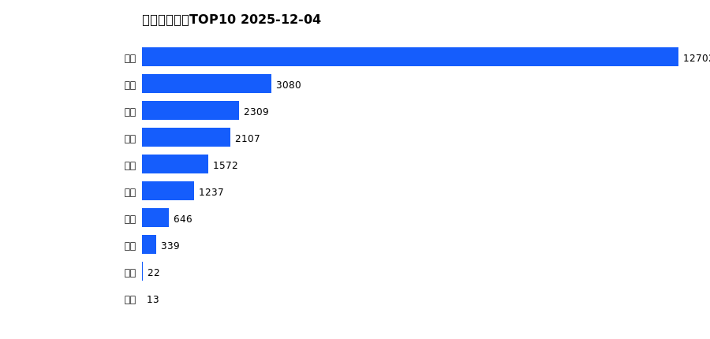
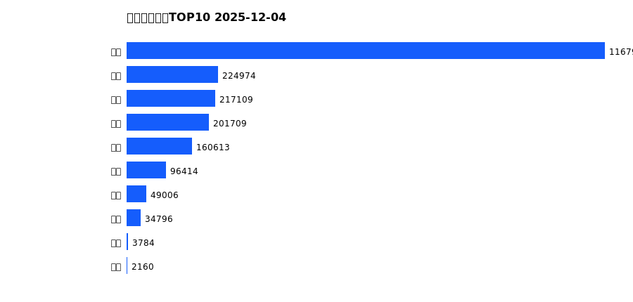
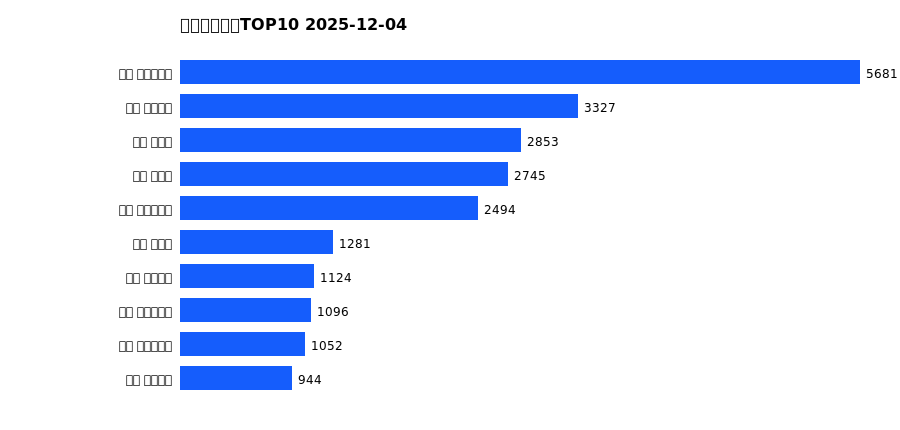
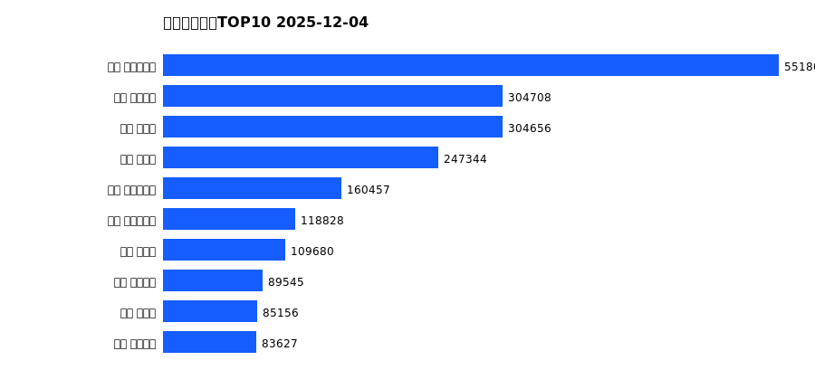

# 销售日报 2025-12-04

## 摘要

- 业态数: 10
- 门店数: 15
- 业态日销最大: 超市 3938
- 业态日销最小: 电玩 3
- 门店日销最大: 许昌 时代广场店 1957
- 门店日销最小: 许昌 劳动店 62
- 同比: -
- 环比: -

## 集团合计

| period | sales_wan |
| --- | --- |
| daily | 7465.0 |
| monthly | 24028.0 |
| yearly | 2158545.0 |

## 业态 TOP10

### 日销

| rank | business_type | sales_wan |
| --- | --- | --- |
| 1 | 超市 | 3937.85 |
| 2 | 服饰 | 905.27 |
| 3 | 珠宝 | 855.92 |
| 4 | 百货 | 661.03 |
| 5 | 电器 | 438.05 |
| 6 | 茶叶 | 379.24 |
| 7 | 医药 | 179.65 |
| 8 | 餐饮 | 101.88 |
| 9 | 电影 | 3.39 |
| 10 | 电玩 | 3.03 |

### 月度累计

| rank | business_type | sales_wan |
| --- | --- | --- |
| 1 | 超市 | 12701.81 |
| 2 | 服饰 | 3080.38 |
| 3 | 珠宝 | 2309.25 |
| 4 | 百货 | 2107.37 |
| 5 | 电器 | 1572.03 |
| 6 | 茶叶 | 1236.93 |
| 7 | 医药 | 646.18 |
| 8 | 餐饮 | 339.02 |
| 9 | 电影 | 21.58 |
| 10 | 电玩 | 13.45 |

### 年度累计

| rank | business_type | sales_wan |
| --- | --- | --- |
| 1 | 超市 | 1167980.73 |
| 2 | 珠宝 | 224973.56 |
| 3 | 百货 | 217108.63 |
| 4 | 电器 | 201708.64 |
| 5 | 服饰 | 160612.87 |
| 6 | 茶叶 | 96414.45 |
| 7 | 医药 | 49006.31 |
| 8 | 餐饮 | 34796.39 |
| 9 | 电玩 | 3784.03 |
| 10 | 电影 | 2159.71 |

## 门店 TOP10

### 日销

| rank | store_name | sales_wan |
| --- | --- | --- |
| 1 | 许昌 时代广场店 | 1957.15 |
| 2 | 新乡 大胖店 | 986.16 |
| 3 | 新乡 小胖店 | 921.64 |
| 4 | 许昌 生活广场店 | 844.41 |
| 5 | 许昌 天使城店 | 807.52 |
| 6 | 许昌 禹州店 | 341.98 |
| 7 | 许昌 实业公司店 | 327.63 |
| 8 | 许昌 金三角店 | 285.76 |
| 9 | 许昌 北海店 | 272.9 |
| 10 | 许昌 线上商城 | 262.63 |

### 月度累计

| rank | store_name | sales_wan |
| --- | --- | --- |
| 1 | 许昌 时代广场店 | 5680.82 |
| 2 | 许昌 天使城店 | 3327.23 |
| 3 | 新乡 大胖店 | 2853.32 |
| 4 | 新乡 小胖店 | 2744.67 |
| 5 | 许昌 生活广场店 | 2494.24 |
| 6 | 许昌 禹州店 | 1281.42 |
| 7 | 许昌 线上商城 | 1123.93 |
| 8 | 许昌 实业公司店 | 1095.9 |
| 9 | 许昌 大众服饰店 | 1052.4 |
| 10 | 许昌 金三角店 | 943.64 |

### 年度累计

| rank | store_name | sales_wan |
| --- | --- | --- |
| 1 | 许昌 时代广场店 | 551806.95 |
| 2 | 许昌 天使城店 | 304708.47 |
| 3 | 新乡 大胖店 | 304655.74 |
| 4 | 新乡 小胖店 | 247343.93 |
| 5 | 许昌 生活广场店 | 160456.94 |
| 6 | 许昌 实业公司店 | 118828.46 |
| 7 | 许昌 禹州店 | 109680.35 |
| 8 | 许昌 线上商城 | 89544.76 |
| 9 | 许昌 北海店 | 85156.38 |
| 10 | 许昌 金三角店 | 83627.04 |

