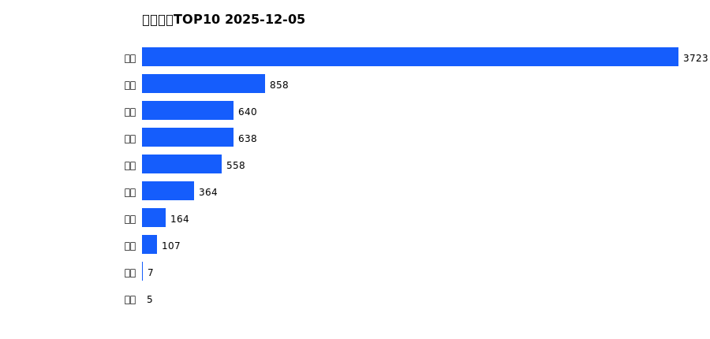
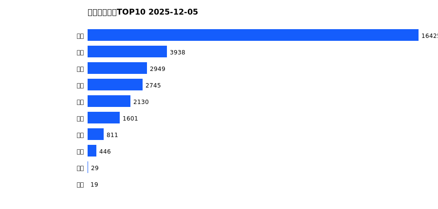
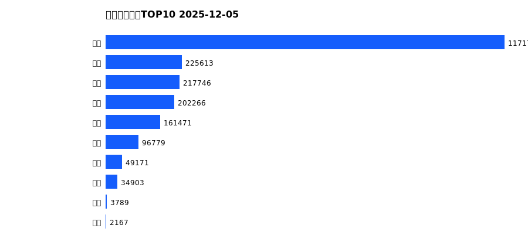
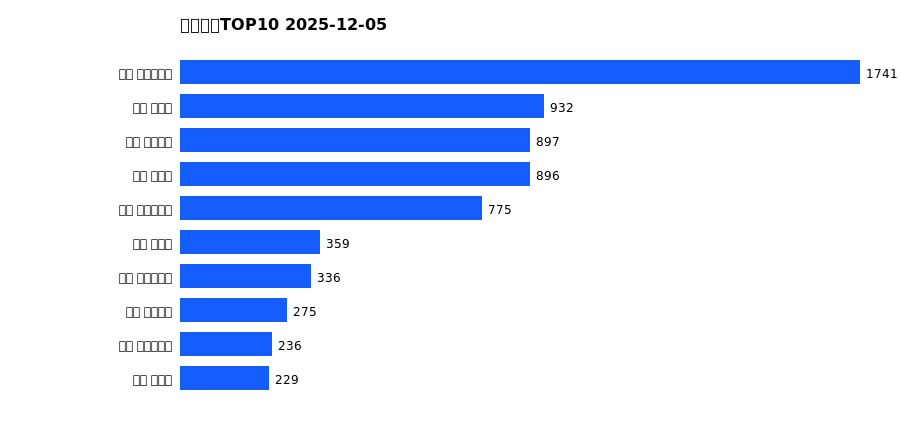
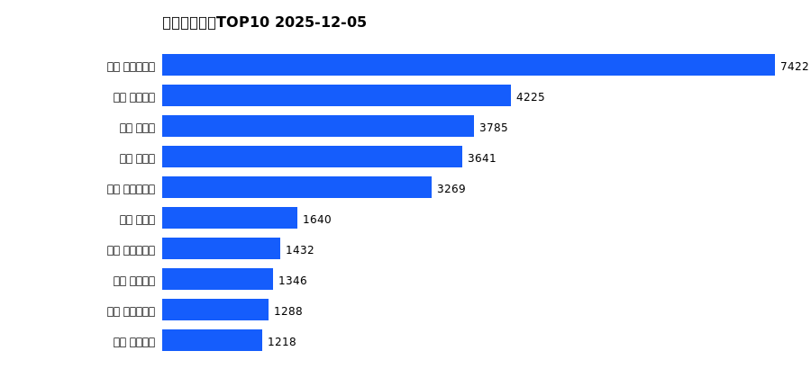
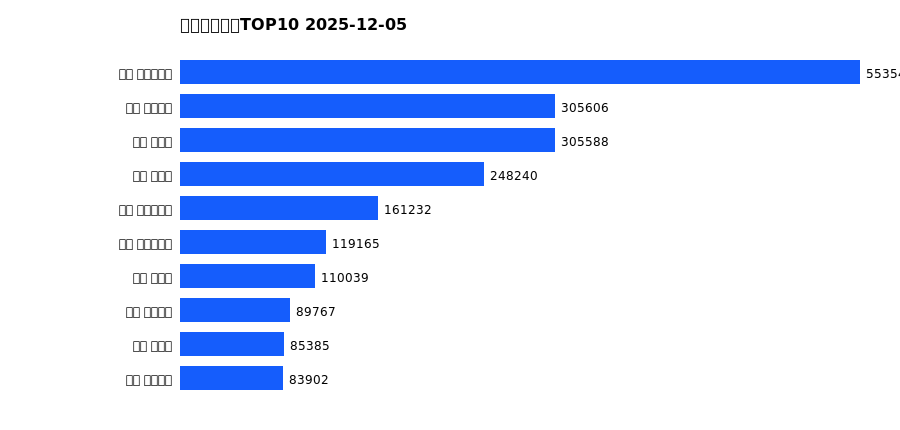

# 销售日报 2025-12-05

## 摘要

- 业态数: 10
- 门店数: 15
- 业态日销最大: 超市 3723
- 业态日销最小: 电玩 5
- 门店日销最大: 许昌 时代广场店 1741
- 门店日销最小: 许昌 劳动店 48
- 同比: -
- 环比: -

## 集团合计

| period | sales_wan |
| --- | --- |
| daily | 7063.0 |
| monthly | 31091.0 |
| yearly | 2165609.0 |

## 业态 TOP10

### 日销

| rank | business_type | sales_wan |
| --- | --- | --- |
| 1 | 超市 | 3722.92 |
| 2 | 服饰 | 857.98 |
| 3 | 珠宝 | 639.55 |
| 4 | 百货 | 637.59 |
| 5 | 电器 | 557.59 |
| 6 | 茶叶 | 364.21 |
| 7 | 医药 | 164.46 |
| 8 | 餐饮 | 106.66 |
| 9 | 电影 | 7.17 |
| 10 | 电玩 | 5.17 |

### 月度累计

| rank | business_type | sales_wan |
| --- | --- | --- |
| 1 | 超市 | 16424.73 |
| 2 | 服饰 | 3938.36 |
| 3 | 珠宝 | 2948.8 |
| 4 | 百货 | 2744.96 |
| 5 | 电器 | 2129.62 |
| 6 | 茶叶 | 1601.14 |
| 7 | 医药 | 810.64 |
| 8 | 餐饮 | 445.68 |
| 9 | 电影 | 28.74 |
| 10 | 电玩 | 18.62 |

### 年度累计

| rank | business_type | sales_wan |
| --- | --- | --- |
| 1 | 超市 | 1171703.65 |
| 2 | 珠宝 | 225613.11 |
| 3 | 百货 | 217746.22 |
| 4 | 电器 | 202266.23 |
| 5 | 服饰 | 161470.85 |
| 6 | 茶叶 | 96778.66 |
| 7 | 医药 | 49170.77 |
| 8 | 餐饮 | 34903.05 |
| 9 | 电玩 | 3789.2 |
| 10 | 电影 | 2166.88 |

## 门店 TOP10

### 日销

| rank | store_name | sales_wan |
| --- | --- | --- |
| 1 | 许昌 时代广场店 | 1740.86 |
| 2 | 新乡 大胖店 | 931.98 |
| 3 | 许昌 天使城店 | 897.43 |
| 4 | 新乡 小胖店 | 896.46 |
| 5 | 许昌 生活广场店 | 775.08 |
| 6 | 许昌 禹州店 | 359.01 |
| 7 | 许昌 实业公司店 | 336.35 |
| 8 | 许昌 金三角店 | 274.61 |
| 9 | 许昌 大众服饰店 | 235.75 |
| 10 | 许昌 北海店 | 229.08 |

### 月度累计

| rank | store_name | sales_wan |
| --- | --- | --- |
| 1 | 许昌 时代广场店 | 7421.68 |
| 2 | 许昌 天使城店 | 4224.66 |
| 3 | 新乡 大胖店 | 3785.31 |
| 4 | 新乡 小胖店 | 3641.13 |
| 5 | 许昌 生活广场店 | 3269.32 |
| 6 | 许昌 禹州店 | 1640.44 |
| 7 | 许昌 实业公司店 | 1432.24 |
| 8 | 许昌 线上商城 | 1345.85 |
| 9 | 许昌 大众服饰店 | 1288.16 |
| 10 | 许昌 金三角店 | 1218.25 |

### 年度累计

| rank | store_name | sales_wan |
| --- | --- | --- |
| 1 | 许昌 时代广场店 | 553547.81 |
| 2 | 许昌 天使城店 | 305605.9 |
| 3 | 新乡 大胖店 | 305587.72 |
| 4 | 新乡 小胖店 | 248240.39 |
| 5 | 许昌 生活广场店 | 161232.02 |
| 6 | 许昌 实业公司店 | 119164.81 |
| 7 | 许昌 禹州店 | 110039.37 |
| 8 | 许昌 线上商城 | 89766.68 |
| 9 | 许昌 北海店 | 85385.46 |
| 10 | 许昌 金三角店 | 83901.65 |

